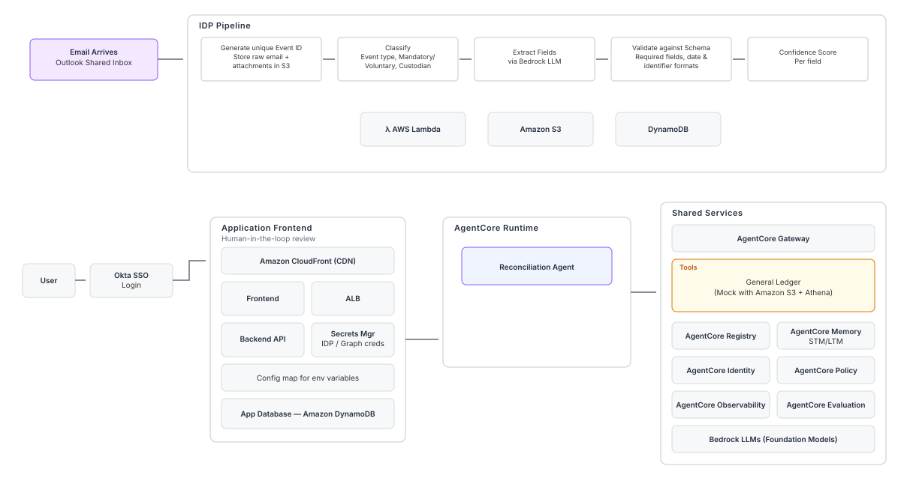
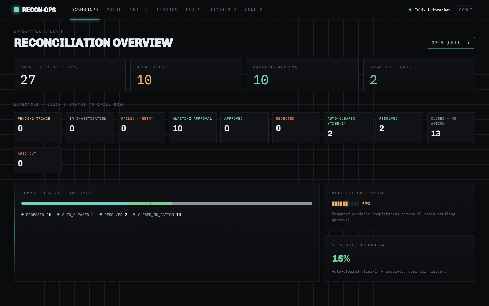
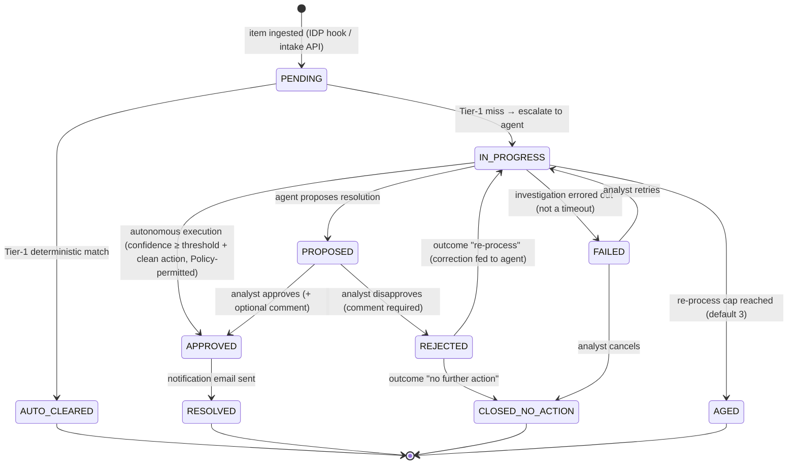
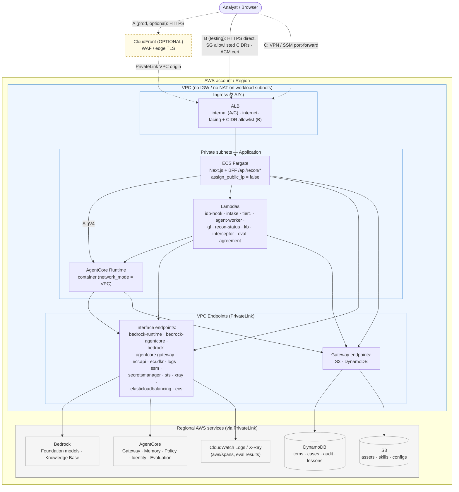

# Reconciliation Workflow Agent

A sample agentic reconciliation platform. Work arrives as a structured dataset posted to an API.
Whatever matches deterministically clears without a model touching it. The rest goes to an LLM
agent, which classifies the break, runs whichever investigation skills apply — including searching
for corresponding unstructured data (e.g. notice documents) — and then either resolves the item
itself or writes up a proposal for an analyst as a next step.

It resolves on its own only when the computed evidence score clears an admin threshold and there is a
clean, provable action available. That gate does not live in the prompt: an AgentCore Policy
(Cedar) on the tools gateway checks the evidence score server-side, so a below-threshold model cannot
write even if it talks itself into trying. Proposals that do reach a human get approved or
corrected, and the corrections come back to the agent as lessons.

The Tier-2 agent has two interchangeable backends, and a single SSM parameter (`agent_backend`)
picks between them, which makes A/B and rollback instant. One is a container AgentCore Runtime
running a hand-rolled Strands/Bedrock loop. The other is the managed AgentCore Harness, declared
in config with no orchestration code of ours. Which Bedrock model either one invokes is a second
runtime parameter (`agent-model-id`), also switchable from the Config tab, so comparing two models on
one queue needs no redeploy. Alongside both, an evaluation pipeline scores
sessions against analyst decisions as ground truth and surfaces prompt and tool recommendations
in the Evals tab.

## Two applications, one console

The console hosts two applications behind one shell, one sign-in and one identity provider:

| App                      | Pages         | BFF               | What it does                                                                                                                                       |
| ------------------------ | ------------- | ----------------- | -------------------------------------------------------------------------------------------------------------------------------------------------- |
| **Trade Reconciliation** | `/recon/*`    | `/api/recon/*`    | Everything the rest of this README describes                                                                                                       |
| **Deal Pipeline**        | `/pipeline/*` | `/api/pipeline/*` | Turns new-issue deal emails into OMS staging records, reviewed before upload — contract and demo script in [`docs/deal-pipeline-design.md`](docs/deal-pipeline-design.md) |

`/` is the landing chooser: one card per app the signed-in viewer may open. Inside an app, a
collapsible vertical rail on the left switches between the apps the viewer has access to. An app the
viewer may not open is absent from the chooser and the rail, and every request to its BFF answers
403. Each app keeps its own routes, hooks, screens and theme; the shell adds the rail and the access
check and changes nothing inside either app.

**Per-app access from identity-provider groups.** Authorization reuses the group claim the BFF
already verifies (`AUTH_GROUPS_CLAIM`). Each app has an _access_ group ("may use it") and an _admin_
group ("may change how it behaves"), named by four environment variables on the console's task — or,
once the console layer described under [Console-wide configuration](#console-wide-configuration) is
configured, by values a console admin stored from the Settings screen, which overlay those same
names. The registry that reads them is `chatbot-app/frontend/src/lib/auth/apps.ts`; adding an app is
one entry there plus its own route trees.

| Variable                     | Grants                                                                                                                                                                                                                                                     | Unset means                                                                                                                                                                                            |
| ---------------------------- | ---------------------------------------------------------------------------------------------------------------------------------------------------------------------------------------------------------------------------------------------------------- | ------------------------------------------------------------------------------------------------------------------------------------------------------------------------------------------------------ |
| `RECON_ACCESS_GROUP`         | may open Trade Reconciliation — and, because most recon writes check nothing further, may rewrite the agent's system prompt, skills and harness configs (see below)                                                                                        | open to every authenticated user, unless `REQUIRE_ACCESS_GROUPS=true`                                                                                                                                  |
| `RECON_ADMIN_GROUP`          | may change its configuration (auto-resolve threshold, agent backend, Tier-1, contacts, templates, workflow types), delete memory records and upload documents; implies access                                                                              | nobody can change configuration                                                                                                                                                                        |
| `PIPELINE_ACCESS_GROUP`      | may open Deal Pipeline: read, chat, simulate an email, reparse, propose a skill change                                                                                                                                                                     | open to every authenticated user, unless `REQUIRE_ACCESS_GROUPS=true`                                                                                                                                  |
| `PIPELINE_ADMIN_GROUP`       | may approve or reject deals, edit staged fields, write skills, the parser prompt and memories, decide proposals, change the model; implies access                                                                                                          | nobody can change the pipeline                                                                                                                                                                         |
| `REQUIRE_ACCESS_GROUPS`      | `true` (exact) makes a blank access group **deny** that app to everyone but its admins, instead of opening it. The composed deployment sets it whenever the pipeline is enabled                                                                            | a blank access group is open (the recon-only behaviour from before the shell)                                                                                                                          |
| `PIPELINE_ENABLED`           | `false` (exact) switches the Deal Pipeline app off in a running console: `/api/me` hides it and `/api/pipeline/*` answers 403. The ECS task sets it from `pipeline_enabled`                                                                                | enabled — local development needs nothing extra; recon has no such switch                                                                                                                              |
| `CONSOLE_ADMIN_GROUP`        | may edit console-wide settings on the Settings screen: every app's access and admin group, app enablement, the console defaults. **Environment-only** — the group that gates the Settings screen cannot be changed from it. Set from `console_admin_group` | nobody is a console admin: the Access, Applications and Defaults sections show their structure without values and cannot be edited. Anonymous local mode holds the group only when the variable is set |
| `CONSOLE_SETTINGS_PREFIX`    | SSM prefix (e.g. `/recon-dev/console`) under which the Settings screen stores its values and each user's preferences; stored values overlay the names above                                                                                                | the console layer is off: every setting reads from the environment as before, the Settings screen renders read-only with a note, preferences stay in the browser                                       |
| `CONSOLE_ORGANIZATION_LABEL` | environment fallback for the label shown under the console mark in the rail; a value stored from the Settings screen wins. Set from `console_organization_label`                                                                                           | `Agentic Operations Console`                                                                                                                                                                           |
| `CONSOLE_DEFAULT_MODEL_ID`   | environment fallback for the console default model id an app may copy (`<prefix>/defaults/model-id`); a stored value wins. Not set by Terraform, which seeds the parameter instead                                                                         | no console default: the pipeline Config tab offers no "Use console default"                                                                                                                            |

An unset **access** group keeps an app open to all authenticated users, which is exactly what a
recon-only deployment had before the shell existed. That default stops being safe the moment two
populations sign in through one OIDC client — a deal-desk user is then "authenticated" for
`/api/recon/*` too — so the composed deployment fails closed: `REQUIRE_ACCESS_GROUPS=true` is set
whenever the pipeline is enabled, and `infra/environments/recon` refuses to plan
`enable_deal_pipeline = true` while either `recon_access_group` or `pipeline_access_group` is blank.
An unset **admin** group fails closed, as it always has. Nothing in Terraform creates a group: an
operator maintains membership in Okta or Entra and the next token carries it.

The access check runs in `src/proxy.ts` for every `/api/recon/*` and `/api/pipeline/*` request. What
happens after it differs between the apps. **Every Deal Pipeline write route re-checks
`PIPELINE_ADMIN_GROUP`** (§9 of the design doc lists them). **Trade Reconciliation's admin group
gates only part of its writes**: `config/*` (threshold, backend, Tier-1, contacts, templates,
workflow types), `memory` DELETE and `uploads`; the case-decision routes (`cases/[id]`, its `draft`)
verify the acting user. The remaining recon writes — `system-prompt`, `skills` (create, edit,
delete), `harness/configs` and its `deploy`, `evals/batch`, `evals/recommendations`,
`idp-extractions` and the bulk `cases` update — carry no admin check at all: anyone the proxy admits
may call them. `RECON_ACCESS_GROUP` is therefore the real boundary around what the reconciliation
agent does, and an app hidden from the rail is a courtesy on top of the proxy, not the gate.

**Local development** runs without an identity provider. `ALLOW_ANONYMOUS_API=true` in
`chatbot-app/frontend/.env.local` skips token verification and grants every app and both admin roles
to the single `anonymous` subject. The BFF honours two older names for the same switch,
`RECON_ALLOW_ANONYMOUS_API` and `PIPELINE_ALLOW_ANONYMOUS_API` (each app's pre-shell spelling); any
one of the three being exactly `true` opens **both** BFFs, so an audit of a task definition must
look for all three, and none of them belongs in a deployment. To preview what a restricted user
sees, set `ANONYMOUS_GROUPS` to
the comma-separated groups that subject should carry instead — for example
`RECON_ACCESS_GROUP=recon-analysts`, `PIPELINE_ACCESS_GROUP=deal-desk` and
`ANONYMOUS_GROUPS=deal-desk` shows the Deal Pipeline app alone, with no admin controls.
`chatbot-app/frontend/.env.example` is the template for both apps, and its Deal Pipeline block uses
the `PIPELINE_`-prefixed names below.

**Deploying.** `infra/environments/recon` is the console's root. Setting `enable_deal_pipeline = true`
there composes `infra/modules/deal-pipeline` (one bucket, three tables, two AgentCore Memories, two
Lambdas) into the same apply, grants the console's task role access to those resources, seeds the
sample-email corpus to the pipeline bucket under `samples/` (the container ships no `data/`, so the
BFF reads samples from S3 there and from disk under `next dev`), and hands the task the pipeline's
variables — under `PIPELINE_`-prefixed names where a bare name would collide with recon's in the shared
process: `PIPELINE_ASSETS_BUCKET`, `PIPELINE_AGENT_MODEL_PARAM`, `PIPELINE_SKILLS_PREFIX`,
`PIPELINE_SAMPLES_PREFIX`. The pipeline BFF reads **only** those prefixed names — there is no fallback
to `ASSETS_BUCKET`, `AGENT_MODEL_PARAM` or `SKILLS_PREFIX`, because in the shared container those are
recon's and a fallback would have read recon's bucket without an error. The same apply sets
`REQUIRE_ACCESS_GROUPS=true` and `PIPELINE_ENABLED=true` on the task, and the plan is refused while
either access group is blank. The pipeline's resources come out under the `<name_prefix>-pipeline`
prefix (e.g. `recon-dev-pipeline-emails`, `/recon-dev-pipeline/agent-model-id`), not the standalone
root's `deal-pipeline-dev`, so the two roots can share an account. With the flag off (the default) the
deployment is the recon app alone, `PIPELINE_ENABLED=false` is set, and the Deal Pipeline entry never
appears. `infra/environments/deal-pipeline` remains the standalone root for running the pipeline by
itself against `npm run dev`, with local state and an `env_local` output that renders `.env.local`.
The five-step demo is §12 of the design doc.

### Console-wide configuration

Everything above is **per-app** configuration, and it stays exactly where it is: the Trade
Reconciliation Config tab (auto-resolve threshold, agent backend, Tier-1, model selection, contacts,
templates, workflow types) and the Deal Pipeline Config tab (parser model) each read and write their
own SSM parameters, and neither can see the other's. Above both sits a thin **console-wide** layer for
what belongs to the console as a whole rather than to one app: who may reach which app, which apps
are deployed, defaults an app may choose to copy, and each user's own preferences. Its contract is
`chatbot-app/frontend/src/lib/console/types.ts`, and §14 of
[`docs/deal-pipeline-design.md`](docs/deal-pipeline-design.md) is the design.

**The Settings screen** is `/console/settings` (`/console` redirects there), reached from the Settings
entry in the rail's footer, in five sections addressed by `?tab=`:

| Tab              | Values readable by | What it holds                                                                                                                                                                                                                                             |
| ---------------- | ------------------ | --------------------------------------------------------------------------------------------------------------------------------------------------------------------------------------------------------------------------------------------------------- |
| **Access**       | console admins     | The access group and admin group of each app, a source chip beside each. Everyone else sees the structure — which variable names each group, per app — without the values                                                                                 |
| **Applications** | console admins     | On/off for the apps that have a switch: today only Deal Pipeline; Trade Reconciliation has no switch and is always part of the console                                                                                                                    |
| **Defaults**     | console admins     | The Bedrock model or inference-profile id an app may copy, and the organization label shown under the console mark in the rail                                                                                                                            |
| **Users**        | every user         | Who the console takes you for (subject, groups, per-app access, console admin or not) and, for console admins, a **check access** tool: which apps a hypothetical user holding a given set of groups would see, and whether they would be a console admin |
| **Preferences**  | every user         | Your own: the app to open from `/` when you may use several, whether the rail starts collapsed, and the theme (`system`, `light` or `dark`)                                                                                                               |

A console admin lands on Access; everyone else on Preferences. Editing needs both a console admin
(`CONSOLE_ADMIN_GROUP`) and a configured layer (`CONSOLE_SETTINGS_PREFIX`); otherwise the admin
sections carry a note saying which of the two is missing. Beside every console-wide field is a
**source chip** — `stored`, `env` or `default` — so an operator can tell a value that came from the
Settings screen from one the task definition supplies, and see what the field would fall back to if
the stored value were cleared. Saving sends only the fields that changed, so a value that was merely
displayed from the environment never silently becomes a stored one.

**Storage.** One SSM String parameter per setting under `CONSOLE_SETTINGS_PREFIX`. Both Terraform
roots set `/<name_prefix>/console`: `/recon-dev/console` for the composed console, inside the
`/<name_prefix>/*` path the task role already uses for the two Config tabs, and
`/deal-pipeline-dev/console` for the standalone pipeline root a laptop runs against:

| Parameter                                              | Holds                                                                                               |
| ------------------------------------------------------ | --------------------------------------------------------------------------------------------------- |
| `<prefix>/access/<appId>/access-group`                 | IdP group that may use the app (`appId` is `recon` or `pipeline`); absent means "see env / default" |
| `<prefix>/access/<appId>/admin-group`                  | IdP group that administers the app                                                                  |
| `<prefix>/apps/<appId>/enabled`                        | `true` or `false`; only for apps with a switch (`pipeline`)                                         |
| `<prefix>/defaults/model-id`                           | Bedrock model or inference-profile id an app may copy                                               |
| `<prefix>/defaults/organization-label`                 | Label shown under the console mark in the rail                                                      |
| `<prefix>/prefs/<sha256(subject) hex, first 32 chars>` | One user's preferences, as JSON                                                                     |
| `<prefix>/meta/updated`                                | `{at, by}` of the last save from the Settings screen, shown as its "Last saved" line                |

**Precedence: stored → env → default.** The stored layer is an _overlay_ on the same environment
names the registry already reads — `RECON_ACCESS_GROUP`, `RECON_ADMIN_GROUP`, `PIPELINE_ACCESS_GROUP`,
`PIPELINE_ADMIN_GROUP`, `PIPELINE_ENABLED` — plus `CONSOLE_ORGANIZATION_LABEL` and
`CONSOLE_DEFAULT_MODEL_ID` for the two defaults. A stored value replaces the environment value before
`resolveAppAccess`, the proxy's access check and the two admin helpers read it, so none of them
changed apart from receiving the overlaid environment; an absent parameter leaves the environment
value in place, and the environment's own unset case falls through to the default the table above
describes. Clearing a field from the UI deletes the parameter (SSM has no empty value), so the
setting falls back to env — never to "open" unless the environment was open. Each process caches the
stored layer for **30 seconds**: the admin who saved sees the result at once (the save drops that
process's cache), while the proxy — a separate bundle with its own cache, even on the same task — and
every other task pick the change up within about half a minute. When Parameter Store cannot be read
(throttling, a missing grant after a deploy) the layer resolves from the environment alone for one
30-second window and logs it once, so a Parameter Store hiccup cannot become a console-wide outage.
The cost is stated plainly: for that window a restriction that exists only in the stored layer is not
enforced, which is why a deployment that cannot accept it names the group in the environment as well
and lets the stored value merely override it. The Settings screen itself never fails open — an admin
who cannot read the parameters sees the error, not a screen claiming every value comes from the
environment — and the two Config tabs' own parameters are not cached and are unaffected.

**Three switches are environment-only** and can never be changed from the UI. The Settings screen
reports them read-only, for transparency: `REQUIRE_ACCESS_GROUPS`, `ALLOW_ANONYMOUS_API` (with its
pre-shell names `RECON_ALLOW_ANONYMOUS_API` and `PIPELINE_ALLOW_ANONYMOUS_API`) and
`CONSOLE_ADMIN_GROUP` itself. A console admin may rename which group opens an app; they must not be
able to widen access past what the deployment allows — turn a fail-closed blank group into an open
one, or token verification into anonymous mode — and they must not be able to make anyone (including
themselves) a console admin. Keeping those three out of the stored layer is what makes an edit from
the UI unable to escalate beyond the deployment's own settings. `CONSOLE_ADMIN_GROUP` fails closed like
the two app admin groups: unset means nobody is a console admin — the Access, Applications and
Defaults sections show their structure without values and cannot be edited — until an operator names
a group in `console_admin_group` and the identity provider releases the claim. Anonymous local mode
holds every configured group, so it is a console admin exactly when the variable is set
(`.env.example` sets `console-admins`).

**Per-user preferences** (default app, rail collapsed, theme) are stored one parameter per user under
`<prefix>/prefs/`, keyed by the first 32 hex characters of the SHA-256 of the token subject rather than
by the subject itself: an OIDC subject can contain characters a parameter name refuses, and a listing
that spelled out every user's identifier would be a roster. `GET`/`PUT /api/console/preferences` read
and write the caller's own row only — the subject comes from the verified token, never from the body.
When the layer is unconfigured `GET` answers `{}`, `PUT` answers 409, and preferences fall back to the
browser (`localStorage`, the `shell:rail:collapsed` key the rail used before). Even when configured
the browser value is used first, so the rail never pops between states on the first paint; the stored
value then wins once per load, the rail's own collapse button writes it back so a click outlives the
browser, and the stored theme is applied once per load. A `defaultApp` sends `/` straight into that
app when the viewer may use several and still has access to it; a viewer with exactly one app goes
there regardless.

**"Use console default"** is the one place an app takes a value from the layer, and it is a copy, not
a link. `GET /api/pipeline/config` reports the console's `defaults/model-id` beside the pipeline's own
selection, so the Deal Pipeline Config tab can offer **Use console default** next to its
family/endpoint presets; choosing it is the same admin-gated `PUT` of the pipeline's own parameter
with that id, and the parser Lambda keeps reading that parameter alone. Nothing outside the pipeline
BFF learns the console default exists, the panel says so when the console default is not an id the
pipeline offers, and a later change to the console default does not move the pipeline until someone
chooses it again. The Trade Reconciliation Config tab is unchanged — its model selection stays its
own — and nothing in the console layer writes either app's parameters.

**Terraform.** `infra/modules/console-settings` creates the parameters; both roots instantiate it at
`/<name_prefix>/console`. It seeds all seven settings from variables the root already has — the four
groups from `recon_access_group` / `recon_admin_group` / `pipeline_access_group` /
`pipeline_admin_group`, the pipeline switch from `enable_deal_pipeline`, the default model id from
`pipeline_agent_model_id`, and the label from the new `console_organization_label` (default
`Agentic Operations Console`) — so on day one the stored layer and the task environment agree and
every seeded field reads `stored`. A blank seed creates **no** parameter (a placeholder would be read
as a stored value that outranks the environment), so the UI creates it on first save. Seeded
parameters are **created, never reverted**: the module ignores changes to the value, so a later apply
leaves what a console admin changed from the Settings screen alone and the next CI run cannot undo an
operator's edit. Two consequences worth knowing: Terraform still manages the parameter's _existence_,
so clearing a value in the UI while its seed is still set means the next apply re-creates it from the
seed — clearing for good is "clear in the UI, then blank the seed" — and a parameter the UI created
first cannot later be adopted by giving its seed a value (the create fails rather than overwrite the
UI's value; import it, or leave the seed blank). The new `console_admin_group` (default `""`, fail
closed) reaches the task as `CONSOLE_ADMIN_GROUP`, `console_organization_label` as
`CONSOLE_ORGANIZATION_LABEL`, and the module's `prefix` output as `CONSOLE_SETTINGS_PREFIX`, so the
seeder, the reader and the task role's grant (`ssm:GetParameter`, `GetParameters`,
`GetParametersByPath`, `PutParameter`, `DeleteParameter` on `parameter<prefix>` and
`parameter<prefix>/*`) cannot drift apart. The plan-only module tests are
`infra/modules/console-settings/tests/` and `infra/modules/frontend-ecs/tests/console_settings.tftest.hcl`.
The standalone pipeline root renders the three `CONSOLE_*` names into its `env_local` output.

---

## Solution Architecture



_Full interactive version: [`assets/Solution Architecture.html`](assets/Solution%20Architecture.html)_



_Each screen of the console, 2.5s apart. Stills in [`assets/img/`](assets/img/)._

The architecture has three planes:

| Plane               | Purpose                                                                                                                                                    | Key services                                                                                               |
| ------------------- | ---------------------------------------------------------------------------------------------------------------------------------------------------------- | ---------------------------------------------------------------------------------------------------------- |
| **Ingestion**       | Email/document intake → unique event id → raw storage → classification → field extraction (Bedrock LLM) → schema validation → per-field confidence scoring | IDP pipeline (Lambda, S3, DynamoDB)                                                                        |
| **Application**     | Human-in-the-loop review frontend + backend API; agent runtime for the Reconciliation Agent                                                                | Frontend (React/Next.js), ECS/ALB, Backend API, AgentCore Runtime/Harness                                  |
| **Shared services** | Tool access, memory, identity, policy, observability, evaluation for all agents; LLM access                                                                | AgentCore Gateway, Memory, Identity, Policy, Evaluation; Bedrock Knowledge Base; Bedrock foundation models |

### High-level architecture components

| Concern            | Implementation                                                                                                                                                                                                                                                                                                                                                                                                                                                                                                                                                                                                                                                                                                                                                                                                                                                                                                                                           |
| ------------------ | -------------------------------------------------------------------------------------------------------------------------------------------------------------------------------------------------------------------------------------------------------------------------------------------------------------------------------------------------------------------------------------------------------------------------------------------------------------------------------------------------------------------------------------------------------------------------------------------------------------------------------------------------------------------------------------------------------------------------------------------------------------------------------------------------------------------------------------------------------------------------------------------------------------------------------------------------------- |
| Entry points       | The IDP post-processing hook Lambda (`recon-dev-idp-hook`, invoked by the IDP stack on document completion), and an intake HTTP API (API Gateway + Cognito JWT) for structured datasets                                                                                                                                                                                                                                                                                                                                                                                                                                                                                                                                                                                                                                                                                                                                                                  |
| Item / case stores | Five DynamoDB tables: `recon-dev-items` (canonical `ReconItem` inputs — **the only stream-enabled table**, which is what makes writing an item the way to open a case), `recon-dev-cases` (case lifecycle, status GSI), `recon-dev-audit` (append-only status-transition log), `recon-dev-lessons` (analyst decisions: approval, correction, auto-resolution, one row per item+trigger), and `recon-dev-notices` (extracted documents as **evidence**, deliberately with no stream, so an extracted document can never open a case). Operator configuration lives in three more: contacts, email templates and workflow types                                                                                                                                                                                                                                                                                                                            |
| Deterministic tier | A Tier-1 Lambda consuming the items stream. Sided items match within tolerance; sides-less (IDP) items are looked up in a mocked general ledger (Athena over S3) and auto-clear only on an unambiguous attribute match: account name, entry-type direction, and amount within tolerance. Toggleable via SSM or the Config tab                                                                                                                                                                                                                                                                                                                                                                                                                                                                                                                                                                                                                            |
| Agent              | Two interchangeable backends selected by the `agent_backend` SSM parameter: an AgentCore Runtime container (Strands `Agent` agentic loop), or the managed AgentCore Harness (config-declared), with the model each one invokes selected by a second parameter (`agent-model-id`), read per invocation. Skills and the system prompt are live from S3, with a ~60 s cache on the runtime and per-session on the harness. Two AgentCore gateways (AWS_IAM/SigV4): the egress tools gateway (10 targets, 7 of them conditional — one is a managed `bedrock-knowledge-bases` **connector** target, the rest Lambda/OpenAPI/MCP) with the Cedar Policy confidence gate, and an ingress agent gateway fronting the runtime (one `http/agentcoreRuntime` target of its own). AgentCore Memory holds the `lessons_learned` semantic strategy, and a fully managed Bedrock Knowledge Base holds the guidance corpus, queried with agent-supplied metadata filters |
| Evaluation         | AgentCore Online Evaluation (a custom analyst-agreement evaluator plus 3 builtins) over harness OTel traces, on-demand batch re-scores, managed recommendations, and a versioned harness-config store (immutable S3 docs + SSM pointer). All of it surfaces in the Evals tab                                                                                                                                                                                                                                                                                                                                                                                                                                                                                                                                                                                                                                                                             |
| Frontend           | Next.js on ECS Fargate behind an ALB and CloudFront, with a WAFv2 web ACL (`AWSManagedRulesCommonRuleSet`) on the distribution, which is the single internet entry point. Okta OIDC login (`auth_provider`, swappable to Entra) and same-origin BFF routes (`/api/recon/*`, plus `/api/pipeline/*` when the Deal Pipeline app is enabled) running under the task role, gated per app by identity-provider groups (see "Two applications, one console")                                                                                                                                                                                                                                                                                                                                                                                                                                                                                                                                                                                                                                                  |
| Notifications      | Microsoft Graph is the only channel (app-only, from the shared mailbox), reached through the egress gateway's OpenAPI target. It carries resolution emails on approve/auto-resolve (`cases/notify.py` plus the frontend BFF calling `sendSharedMailboxMail` through the gateway with SigV4), counterparty email sent by the BFF from an analyst-approved draft, and mailbox reads (`listSharedMailboxMessages`, reached only through the `search_correspondence` wrapper). No agent holds a send tool on either backend: the model writes the counterparty message into its proposal and a human approves a specific revision of it. Nothing stores an address: a draft and a resolution notice both name a contact id, and the address is read from the contacts table at the moment of sending, so deactivating a contact stops mail to them even if a draft was already approved. Sends are gated at the gateway REQUEST interceptor.                 |
| IaC                | Terraform (`infra/`) with S3-backed state. The AgentCore Harness lifecycle is an `aws_cloudformation_stack` (`infra/modules/recon-agent-harness`).                                                                                                                                                                                                                                                                                                                                                                                                                                                                                                                                                                                                                                                                                                                                                                                                       |

**Intelligent Document Processing (IDP) decoupling:** Two channels reach the independently-deployed
IDP solution and no others: the inbound hook invocation and the IDP MCP tool. One storage read is
sanctioned, and it happens at ingest, when the hook copies extracted field values and page images
into the recon item. After that the runtime never touches IDP storage.

---

## Repository layout

```
backend/                Python 3.12 Lambda handlers
  recon_core/           Shared domain: schema, cases, status, confidence, auto_resolve,
                        lessons_recall, memory (AgentCore record retrieval, used by both apps),
                        ddb_update + s3_text (helpers both apps' Lambdas import),
                        errors (ToolDenied), email_policy + templating (the
                        authority on which recipient and which wording a send may carry —
                        the BFF, the interceptor and the browser all defer to it),
                        skills_s3, prompt_source
                        (shared-core + harness-contract composition), otel_client
                        (client-side spans, baggage, trace propagation)
  tier1/                DynamoDB stream consumer + agent-worker (ingress-gateway / direct / harness selector)
  harness_agent/        Managed-Harness backend: worker, stream, intake (proposal validation +
                        reference derivation), prompting, session, config_store
  gl_tool/              General-ledger read + set_draw_status write (status allowlist only;
                        threshold via Cedar Policy, provenance via the gateway interceptor)
  status_tool/          recon-status gateway target: recon_update_status (platform-only,
                        state-machine-guarded + audited case-status writes)
  gateway_interceptor/  Gateway REQUEST interceptor: set_draw_status provenance +
                        recon_update_status transition re-check + the sendSharedMailboxMail
                        email gate — token + sendPurpose, where `notification` may only
                        address an active internal_notification contact and `counterparty`
                        must match the draft approved on the case at that revision
                        (log/enforce modes), plus OData argument normalization on the
                        listSharedMailboxMessages read
  notify_tool/          Microsoft Graph email: graph.py (app-only client), send + search handlers
  correspondence_tool/  correspondence-search gateway target: search_correspondence(query, top)
                        — sanitizes the model's arguments into Graph's OData form ($search
                        double-quoted, $top an integer) and re-enters this gateway to call
                        listSharedMailboxMessages, so the Graph credential stays in the vault
  eval_agreement/       Analyst-agreement custom evaluator Lambda
  intake/               Intake API handler
  idp_hook/             IDP post-processing hook Lambda + mapper + explainability (aggregates
                        IDP's per-field extraction confidences into the notice's
                        extraction_confidence — IDP emits no document_class.confidence)
  cases/                Resolution-email helper (notify.py), shared by the proposal service +
                        approve path — the JWT cases BFF was removed (status writes now go
                        through the recon-status gateway tool)
  contacts/             Recipient list + email templates: store.py (ContactStore /
                        TemplateStore — resolve_address is the only code path that reads a
                        contact's address; the agent-facing read projects it away) and
                        handler.py, the read-only gateway target the agent uses to pick a
                        recipient and a template by id
  skills_api/           Skills BFF (CRUD)
  lessons_api/          Lessons BFF
  deal_pipeline/        Deal Pipeline: parser_handler (Bedrock Converse tool loop with
                        lookup_security_master + stage_deal), oms_upload_handler (mock OMS
                        validator), oms_schema + oms_fields.json (the staging-CSV contract),
                        security_master, skills_loader, memory_recall, coerce

agent-blueprint/
  recon-agent/          AgentCore Runtime container: agent.py, strands_investigator.py, llm.py,
                        classifier.py, proposal.py, gateway_mcp.py, skills_loader.py,
                        skills/*.md, system-prompt.md, Dockerfile
  recon-agent-harness/  Harness blueprint: harness_config.py (tools/schema), system-prompt.md
  deal-pipeline-agent/  Deal Pipeline seed, no code: skills/*/SKILL.md (deal-parsing,
                        news-alert-format, bank-notice-format, oms-csv-format) and
                        prompts/{parser,assistant}-system.md, seeded to the pipeline bucket

chatbot-app/
  frontend/             Next.js console: the shell (/ landing chooser, the app rail, /api/me,
                        src/lib/auth/apps.ts, the console-wide Settings screen and /api/console/*
                        behind it, contract in src/lib/console/types.ts) hosting two apps —
                        /recon/* pages + /api/recon/*
                        BFF, and /pipeline/* pages + /api/pipeline/* BFF (server libs under
                        src/lib/pipeline/server). Other api/ route groups are scaffolding
                        inherited with the fork; 10 of them are non-functional in this
                        deployment and fail loudly naming the missing env var
                        (src/lib/deployment-env.ts)

docs/
  deal-pipeline-design.md  The Deal Pipeline contract: flow, data model, OMS rules, BFF routes,
                        environment, console integration, demo script

infra/
  modules/              Terraform modules: foundation, intake, tier1, idp-hook, recon-agent,
                        recon-agent-harness, agent-evals, gl-mock, api, frontend-ecs,
                        lambda-package, lambda-logs, network, observability, microsoft-graph-obo,
                        deal-pipeline (bucket, tables, memories, parser + OMS Lambdas),
                        console-settings (the console-wide layer's seeded SSM parameters)
  environments/recon/   The console's root (S3-backed state via a partial backend config);
                        enable_deal_pipeline composes modules/deal-pipeline into it
  environments/deal-pipeline/  Standalone root for the pipeline alone (local state, env_local output)
  bootstrap/            Terraform-state bucket bootstrap (local state; import-first — see
                        "Getting Started" step 1)
  scripts/              Utility scripts (deploy-recon.sh, spike_harness.py, spike_evals.md)

data/                   Synthetic sample documents + mocked general-ledger CSV (recon);
                        deal-emails/ (the pipeline's seven fictional emails, file name = corpus
                        id) and security-master/ (issuers + canonical counterparties)
tests/                  pytest (moto-mocked AWS), one directory per backend package incl.
                        tests/deal_pipeline; frontend: chatbot-app/frontend/__tests__
assets/                 Architecture diagrams (SVG/HTML), screenshots, CUJ walkthrough + template

.github/workflows/      GitHub Actions: CI only (the public remote has no AWS account)
.gitlab-ci.yml          GitLab: the same CI, plus plan + apply on main — see "CI/CD"
requirements-dev.txt    Test-only Python deps (pytest, moto, responses, ruff)
```

## Tech stack

| Layer    | Stack                                                                                                                                                            |
| -------- | ---------------------------------------------------------------------------------------------------------------------------------------------------------------- |
| Backend  | Python 3.12, `strands-agents==1.50.2`, `bedrock-agentcore==1.18.1`, `boto3==1.43.57`, `pydantic==2.13.4`, `aws-opentelemetry-distro==0.19.0` (runtime container) |
| Frontend | Next.js 16, React 18, Tailwind CSS, Radix UI, `@aws-sdk/client-bedrock-agentcore`, MSAL / `@okta/okta-auth-js`                                                   |
| IaC      | Terraform (AWS provider `~> 6.55, != 6.57.0` — 6.57.0 corrupts request bodies under parallel refresh), S3 backend                                                |
| Agent    | Amazon Bedrock AgentCore (Runtime, Harness, Gateway, Memory, Policy, Evaluation, Identity)                                                                       |
| LLMs     | Claude Sonnet 5 (default for both the runtime and harness backends; selectable per backend)                                                                      |
| Testing  | pytest + moto (backend), vitest + testing-library (frontend)                                                                                                     |

## Getting Started

You need a clone of this repo, Terraform `>= 1.11`, and AWS credentials for the target account. Steps
1 to 3 are one-time setup for a fresh account or a fresh checkout; from then on step 4 is the whole
deployment.

### 1. Bootstrap the Terraform state bucket (once per account)

`infra/bootstrap` creates the S3 bucket every environment stores its state in. It keeps local state,
because it cannot use the bucket it is about to create as its own backend.

In a fresh account, `terraform init && terraform apply` there is all it takes. If the bucket already
exists — it does in the dev account, where `recon-dev-tfstate-<account_id>` was created out-of-band
before it was expressed as code — a plain apply fails with `BucketAlreadyOwnedByYou` instead of
adopting it. Import the four resources first:

```bash
cd infra/bootstrap && terraform init
BUCKET="recon-dev-tfstate-$(aws sts get-caller-identity --profile <your-profile> --query Account --output text)"
terraform import aws_s3_bucket.tfstate                                      "$BUCKET"
terraform import aws_s3_bucket_versioning.tfstate                           "$BUCKET"
terraform import aws_s3_bucket_server_side_encryption_configuration.tfstate "$BUCKET"
terraform import aws_s3_bucket_public_access_block.tfstate                  "$BUCKET"
terraform plan   # expect "No changes" — the live bucket already has all four settings
```

Skipping the import is not free: an unimported bucket has no Terraform source, so drift in its
versioning, encryption or public-access settings appears in no plan.

### 2. Create the two local config files

Neither file is committed, because both carry the AWS account ID — the state bucket name embeds it,
and a `backend` block cannot read variables, which is why the bucket name arrives through a separate
`-backend-config` file.

```bash
cd infra/environments/recon
cp backend.hcl.example backend.hcl            # then set the state bucket name from step 1
cp terraform.tfvars.example terraform.tfvars  # then fill in the required values
```

`otel_layer_account` declares no default, so both plan and apply stop until it is set. It is AWS's own
public layer-publisher account rather than a secret. See
[Prerequisites & configuration](#prerequisites--configuration) for every variable.

### 3. Deploy

```bash
./infra/scripts/deploy-recon.sh plan
./infra/scripts/deploy-recon.sh apply
```

The script changes into `infra/environments/recon`, refuses to run at all without `backend.hcl`, and
wraps `terraform init -backend-config=backend.hcl` plus plan, apply or destroy with `-input=false`. By
hand it is `terraform init -backend-config=backend.hcl && terraform apply`.

One apply deploys everything. It packages the Lambdas, has CodeBuild build and push the agent
container and the frontend image (the build driver blocks until the push succeeds, before the
AgentCore Runtime is created), provisions the managed Harness (an `aws_cloudformation_stack`),
attaches the Cedar Policy, seeds the skills, system prompts and KB corpus to S3,
wires the CloudFront domain and agent runtime ARN through Terraform's dependency graph, and rolls the
ECS service. No second apply, no manual build step. Most of the wall-clock time is CodeBuild.

### 4. Configure Okta OIDC app for sign-in

Register the `okta_redirect_uri_to_register` output as a sign-in redirect URI on the Okta OIDC app,
and `frontend_url` as a sign-out redirect URI. This needs an Okta org admin. Until the callback URI is
registered, login cannot complete and every route stops at `400 invalid_request`.

### 5. Configure PostProcessingLambdaHookFunctionArn in IDP solution (if applicable)

Set the IDP solution's `PostProcessingLambdaHookFunctionArn` to the `idp_hook_function_arn` output, so
extracted documents reach the recon pipeline.

### 6. Optional flips

```bash
# Harness instead of the runtime backend (instant A/B; flip back with agent_backend=runtime)
terraform apply -var="agent_backend=harness"

# Policy is ENFORCE by default; LOG_ONLY observes decisions without blocking
terraform apply -var="policy_enforcement_mode=LOG_ONLY"
```

### 7. Run the tests

```bash
# Backend (repo root). The suite imports the same backend modules the agent container runs,
# so it needs the runtime requirements as well as the test-only ones.
pip install -r agent-blueprint/recon-agent/requirements.txt -r requirements-dev.txt
export AWS_DEFAULT_REGION=us-east-1   # moto builds real boto3 clients; botocore needs a region
ruff check .
python -m pytest -q            # 1851 passed, 21 skipped, ~50s
#                              # 11 of the skips are in tests/integration/ — 10 need
#                              # RECON_GATEWAY_URL (+ dev-account creds), 1 also needs
#                              # EMAIL_CONFIRMATION_TOKEN. 4 are in tests/skills/, one per
#                              # skill that prescribes no required evidence steps. 6 are in
#                              # tests/input_corpus/test_extraction_config.py, one per
#                              # document class that configures no amount columns.

# Frontend (chatbot-app/frontend). `npm run build` is the gate that matters — it compiles
# every route, catching breakage both vitest and tsc miss.
cd chatbot-app/frontend && npm ci && npx tsc --noEmit && npx vitest run && npm run build
#                          # 120 files, 1677 passed

# Terraform module tests (plan-only, mocked providers, no credentials). Both CIs run these.
for m in deal-pipeline frontend-ecs lambda-package; do
  (cd infra/modules/$m && terraform init -backend=false && terraform test)
done
```

`npm run lint` is not part of this: ESLint is broken repo-wide. `npm run verify` points at a
`verify-build.sh` that does not exist. `ruff format --check` reports 34 files that predate the
convention, so formatting is not gated either. CI runs exactly the commands above.

These counts are a snapshot, not a gate — nothing asserts them, so treat a disagreement as this
line being stale rather than as a missing test, and re-measure before quoting it.

## CI/CD

Two pipeline samples:

| File                       | Remote | Runs on              | Does                                                             |
| -------------------------- | ------ | -------------------- | ---------------------------------------------------------------- |
| `.github/workflows/ci.yml` | GitHub | every push, every PR | verification only — no AWS credentials in any job                |
| `.gitlab-ci.yml`           | GitLab | every MR, and `main` | the same verification plus SAST, then `plan` + `apply` on `main` |

On GitLab the pipeline is merge-request-only on feature branches, so open the MR as part of the push
and CI starts once, immediately:

```bash
git push -o merge_request.create -o merge_request.target=main \
         -o merge_request.remove_source_branch origin <branch>
```

Both run the same four checks as independent jobs, so a Terraform typo and a failing test report on
the same run instead of one masking the other:

| Job           | Command                                                                                 |
| ------------- | --------------------------------------------------------------------------------------- |
| `python`      | `ruff check .` then `pytest -q` (full suite, nothing excluded)                          |
| `frontend`    | `npm ci`, `tsc --noEmit`, `vitest run`, `npm run build`                                 |
| `terraform`   | `terraform fmt -check -recursive infra/`, `validate` in both roots (`infra/environments/recon`, `infra/environments/deal-pipeline`), then `terraform test` in `infra/modules/{deal-pipeline,frontend-ecs,lambda-package}` |
| `secret-scan` | `gitleaks` — the working tree on GitHub, the commit history on GitLab                   |

`terraform validate` only means something from the environment directory; run from `infra/` it passes
vacuously, because there is no root module there. `-backend=false` keeps it credential-free.
`secret-scan` installs no project dependencies on purpose: scanning after `npm ci` walks
`node_modules` and reports ~30 findings from vendored minified JS.

### Static analysis (GitLab only)

Two more jobs run in a `test` stage, which also gates `plan`. They are GitLab-only because the
scanner is a GitLab-bundled CI template, not something a GitHub workflow can include:

| Job            | Does                                                                             |
| -------------- | -------------------------------------------------------------------------------- |
| `semgrep-sast` | `include: - template: Security/SAST.gitlab-ci.yml` — scans Python and TypeScript |
| `sast-gate`    | reads the report and fails on `Critical`/`High` that is not triaged              |

### GitLab CI/CD variables

Set these under Settings → CI/CD → Variables. None can be committed: the first two embed the AWS
account ID, and the repo's pre-push guard rejects any 12-digit run in a tracked file.

| Variable                | Type     | Value                                                                                                                   |
| ----------------------- | -------- | ----------------------------------------------------------------------------------------------------------------------- |
| `AWS_CREDS_TARGET_ROLE` | Variable | `arn:aws:iam::<account-id>:role/<ci-role>` — read by the runner's credential-vendor hook                                |
| `TF_STATE_BUCKET`       | Variable | the state bucket from step 1; the pipeline rebuilds `backend.hcl` from it                                               |
| `RECON_TFVARS`          | File     | the contents of `infra/environments/recon/terraform.tfvars` — holds the Entra client secret and the IDP MCP credentials |

Set all three with environment scope `*`: `terraform:apply` declares an environment but
`terraform:plan` declares none, so an environment-scoped variable would silently not reach the plan
job. `RECON_TFVARS` **cannot be masked**: GitLab
only masks single-line values, and a tfvars file is multi-line. Mark it **Protected** instead, which
restricts it to pipelines on protected branches — note that this also means a pipeline on an
unprotected branch cannot plan, which is usually what you want and is worth knowing when testing.

## Prerequisites & configuration

| Variable                                                                                      | Required | Purpose                                                                                                                                                                                                                                                                                                                                                                                                                                                                                                                                                                                                                                                                                                                                    |
| --------------------------------------------------------------------------------------------- | -------- | ------------------------------------------------------------------------------------------------------------------------------------------------------------------------------------------------------------------------------------------------------------------------------------------------------------------------------------------------------------------------------------------------------------------------------------------------------------------------------------------------------------------------------------------------------------------------------------------------------------------------------------------------------------------------------------------------------------------------------------------ |
| `region`                                                                                      | yes      | AWS region (default `us-east-1`)                                                                                                                                                                                                                                                                                                                                                                                                                                                                                                                                                                                                                                                                                                           |
| `name_prefix`                                                                                 | yes      | Resource name prefix (e.g. `recon-dev`)                                                                                                                                                                                                                                                                                                                                                                                                                                                                                                                                                                                                                                                                                                    |
| `otel_layer_account`                                                                          | **yes**  | AWS's own public publisher account for the `AWSOpenTelemetryDistroPython` layer. It declares no default on purpose: a wrong or absent value composes a valid-looking layer ARN that fails at apply with an opaque Lambda error, so Terraform stops and names the variable instead. Not a secret. It lives in tfvars only because the repo's pre-push guard rejects any 12-digit run in a committed file. Only read when `enable_worker_tracing = true`, though `terraform plan` requires it either way                                                                                                                                                                                                                                     |
| `hosted_ui_prefix`                                                                            | yes      | Cognito Hosted UI domain prefix. It must be globally unique, so the `recon-dev-login` default will collide. Required only because `aws_cognito_user_pool_domain` is unconditional in `modules/foundation`; the Hosted UI login path itself has been orphaned since the Okta switch (`hosted_ui_domain` → `NEXT_PUBLIC_COGNITO_HOSTED_UI` → `src/lib/auth.ts` `buildLoginUrl`/`exchangeCode`, which nothing calls). The user pool is still live, as the issuer for the intake API's JWT authorizer, but that authorizer uses the pool's `cognito-idp` endpoint rather than this domain, so the domain can be dropped on its own                                                                                                             |
| `idp_gateway_target_url`                                                                      | no       | IDP MCP endpoint (enables `document-extraction` target)                                                                                                                                                                                                                                                                                                                                                                                                                                                                                                                                                                                                                                                                                    |
| `idp_mcp_secret_json`                                                                         | no       | IDP OAuth2 client credentials JSON                                                                                                                                                                                                                                                                                                                                                                                                                                                                                                                                                                                                                                                                                                         |
| `recon_domain`                                                                                | no       | Recon domain the IDP hook stamps on ingested items (default `cash`)                                                                                                                                                                                                                                                                                                                                                                                                                                                                                                                                                                                                                                                                        |
| `graph_enabled`                                                                               | no       | Enable the `microsoft-graph` OpenAPI target (the platform's single email interface)                                                                                                                                                                                                                                                                                                                                                                                                                                                                                                                                                                                                                                                        |
| `graph_mailbox`                                                                               | no       | Shared mailbox SMTP address all Graph email is sent from / read (must be a real mailbox in the Entra tenant)                                                                                                                                                                                                                                                                                                                                                                                                                                                                                                                                                                                                                               |
| `notify_email`                                                                                | no       | Resolution-notification recipient (human approve + auto-resolve), sent **from** `graph_mailbox` via the gateway's `sendSharedMailboxMail` tool. Empty disables the email step. The dev environment points it at the shared mailbox itself, so notifications land in the same inbox the agent reads                                                                                                                                                                                                                                                                                                                                                                                                                                         |
| `entra_tenant_id/client_id/client_secret`                                                     | no       | Entra app-only credentials for Graph email                                                                                                                                                                                                                                                                                                                                                                                                                                                                                                                                                                                                                                                                                                 |
| `auth_provider`                                                                               | no       | Frontend IdP: `okta` (deployed) or `entra` (var default)                                                                                                                                                                                                                                                                                                                                                                                                                                                                                                                                                                                                                                                                                   |
| `okta_issuer` / `okta_client_id`                                                              | no       | Required when `auth_provider=okta`                                                                                                                                                                                                                                                                                                                                                                                                                                                                                                                                                                                                                                                                                                         |
| `agent_backend`                                                                               | no       | `runtime` (default) or `harness`                                                                                                                                                                                                                                                                                                                                                                                                                                                                                                                                                                                                                                                                                                           |
| `enable_deal_pipeline`                                                                        | no       | `false` (default) deploys the recon app alone. `true` composes `infra/modules/deal-pipeline` into this environment under the `<name_prefix>-pipeline` prefix and hands the console's task the `PIPELINE_*` variables plus `REQUIRE_ACCESS_GROUPS=true` and `PIPELINE_ENABLED=true`, so the Deal Pipeline app appears in the rail. The plan is **refused** while `recon_access_group` or `pipeline_access_group` is blank — see [Two applications, one console](#two-applications-one-console)                                                                                                                                                                                                                                              |
| `recon_admin_group` / `recon_access_group` / `pipeline_admin_group` / `pipeline_access_group` | no       | The identity-provider groups behind `RECON_ADMIN_GROUP`, `RECON_ACCESS_GROUP`, `PIPELINE_ADMIN_GROUP`, `PIPELINE_ACCESS_GROUP`. With the pipeline off, an empty access group leaves recon open to every authenticated user; an empty admin group means nobody can change that app. With `enable_deal_pipeline = true` both access groups are required (the plan fails otherwise) and the task runs with `REQUIRE_ACCESS_GROUPS=true`, so a blank one would deny rather than open                                                                                                                                                                                                                                                           |
| `console_admin_group` / `console_organization_label`                                          | no       | The console-wide layer — see [Console-wide configuration](#console-wide-configuration). `console_admin_group` is the identity-provider group behind `CONSOLE_ADMIN_GROUP` (who may edit console-wide settings; empty = nobody, fail closed, and it can never be changed from the UI). `console_organization_label` (default `Agentic Operations Console`) reaches the task as `CONSOLE_ORGANIZATION_LABEL` and seeds `<prefix>/defaults/organization-label`. The same apply seeds the four groups, the pipeline switch and the default model id (from `pipeline_agent_model_id`) under `/<name_prefix>/console` through `infra/modules/console-settings`; a value later changed from the Settings screen is **never reverted** by an apply |
| `harness_model_id`                                                                            | no       | Override harness LLM (default `us.anthropic.claude-sonnet-5`)                                                                                                                                                                                                                                                                                                                                                                                                                                                                                                                                                                                                                                                                              |
| `policy_enforcement_mode`                                                                     | no       | `ENFORCE` (default) or `LOG_ONLY` (observe only)                                                                                                                                                                                                                                                                                                                                                                                                                                                                                                                                                                                                                                                                                           |
| `interceptor_mode`                                                                            | no       | Gateway REQUEST interceptor: `enforce` (default) or `log` (observes only, **never blocks**). The example tfvars also ships `"enforce"` explicitly; set `"log"` only for a first rollout, then remove it.                                                                                                                                                                                                                                                                                                                                                                                                                                                                                                                                   |
| `enable_worker_tracing`                                                                       | no       | `true` (default) attaches the ADOT layer and OTel env to the agent-worker Lambda so its invocations share one trace with the agent's own spans. `false` means no layer, no OTel env, PassThrough X-Ray                                                                                                                                                                                                                                                                                                                                                                                                                                                                                                                                     |
| `otel_layer_version`                                                                          | no       | Version of AWS's public `AWSOpenTelemetryDistroPython` Lambda layer (default `30`; pinned rather than `latest`, which AWS does not publish)                                                                                                                                                                                                                                                                                                                                                                                                                                                                                                                                                                                                |
| `reprocess_cap`                                                                               | no       | Max re-process attempts before a case ages out (default `3`)                                                                                                                                                                                                                                                                                                                                                                                                                                                                                                                                                                                                                                                                               |
| `private_vpc`                                                                                 | no       | `false` (default) = public CloudFront + internet-facing ALB. `true` = the whole private topology in one flag: internal ALB on private subnets, Fargate with no public IP, no CloudFront, plus the interface endpoints. Does **not** remove the NAT — see [Private VPC deployment](#private-vpc-deployment)                                                                                                                                                                                                                                                                                                                                                                                                                                 |
| `private_ingress_cidrs`                                                                       | no       | CIDRs allowed to reach the internal ALB when `private_vpc=true` (VPN/corporate ranges). Empty ⇒ the VPC CIDR only. Ignored when `private_vpc=false`                                                                                                                                                                                                                                                                                                                                                                                                                                                                                                                                                                                        |

Copy `infra/environments/recon/terraform.tfvars.example` → `terraform.tfvars` and fill values.
`terraform.tfvars.example` is the only committed record of which variables an environment is
expected to set — add a placeholder entry there (never a real credential) in the same change that
adds a variable.

---

## Status & Process Flow



### Step-by-step

| #   | Step                                | Status                                  | What happens                                                                                                                                                                                                                                                                                                                                                                                                                                                                                                                                                                                                                                                                                                                                                                                              |
| --- | ----------------------------------- | --------------------------------------- | --------------------------------------------------------------------------------------------------------------------------------------------------------------------------------------------------------------------------------------------------------------------------------------------------------------------------------------------------------------------------------------------------------------------------------------------------------------------------------------------------------------------------------------------------------------------------------------------------------------------------------------------------------------------------------------------------------------------------------------------------------------------------------------------------------- |
| 1   | Ingest                              | → `PENDING`                             | A structured dataset hits the intake API, which validates the whole batch and writes canonical `ReconItem`s. Writing an item opens a `PENDING` case, because the items table is the only one carrying a DynamoDB stream. A completed IDP document takes the other path and does **not** open a case: the hook Lambda writes a **Notice** to `recon-dev-notices` (idempotent on `idp-<documentId>`) with the per-section classification, extracted field values, and page-preview images copied into recon's own assets bucket. Notices are evidence the agent searches, never work items, and the mechanism is that `recon-dev-notices` has no stream — an absence rather than a flag (`backend/idp_hook/handler.py`).                                                                                    |
| 2   | Tier-1 deterministic                | → `AUTO_CLEARED` or → `IN_PROGRESS`     | A DynamoDB-stream Lambda runs rule-based matching. Sided items match within tolerance. Sides-less (IDP) items are matched against the mocked general ledger on the cash item's economic identity (`backend/tier1/gl_match.py`): account name (IDP `BorrowerName` → GL `borrower`), the entry-type direction (CREDIT/DEBIT, derived by keyword from the opaque IDP document class), and an amount within ±0.05 of an IDP-extracted amount. It never keys on the document filename or reference. Auto-clear requires exactly one surviving GL row; zero means no match, more than one means ambiguous, and both escalate to `IN_PROGRESS` with the candidate rows attached as `gl_candidates` context before invoking the agent worker. Tier-1 can be disabled at runtime from the Config tab (SSM-backed). |
| 3   | Tier-2 agent                        | `IN_PROGRESS` → `PROPOSED`              | The agent characterizes the break (which selects the driving skill), investigates by invoking one or more relevant skills from the live SKILL.md library (gateway tools, with reasoning and cited evidence per step), then proposes a resolution and reports, step by step, which of its skill's prescribed evidence steps actually obtained data. The confidence is that fraction.                                                                                                                                                                                                                                                                                                                                                                                                                       |
| 3b  | Autonomous execution + auto-resolve | `IN_PROGRESS` → `APPROVED` → `RESOLVED` | When confidence clears the admin threshold and a single matched ledger reference exists, the agent executes `set_draw_status` through the Policy-gated egress gateway. The AgentCore Policy (Cedar, ENFORCE) gates it at the gateway, and the write Lambda additionally verifies provenance by checking the reference against the persisted proposal. On success the case auto-resolves: notification, `AUTO_RESOLVED` lesson, `RESOLVED`. Below threshold, or with no clean action, it halts at `PROPOSED` for human review.                                                                                                                                                                                                                                                                             |
| 4   | Human review                        | `PROPOSED`                              | The analyst reviews the case: IDP document panel (section tabs ⇄ page images + extracted fields), classification and reasoning, the proposed resolution, and the step-by-step agent trace. Bulk status updates are supported, with comments.                                                                                                                                                                                                                                                                                                                                                                                                                                                                                                                                                              |
| 5a  | Approve                             | → `APPROVED` → `RESOLVED`               | Optional comment. A notification email goes out and the case closes as `RESOLVED`. The decision is captured as a `USER_APPROVED` lesson.                                                                                                                                                                                                                                                                                                                                                                                                                                                                                                                                                                                                                                                                  |
| 5b  | Disapprove                          | → `REJECTED` → …                        | A correction comment is required, plus an outcome: _No further action_ → `CLOSED_NO_ACTION`, or _Re-process_ → stores the correction and re-invokes the agent (`IN_PROGRESS`). Re-processing is capped (default 3) and ages out at the cap. Captured as a `USER_CORRECTION` lesson.                                                                                                                                                                                                                                                                                                                                                                                                                                                                                                                       |
| 3c  | Investigation failure               | `IN_PROGRESS` → `FAILED`                | Only the agent writes the `PROPOSED` row, so a run that dies leaves nothing behind. The agent worker therefore marks the case `FAILED` with the error text and a timestamp, and the case surfaces in the default triage queue with a **Retry** action (re-opens it to `IN_PROGRESS` and re-drives the worker) or **Cancel** (`CLOSED_NO_ACTION`). Timeouts are exempt: the investigation is still running server-side and will persist its own outcome, so a retry would duplicate it.                                                                                                                                                                                                                                                                                                                    |
| 6   | Lessons learned                     | (parallel)                              | Every analyst decision is captured twice: in the `recon-lessons` DynamoDB ledger, and as an AgentCore Memory event (`lessons_learned` SEMANTIC strategy). Before classifying, the agent retrieves consolidated lessons and weights them in both classification and investigation.                                                                                                                                                                                                                                                                                                                                                                                                                                                                                                                         |

### Terminal states

`AUTO_CLEARED` · `RESOLVED` · `CLOSED_NO_ACTION` · `AGED`

`FAILED` is deliberately **not** terminal — most causes are transient (throttling, an output-token
cap, a tool outage), so it is a retry queue rather than an archive.

---

## The Reconciliation Agent & pre-created skills

The Tier-2 agent runs on one of two interchangeable backends (below). Skills are a composable
library of investigation and resolution _procedures_, not classification categories: the agent gets
handed the whole library and invokes as many of them as the item warrants. Each escalated item goes
through one loop:

1. **Recall lessons.** Retrieve the most relevant consolidated analyst lessons for the item's
   domain from AgentCore Memory (`lessons_learned` strategy). Advisory, fail-soft.
2. **Characterize the break.** The model assesses what kind of exception the item is (name and
   reasoning — it is not asked how sure it is). This seeds the case class, which selects the skill
   whose prescribed evidence steps the confidence is then scored against; it does not restrict which
   skills may run. A name that is not in the catalog is recorded as `unknown`, which declares no
   evidence steps and therefore always escalates.
3. **Investigate.** The agent receives the full skill library, where each skill's markdown body
   _is_ its procedure, and runs whichever ones apply, composing several when the evidence warrants.
   Their gateway tools (`search_ledger`, `search_guidance`, `get_results`,
   `search_correspondence` — all reads) each land in the trace as a typed `ReasoningStep` carrying
   reasoning, cited evidence, and tool I/O.
4. **Propose.** A final pass produces the resolution, a per-evidence-step outcome report, and a structured
   `proposed_action`. The ledger reference in it is derived by the worker from the `search_ledger`
   results rather than supplied by the model; zero matches or more than one distinct match means no
   action, which forces an escalation.
5. **Execute or escalate.** If the evidence-completeness score clears the threshold and a clean action exists, the
   platform (the worker or runtime process, never the model) performs the Policy-gated
   `set_draw_status` write on the agent's behalf and the case auto-resolves. Otherwise it halts at
   `PROPOSED` for human review.

### Two backends (`agent_backend` — instant A/B + rollback)

| Backend                 | Where                                                             | How it runs                                                                                                                                                                                                                                                                                                                                                                                                                                                                              |
| ----------------------- | ----------------------------------------------------------------- | ---------------------------------------------------------------------------------------------------------------------------------------------------------------------------------------------------------------------------------------------------------------------------------------------------------------------------------------------------------------------------------------------------------------------------------------------------------------------------------------- |
| **`runtime`** (default) | `agent-blueprint/recon-agent/`                                    | An arm64 AgentCore Runtime container running a Strands `Agent` agentic loop (`strands_investigator.py`) with k-sample self-consistency classification. That classification is also a Strands call: every Bedrock request this container makes goes through the SDK with `streaming=False`. It makes autonomous gateway tool calls over MCP (SigV4) and returns a JSON proposal. Tools: `search_ledger`, `search_guidance`, `get_results`, `search_correspondence` — reads only, no send. |
| **`harness`**           | `agent-blueprint/recon-agent-harness/` + `backend/harness_agent/` | The managed AgentCore Harness, declared in config with no orchestration container of ours. The harness calls the egress gateway (the `agentCoreGateway` tool) plus an `inline_function submit_proposal`, and a thin worker drives the round-trip, assembles the trace from the event stream, derives the reference, computes the evidence-completeness confidence and persists.                                                                                                          |

Both backends share the egress gateway, Memory, KB, DynamoDB, and the same SKILL.md skill set, and
both reach the same Microsoft Graph surface — for reading only. Mailbox reads go through the
sanitized `search_correspondence(query, top)` wrapper, because the raw Graph op's `$`-prefixed OData
arguments are not legal tool-schema property names. Neither backend holds a send tool: a
counterparty email is data the model writes into its proposal, and the BFF sends the revision an
analyst approved. Both models are propose-only. Neither is given
`set_draw_status`, and the confidence-gated write happens after the proposal in
`auto_resolve.autonomous_execute`, where the harness worker and the runtime container run the same
code. What differs between the two is the calling mechanics, meaning who drives the loop and where
the trace comes from, not the tool surface.

The runtime is reached through the ingress agent gateway (SigV4, with a direct
`InvokeAgentRuntime` fallback).

Skills live as `SKILL.md` files in S3, one directory per skill (`skills/<name>/SKILL.md`), with
frontmatter (`name`, `description`, `tools: [<gateway tools>]`, optional `model`) and a free-text
procedure body. The catalog is a composable library rather than a one-of-N classification registry:
the agent is handed every skill and invokes the relevant ones, and `unknown` is the
escalate-with-context fallback for when nothing conclusive applies. Create or edit a skill in the
Skills tab and the agent picks it up within about 60 s, no redeploy. The system prompt is just as
live-editable. Nothing gates the break-characterization step: a name outside the catalog becomes
`unknown`, and escalation is decided later by the computed score.

### Pre-created skills

These ship as a starting library. They are composable rather than mutually exclusive, and one
reconciliation often uses several: `document-cross-reference` plus `record-match-review` plus
`correspondence-search`, then `ledger-status-resolution` to act on what they turned up.

| Skill                        | Tools (`tools:` frontmatter)   | Purpose                                                                                                                                                                                                                                                                                                                                                                                                                                                                                      |
| ---------------------------- | ------------------------------ | -------------------------------------------------------------------------------------------------------------------------------------------------------------------------------------------------------------------------------------------------------------------------------------------------------------------------------------------------------------------------------------------------------------------------------------------------------------------------------------------- |
| `record-match-review`        | `search_ledger`                | Compare the two sides' key attributes (amount, date, identifier) with tolerance and aggregation to confirm or refute a match                                                                                                                                                                                                                                                                                                                                                                 |
| `document-cross-reference`   | `get_results`, `search_ledger` | Retrieve and compare fields from the source document (via the IDP `document-extraction` MCP tool) against ledger records to confirm or refute a candidate match                                                                                                                                                                                                                                                                                                                              |
| `consult-guidance`           | `search_guidance`              | Retrieve guidance, playbooks and archived counterparty correspondence from the recon Knowledge Base, narrowed by a metadata filter (`doc_type`, `break_class`, `skill`, `message_id`, date bounds). On the gateway the tool is `managed-kb___Retrieve`                                                                                                                                                                                                                                       |
| `correspondence-search`      | `search_correspondence`        | Search the shared mailbox for messages that clarify the item — via the sanitized `correspondence-search` target, which builds the Graph OData arguments for the model                                                                                                                                                                                                                                                                                                                        |
| `counterparty-contact-draft` | — (`tools: []`)                | Cite a counterparty email into `submit_proposal`'s `email_draft` and stop. The model does **not** write the message: `email_draft` takes a `recipient_contact_id` (from `contacts___list_contacts`), a `template_id` (from `templates___list_templates`) and the template's `variables` — never a subject, a body or an address. The platform renders the wording, the analyst approves a revision on the case, and the BFF sends that exact text. No send tool is offered on either backend |
| `ledger-status-resolution`   | `set_draw_status`              | Resolve a confirmed break via a ledger status update (`{Confirmed, Cancelled, OnHold, Amended}`); executed by the worker/human-approve path as the Policy-gated write — reference derived from `search_ledger`, never model-supplied                                                                                                                                                                                                                                                         |
| `unknown`                    | —                              | Escalate-with-context fallback when no skill conclusively applies — gather context and escalate (not deletable)                                                                                                                                                                                                                                                                                                                                                                              |

The model is configurable per backend: runtime `MODEL_ID` (default `us.anthropic.claude-sonnet-5`),
harness `harness_model_id` (default `us.anthropic.claude-sonnet-5`).

### Confidence & auto-resolution (straight-through processing)

The **Overall Confidence** shown on the case, which is also what gets compared against the admin
threshold, is a computed **evidence-completeness** score (`confidence.py`):

    confidence = satisfied_required_steps / prescribed_required_steps

Every SKILL.md declares, in its front matter, the evidence steps an investigation under that skill
must obtain. The classified break type selects the skill; the agent reports per step whether that
step's tool call returned data answering it; the score is the fraction of the REQUIRED steps that
did. A four-step skill that obtained three scores 0.75.

Both backends call the same `score_proposal()` with the same trace, so the same document scores the
same whichever backend reconciled it — an identity rather than a reconciliation, unit-tested at each
backend's own entry point in `tests/recon_core/test_confidence_idp.py`.

**Coverage is not accuracy.** A proposal can satisfy every prescribed step and still match the wrong
record, scoring 1.0. Whether answers are _right_ is measured only by the labelled eval set and the
Online Evaluation configuration, never by this score.

Because the score is a rational fraction, a four-step skill can only produce 0.00, 0.25, 0.50, 0.75
or 1.00. At the 0.85 default threshold, no skill with fewer than seven required steps can
auto-resolve on anything short of full evidence (6/7 ≈ 0.857 is the first sub-perfect value that
clears). That is the intended posture.

The default threshold is set to 0.85, which in practice demands complete evidence for every skill
declaring six or fewer required steps, and sits deliberately at the conservative end of the
reachable band. Treat 0.85 as a stated assumption rather than a derived answer. No target
auto-execute rate was ever specified, and n=10 is far too small to fit a calibration curve to.
Operators should re-tune it against their own observed distribution; it is a live knob in the Config
tab, needs no redeploy, and rewrites the Cedar gate immediately.

The auto-resolve threshold (Config tab, default 0.85, disableable) is enforced by the AgentCore
Policy Cedar gate on the gateway in ENFORCE mode, and that gate is the single source of truth for
whether an autonomous write is permitted. Editing the threshold in the Config tab rewrites the Cedar
policy at runtime (`reconPolicy.ts` calling the Policy `UpdatePolicy` API), so the gate tracks the
admin value without a redeploy. The SSM value the worker reads is only an app-level hint, used to
decide execute-vs-escalate before it attempts the write at all.

---

## AgentCore Gateways, Policy & preconfigured tools

Two gateways, both AWS_IAM inbound (SigV4):

- **Egress tools gateway** (`recon-dev-gateway`) fronts all tool traffic: the agent's, the worker's,
  and the frontend BFF's platform calls. Two gateway-native enforcement layers sit on it.
  - **AgentCore Policy** (Cedar, `ENFORCE` by default). `recon_write_gate` permits
    `set_draw_status` when `context.input.confidence ≥ threshold`, which covers the agents and the
    worker. `recon_write_human` permits it for the BFF principal, since human approval carries no
    confidence value to test. `recon_status_platform` and `recon_status_forbid_agents` together make
    `recon_update_status` platform-only, so the model can never move its own case. Reads are
    unconditional. The Config-tab threshold edit rewrites `recon_write_gate` through the Policy API.
  - **REQUEST interceptor** (Lambda, `backend/gateway_interceptor/`) holds the three guards Cedar
    cannot express: provenance for the ledger write, where the reference must equal the persisted
    `proposed_action.reference`; a case state-machine re-check for `recon_update_status`; and the
    email gate on `sendSharedMailboxMail`. Every send needs a `confirmationToken` matching
    `EMAIL_CONFIRMATION_TOKEN` (stripped before the request reaches Graph) plus a `sendPurpose`
    saying which kind of send it is. A `notification` send may only address one of the addresses on
    the active `internal_notification` contacts, re-read from the contacts table on every send; an
    empty list refuses, in the same fail-closed direction as an empty counterparty domain allowlist.
    A `counterparty` send must name a `reconItemId` whose persisted draft is `approved`, at the
    revision that was approved, and must match that draft's subject and body byte for byte and the
    address its `recipient_contact_id` resolves to now — so the guard is provenance ("is this the
    text a human approved, going where they said?"), not just capability ("does the caller hold the
    token?"). Because the address is resolved rather than stored, an operator deactivating a contact
    revokes an already-approved send. A missing or unrecognized `sendPurpose` is denied. A new
    environment can be rolled out on `interceptor_mode = "log"` first, then flipped to `"enforce"`.

- **Ingress agent gateway** (`recon-dev-ingress-gateway`) is an `http/agentcoreRuntime` target
  fronting the Runtime: one controlled SigV4 entry point for the Tier-1 worker and the BFF.

### Egress tools

| Target                  | Type                                          | Enabled by                                       | Tools                                                                                                                                                                                                                                                                                                                                                                                                                                                                                                                                                                                                                                                              |
| ----------------------- | --------------------------------------------- | ------------------------------------------------ | ------------------------------------------------------------------------------------------------------------------------------------------------------------------------------------------------------------------------------------------------------------------------------------------------------------------------------------------------------------------------------------------------------------------------------------------------------------------------------------------------------------------------------------------------------------------------------------------------------------------------------------------------------------------ |
| `general-ledger`        | Lambda (Athena over S3)                       | always                                           | `search_ledger(reference, borrower, facility, amount, date)`                                                                                                                                                                                                                                                                                                                                                                                                                                                                                                                                                                                                       |
| `set-draw-status`       | Lambda (DynamoDB GL status overlay)           | always                                           | `set_draw_status(reference, status, reason, item_id, confidence)` — Policy-gated + interceptor-provenance-checked write; executed by the WORKER (autonomous) or the BFF (human approve) — never by the model directly on the harness backend                                                                                                                                                                                                                                                                                                                                                                                                                       |
| `recon-status`          | Lambda (cases + audit tables)                 | always                                           | `recon_update_status(item_id, new_status, comment, actor)` — **platform-only** workflow-status tool (Cedar forbids agent principals); guarded by the case state machine + audited                                                                                                                                                                                                                                                                                                                                                                                                                                                                                  |
| `managed-kb`            | **Connector** (`bedrock-knowledge-bases`)     | always                                           | `Retrieve` — the Bedrock Retrieve API surfaced directly, no Lambda in the path. The agent supplies `retrievalQuery.text`, `numberOfResults` and a **metadata `filter`**, and `knowledgeBaseId` is deliberately NOT an exposed override, which is the whole trust boundary. This is the ONE resource Terraform has no provider support for yet (nothing models `targetConfiguration.mcp.connector`), so it is an `aws_cloudformation_stack` — see `infra/modules/recon-agent/kb-connector-target.tf`. Arguments are NESTED, mirroring the Retrieve request.                                                                                                         |
| `microsoft-graph`       | OpenAPI target (app-only, client_credentials) | `graph_enabled` + Entra app credentials          | The one Graph interface for email. `sendSharedMailboxMail` sends from the shared mailbox, called only by the platform — the approve/auto-resolve notification and the BFF's counterparty send of an analyst-approved draft, never by a model; `listSharedMailboxMessages` reads and searches it, used by `correspondence-search`. See [The Graph target in detail](#the-graph-target-in-detail).                                                                                                                                                                                                                                                                   |
| `correspondence-search` | Lambda (re-enters this gateway)               | `graph_enabled` (shares `graph_mailbox`)         | `search_correspondence(query, top)` — the model-safe mailbox read. Declares only pattern-legal property names, then assembles the OData form (`$search` double-quoted, `$top` an integer, `mailboxAddress` from `GRAPH_MAILBOX`) and calls `microsoft-graph___listSharedMailboxMessages` back through this gateway with SigV4. It re-enters rather than calling Graph directly because the Graph credential lives in the AgentCore OAuth2 provider and there is no Lambda-readable copy — so the read still passes Cedar and the interceptor. Cedar permits both the wrapper action and the inner Graph action (the inner call arrives as the wrapper's own role). |
| `document-extraction`   | MCP server (IDP endpoint, client_credentials) | `idp_gateway_target_url` + `idp_mcp_secret_json` | `get_results(document_id)` — full IDP extraction results. The parameter is **snake_case** (`document_id`); `documentId` and `batch_id` both fail for a single document.                                                                                                                                                                                                                                                                                                                                                                                                                                                                                            |
| `notices`               | Lambda (notices table)                        | `notice_tool_enabled`                            | `search_notices(counterparty, fund, reference, amount, amount_tolerance, date_from, date_to, notice_class, activity_type, limit)` — the EXPECTED side's counterpart: extracted counterparty notices, which is what makes a document evidence rather than a work item. A field this notice's class never extracts comes back in `fields_unavailable`, which is **not** a non-match; an empty `rows` means searched-and-found-nothing, and a read failure raises.                                                                                                                                                                                                    |
| `contacts`              | Lambda (contacts table)                       | `contact_tool_enabled`                           | `list_contacts(kind, active_only)` — who the platform may email. Read-only, and **addresses are never returned**: the model cites a `contact_id` and the address is resolved at send time.                                                                                                                                                                                                                                                                                                                                                                                                                                                                         |
| `templates`             | Lambda (templates table, same Lambda)         | `contact_tool_enabled`                           | `list_templates(purpose, active_only)` — the operator-authored wording the platform may send. Read-only, and the subject/body bytes are never returned. Two targets in front of one Lambda on purpose: the gateway composes the tool name as `<target>___<tool>`, so one combined target would expose this as `contacts___list_templates`, a name the Cedar permit and both backends' allowlists silently fail to match.                                                                                                                                                                                                                                           |

#### The Graph target in detail

Auth is the configured Entra app (client-credentials, `auth_mode` pinned in
`environments/recon/main.tf`). The app holds admin-consented **application** permissions
`Mail.Read` and `Mail.Send`, so both send and read are live, and a read through the gateway comes
back with a normal Graph payload. The target mailbox comes from `graph_mailbox` / `GRAPH_MAILBOX`
and has to be a real mailbox in the tenant.

None of these ops are confidence-gated, because OpenAPI ops carry no `confidence` argument for Cedar
to compare against. `sendSharedMailboxMail` is gated at the REQUEST interceptor instead, which
rejects any send arriving without a valid `confirmationToken` and a `sendPurpose` whose conditions
hold (see the interceptor bullet above).

`getUserProfile` and `searchSharePointSites` are denied by Cedar, not by Graph. `cedar_reads`
permits exactly six actions and omits both, and the policy engine denies by default, so a call
returns `No policy applies to the request (denied by default)` and never reaches Graph. Whatever the
Entra app is consented for is beside the point for these two. Don't read that denial as a missing
permission grant.

`sendSharedMailboxMail` reaches the model on neither backend, and this one is a design choice rather
than a technical limit — its argument names are all pattern-legal and it would work if offered. The
model cites a recipient and a wording BY ID in `submit_proposal`'s `email_draft` (`recipient_contact_id`,
`template_id`, `variables` — it authors neither the address nor the text), the platform renders it,
an analyst approves a specific revision, and the BFF sends that text.

`listSharedMailboxMessages`, as the gateway advertises it, reaches the model on neither backend.
Its `$`-prefixed OData arguments surface as tool-schema property names and violate Bedrock's
`^[a-zA-Z0-9_.-]{1,64}$` pattern, so the model always goes through a `search_correspondence` wrapper
(the runtime's in-process one, or the `correspondence-search` target) and only those wrappers call
the op. On the harness the raw op sits in the decorative `GATEWAY_TOOLS` list but is deliberately
absent from the enforced `ALLOWED_TOOLS`. The op wants two strict argument forms, `$top` an integer
and `$search` a double-quoted string, which the interceptor normalizes; verified live, a `$top` of
`"3"` is coerced and the read succeeds.

One naming trap worth knowing: the runtime registers its in-process wrapper under the raw op name as
a tolerant-matching alias (`strands_investigator.py`). So
`microsoft-graph___listSharedMailboxMessages` in a runtime model's tool list means the clean
`query`/`top` wrapper, not the raw Graph schema.

---

## Agent evaluation & optimization

The harness emits OTel traces, and a continuous evaluation pipeline scores them.

- **Online evaluation** (100% sampling, 4 evaluators): the `GoalSuccessRate`, `Helpfulness` and
  `Correctness` builtins, plus a custom analyst-agreement evaluator (a code-based Lambda scoring
  against the lessons ledger). Online eval scores each session about 5 min after it closes, which is
  before any analyst decision exists, so the agreement evaluator abstains at that point.

  The authoritative agreement pass is a batch re-score. Nothing schedules it weekly; it fires two
  ways. Every analyst decision triggers one automatically, so approving or correcting a case starts a
  targeted `StartBatchEvaluation` for that case's latest session with the agreement evaluator alone,
  and the metric updates within a few minutes with no manual step. The other way is the Evals-tab
  "Re-run evaluation" button, which re-scores the active backend's recent sessions against all
  evaluators.

- **Recommendations**: managed `SYSTEM_PROMPT_RECOMMENDATION` and
  `TOOL_DESCRIPTION_RECOMMENDATION` over a trace window. It is backend-agnostic, since the API
  distinguishes only the trace source, and the prompt sent for optimization is the shared policy core
  `s3://<assets>/system-prompt.md` that both backends run (see "One prompt, two backends" below).
  The harness's calling contract is deliberately kept out of what the optimizer sees, so an applied
  recommendation can never paraphrase the `submit_proposal` field list into the shared core.

- **Versioned config store**: `harness-configs/v<NNNN>.json` in S3 plus an SSM active-pointer. A
  deploy writes the version's `system_prompt` into the shared core object (`system-prompt.md`)
  first, then moves the pointer, and rollback is just deploying the older version. That order is
  what makes a deploy reach both backends: the runtime container reads the prompt object and never
  the pointer, so the prompt write _is_ the deploy and the pointer is the harness worker's view of
  it. A version with a blank `system_prompt` returns 409 instead of blanking the live prompt.

  A version's `system_prompt` is a snapshot at save time and is never rewritten, so it stays an
  honest record of what ran. The live prompt object, though, is also writable from the Skills tab
  (Skills → System Prompt), which does not move the pointer, so the deployed version can stop being
  the live text. The list endpoint compares the two and returns `liveMatchesDeployed`; when that is
  `false` the row reads **LIVE · edited since** and the panel explains that the edited text is what
  both backends run. `null`, meaning the prompt object could not be read, shows as `LIVE ?` and
  never as agreement.

  **Archive, not delete.** A bad version can be soft-archived out of the list
  (`PATCH /api/recon/harness/configs` `{version, archived}`), and "Show archived (n)" brings them
  back. There is no delete at all: the deployed version is both the rollback target and the drift
  baseline, and the documents are the record of every prompt that ever ran. Archiving the deployed
  version returns 409. Version numbering counts archived documents too, so a number is never reused.

Prerequisites: the harness backend active, and account-level CloudWatch Transaction Search enabled.

### Client → agent trace continuity

AgentCore traces the agent side for you, but the caller is a separate trace unless the client
propagates context. The SDK does not forward `traceparent` or `baggage`, so a worker invocation and
the agent's own spans land as two unrelated traces. The agent-worker Lambda closes that gap with
five pieces:

| Piece                                         | Where                                                                                                               | What it does                                                                                                                                                                                                                                                                                                                                                                                           |
| --------------------------------------------- | ------------------------------------------------------------------------------------------------------------------- | ------------------------------------------------------------------------------------------------------------------------------------------------------------------------------------------------------------------------------------------------------------------------------------------------------------------------------------------------------------------------------------------------------ |
| **ADOT layer** `AWSOpenTelemetryDistroPython` | `enable_worker_tracing` / `otel_layer_version` (`infra/.../recon`)                                                  | supplies the `opentelemetry` packages + `/opt/otel-instrument` (`AWS_LAMBDA_EXEC_WRAPPER`). Deliberately **not** vendored into the shared Lambda zip, which every other Lambda uses.                                                                                                                                                                                                                   |
| **`backend/recon_core/otel_client.py`**       | worker + harness worker                                                                                             | `traced(...)` custom spans around each invoke, `set_recon_baggage(...)` for item/domain/backend/session, `register_trace_propagation(client)`.                                                                                                                                                                                                                                                         |
| **boto3 `before-send` hook**                  | `register_trace_propagation`                                                                                        | injects `traceparent` + `baggage` (and forces `X-Amzn-Trace-Id` to `Sampled=1`) **after** SigV4, so the headers ride along unsigned and cannot invalidate the signature. The ingress path is hand-signed urllib with no botocore event system, so it takes the same headers through `invoke_via_ingress(extra_headers=…)`, merged after `signed_headers` — `ingress_invoke.py` itself stays OTel-free. |
| **`OTEL_BAGGAGE_SPAN_ATTRIBUTE_KEYS`**        | set identically on **all three** participants: the worker Lambda, the harness definition, and the Runtime container | promotes the allow-listed baggage keys onto the agent-side spans — this is what makes `recon.item_id` / `session.id` searchable in Transaction Search. The allow-list is **per-participant**: the header propagates either way, but a participant without its own copy records nothing (the container runtime's spans showed only `session.id` until it got one).                                      |
| **Harness `environmentVariables`**            | `infra/modules/recon-agent-harness` (`HARNESS_ENV_JSON`)                                                            | span-noise reduction (`OTEL_PYTHON_EXCLUDED_URLS`, `OTEL_PYTHON_DISABLED_INSTRUMENTATIONS`) plus the baggage allow-list; hashed into `config_hash` so an edit is never a no-op.                                                                                                                                                                                                                        |

Two settings are asymmetric on purpose. `AWS_GENAI_CONTENT_EXTRACTION_OPT_OUT` and
`OTEL_SEMCONV_STABILITY_OPT_IN` are on for the Lambda, which emits no gen-ai content, and off for the
harness, because the live online evaluators score the gen-ai content records the harness emits;
opting out there would silently starve them.

Set `enable_worker_tracing = false` to detach the layer and make the whole client-side path inert. In
a private VPC the `xray` interface endpoint is required, and without it spans are dropped silently.

### One prompt, two backends

The agent's instructions live in one editable artifact, and both Tier-2 backends read it:

| Artifact                                 | Holds                                                                                   | Read by                                  | Written by                                      |
| ---------------------------------------- | --------------------------------------------------------------------------------------- | ---------------------------------------- | ----------------------------------------------- |
| `s3://<assets>/system-prompt.md`         | the shared **policy core** — role, skills-as-procedures, workflow, autonomy, principles | runtime container **and** harness worker | Skills-tab prompt editor; config-version deploy |
| `s3://<assets>/system-prompt-harness.md` | the harness's **calling contract** only — `submit_proposal` fields, prefixed tool names | harness worker (appended after the core) | repo seed, re-pushed by every apply             |

`backend/recon_core/prompt_source.py` owns the composition and fails loudly on an empty core.
Switching `agent_backend` therefore cannot change the agent's policy, only its calling mechanics.

One core object keeps the policy single-sourced, and the harness file holds only calling mechanics,
which cannot drift into policy.

Both S3 objects (and every `skills/<name>/SKILL.md`) are `ignore_changes` create-only
`aws_s3_object` seeds, so Terraform itself never overwrites live text — that is the prompt editor's
job. Keeping the repo and the live objects in step is instead
`aws_lambda_invocation.seed_push`, which runs on **every apply**: it re-pushes each entry of
`local.editable_seeds` whose repo file changed, and **fails the apply**, naming the key, when the
repo file _and_ the live object have both changed since the last push. A repo-side prompt or skill
edit therefore reaches an existing environment through a normal apply, with no manual `aws s3 cp`.
The one case it cannot see is an edit made **only** through the UI: that wins silently, because
there is nothing on the repo side to conflict with it.

---

## Frontend tabs

The Trade Reconciliation app's tabs. The Deal Pipeline app's screens (inbox, deals, assistant — with
the Memory Manager as a panel inside it — skills, config) are listed in §10 of
[`docs/deal-pipeline-design.md`](docs/deal-pipeline-design.md). Console-wide settings — access
groups, app enablement, console defaults, each user's preferences — are on the shell's Settings
screen, not in either Config tab; see
[Console-wide configuration](#console-wide-configuration).

| Tab             | Purpose                                                                                                                                                                                                                                                                                                                                                                                                |
| --------------- | ------------------------------------------------------------------------------------------------------------------------------------------------------------------------------------------------------------------------------------------------------------------------------------------------------------------------------------------------------------------------------------------------------ |
| **Dashboard**   | Lifecycle status counts across all cases; click-through to filtered history                                                                                                                                                                                                                                                                                                                            |
| **Queue**       | Open exceptions (PENDING / IN_PROGRESS / PROPOSED); class, confidence meter; multi-select bulk actions; click-through to case detail                                                                                                                                                                                                                                                                   |
| **Case detail** | IDP document split view (section ⇄ page images + extracted fields), classification + reasoning, evidence score with one row per prescribed step, the notices the investigation matched (expandable to every extracted field beside the source document they were read off), the skill that drove the score, proposed resolution, agent trace (tool calls + evidence), approve/disapprove with comments |
| **Documents**   | What the extraction pipeline processed, newest window first, with the config version each row ran under; per-document sections, confidence alerts and evaluation status; streams the source file beside what was extracted from it; upload                                                                                                                                                             |
| **Skills**      | Browse/create/edit/delete SKILL.md files (live, ~60 s). Each tile shows tools; click opens read-only (Edit is explicit). System prompt also editable here                                                                                                                                                                                                                                              |
| **Lessons**     | Captured analyst decisions/corrections fed back to the agent                                                                                                                                                                                                                                                                                                                                           |
| **Evals**       | Last-7-days evaluation metrics; on-demand batch; managed recommendations; versioned harness-config (save/deploy/rollback)                                                                                                                                                                                                                                                                              |
| **Config**      | Toggle Tier-1 (with inline read-only source); set/disable auto-resolve threshold (rewrites Cedar); switch agent backend runtime↔harness (with inline code viewer / harness skill list); model selection; the email contact list and templates                                                                                                                                                          |

### Authentication

`NEXT_PUBLIC_AUTH_PROVIDER` (build-time, from the `auth_provider` Terraform var) selects one of two
providers:

- `okta` is the Okta OIDC redirect flow (`@okta/okta-auth-js`), and needs `okta_issuer` plus
  `okta_client_id`. This is what the dev environment is deployed with.
- `entra` is Microsoft Entra ID via MSAL. It is the Terraform variable's default, so it applies when
  `auth_provider` is unset.

`UserMenu` (`src/components/app-ui/UserMenu.tsx`, shared by both apps' headers) shows the signed-in user's name and a Logout button. Cognito survives only as the intake
HTTP API's JWT authorizer; it is not the frontend login.

Which apps a signed-in user may open, and where they are an admin, comes from the token's group claim
(`AUTH_GROUPS_CLAIM`) matched against the four `*_ACCESS_GROUP` / `*_ADMIN_GROUP` variables (or the
values a console admin stored over them from the Settings screen), and whether they may edit
console-wide settings against `CONSOLE_ADMIN_GROUP`, which is environment-only — see
[Two applications, one console](#two-applications-one-console). `ALLOW_ANONYMOUS_API=true` is the
local-dev switch that replaces token verification with a single anonymous subject holding every
configured group (or the ones in `ANONYMOUS_GROUPS`); `RECON_ALLOW_ANONYMOUS_API` and
`PIPELINE_ALLOW_ANONYMOUS_API` are the same switch under each app's older name. None of the three
may appear in a deployment.

---

## Networking

All recon backend compute runs inside the VPC on private subnets (`infra/modules/network`). The
Lambdas are VPC-attached with a shared egress-only security group, and the AgentCore Runtime uses
`network_mode = VPC` on the same subnets and SG. Gateway VPC endpoints cover S3 and DynamoDB;
interface endpoints for `ecr.api`, `ecr.dkr` and `logs` handle container image refresh and logging
without leaving the VPC. A single NAT gateway carries the remaining AWS API egress: Bedrock, SSM, the
AgentCore control plane.

Two components sit outside that shape:

- **AgentCore Gateway.** No gateway-level VPC attribute exists (confirmed July 2026), so both
  gateways are managed public endpoints behind AWS_IAM, and targets are invoked via the gateway's own
  IAM role.
- **Frontend.** In the deployed dev environment the ECS/ALB tier is cost-optimized: the Fargate task
  runs in dedicated public subnets with `assign_public_ip = true`, pulling its image and reaching
  CloudFront and AWS APIs directly with no NAT, locked down by security groups and fronted by the
  ALB. The next section describes the hardened private-VPC alternative.

CloudFront is the only internet entry point, since the ALB's sole port-80 ingress is the CloudFront
managed prefix list, so it carries a WAFv2 web ACL (`aws_wafv2_web_acl.frontend` in
`infra/modules/frontend-ecs`) with `AWSManagedRulesCommonRuleSet` and a default action of allow. That
default is deliberate: this is a filter in front of an already-authenticated app, not an allowlist
perimeter. `SizeRestrictions_BODY` is overridden to count, because real config-save and proposal
bodies exceed its 8 KB limit.

A `CLOUDFRONT`-scoped ACL has to be created in us-east-1, and the module inherits the root provider,
so a `lifecycle.precondition` asserts `var.region == "us-east-1"` rather than failing later with an
opaque WAF error. In private-VPC mode the ACL is `count = 0`, since there is no distribution to attach
it to. No rate-based rule is configured on the ACL, so request-rate abuse is unmitigated at the edge.

---

## Private VPC deployment

The dev default trades isolation for cost: public Fargate subnets and a single NAT. For a regulated or
internet-restricted deployment, the frontend and backend both run entirely on private subnets with no
route to an Internet Gateway, and every AWS dependency is reached over PrivateLink interface endpoints
instead of the public internet. CloudFront is an optional edge layer here rather than part of the
isolation: the workload isolation is identical without it, and only the ingress hop differs.

### Ingress options (CloudFront optional)

| Option                       | Ingress path                                                                                        | When to use                                                                                                                                                                                                                                               |
| ---------------------------- | --------------------------------------------------------------------------------------------------- | --------------------------------------------------------------------------------------------------------------------------------------------------------------------------------------------------------------------------------------------------------- |
| **A — CloudFront (prod)**    | CloudFront → **PrivateLink VPC origin** → **internal ALB**                                          | Production: global edge, WAF attachment point, managed TLS, no internet-facing ALB                                                                                                                                                                        |
| **B — Direct ALB (testing)** | Internet-facing ALB in the two public subnets, **SG locked to tester CIDRs** → private Fargate task | Easier testing without CloudFront: the workloads stay exactly as private; only the ALB is reachable, and only from allowlisted IPs. Needs an ACM cert on the ALB (or HTTP for quick tests) and the ALB DNS name added to the Okta/Entra **redirect URIs** |
| **C — Fully private**        | **Internal ALB**, reached via Client VPN / Direct Connect, or an SSM port-forward for ad-hoc tests  | Internet-restricted environments; nothing is reachable from the internet at all                                                                                                                                                                           |

### What changes vs. the dev default

| Concern             | Dev default (cost-optimized)                        | Private VPC mode                                                                                                                                                                                                                  |
| ------------------- | --------------------------------------------------- | --------------------------------------------------------------------------------------------------------------------------------------------------------------------------------------------------------------------------------- |
| Fargate placement   | Public subnets, `assign_public_ip = true`, no NAT   | Private subnets, `assign_public_ip = false`, no public IP                                                                                                                                                                         |
| ALB                 | Internet-facing, open to the CloudFront prefix list | Option A/C: **internal** ALB · Option B: internet-facing but **CIDR-allowlisted** (testing)                                                                                                                                       |
| Egress to AWS APIs  | Direct (Fargate) + single NAT (Lambdas/Runtime)     | All AWS access via **VPC interface endpoints** (PrivateLink) + S3/DynamoDB gateway endpoints. No IGW route for the frontend; the NAT is what the endpoints make **removable** — the flag does not delete it (see "Enabling it")   |
| Bedrock / AgentCore | Over NAT to public endpoints                        | `bedrock-runtime`, `bedrock-agentcore` and `bedrock-agentcore.gateway` (Gateway has its own PrivateLink service) **interface endpoints**. No `bedrock-agent-runtime` — the KB `Retrieve` is made by the Gateway, not from the VPC |
| Blast radius        | Task can reach the internet                         | Task can reach **only** the enumerated endpoint services                                                                                                                                                                          |

### Interface (PrivateLink) endpoints required

Beyond the S3 + DynamoDB **gateway** endpoints and the `ecr.api` / `ecr.dkr` / `logs`
interface endpoints already provisioned, the root `private_vpc = true` flag (which sets the
network module's `enable_private_endpoints`) adds the following
(`infra/modules/network/main.tf`, `_private_interface_endpoints`) so nothing needs the NAT:
`bedrock-runtime`, `bedrock-agentcore`, `bedrock-agentcore.gateway`, `ssm`, `secretsmanager`,
`sts`, `elasticloadbalancing`, `ecs` / `ecs-agent` / `ecs-telemetry`, and
`xray` (OTel span export — without it the VPC-attached worker drops every span while otherwise
working normally). Each carries a security group allowing 443 from the workload SGs.

`bedrock-agent-runtime` used to be in that list and no longer is. It existed for the
Lambda-backed `knowledge-base` tool, which called Bedrock KB `Retrieve` through
`boto3.client("bedrock-agent-runtime")` — a different service from `bedrock-runtime` (model
inference) — and hung without the endpoint in a no-NAT deployment. That Lambda and its gateway
target were deleted in Phase 3, and the KB read the agent uses now does **not** need the endpoint:
`managed-kb` is a connector target, so the `Retrieve` call is made by the AgentCore Gateway's own
service role from outside the VPC, and the only thing the workload has to reach is
`bedrock-agentcore.gateway`. Add it back if you ever put an in-VPC caller of `Retrieve` /
`RetrieveAndGenerate` / `InvokeAgent` in. `states` is deliberately absent.

> **AgentCore Gateway PrivateLink Support:** AgentCore publishes three PrivateLink services, and Gateway is supported on both
> data and control plane:
>
> | Service name                                       | Private DNS                                          | Purpose                         |
> | -------------------------------------------------- | ---------------------------------------------------- | ------------------------------- |
> | `com.amazonaws.<region>.bedrock-agentcore`         | `bedrock-agentcore.<region>.amazonaws.com`           | data plane (Runtime, Memory, …) |
> | `com.amazonaws.<region>.bedrock-agentcore.gateway` | `*.gateway.bedrock-agentcore.<region>.amazonaws.com` | **Gateway invocation**          |
> | `com.amazonaws.<region>.bedrock-agentcore-control` | `bedrock-agentcore-control.<region>.amazonaws.com`   | control plane (Runtime/Memory)  |
>
> The gateway endpoint is not redundant with the data-plane one. A gateway URL is
> `<gateway-id>.gateway.bedrock-agentcore.<region>.amazonaws.com`, a subdomain the data-plane
> endpoint's exact-name private zone does not resolve. An earlier version of this README claimed
> egress-tool traffic "still leaves via the `bedrock-agentcore` interface endpoint's service"; that
> was wrong, and in a no-NAT deployment those calls had no private path at all.
> `bedrock-agentcore.gateway` is in `_private_interface_endpoints` for exactly this reason.
>
> Both recon gateways use AWS_IAM/SigV4 inbound auth, so the default full-access endpoint policy works
> and a custom policy can scope `Principal` to specific IAM identities. There is an asymmetry to watch
> if the ingress is ever switched to OAuth/JWT: endpoint policies can only match IAM principals, so an
> OAuth-ingress gateway requires `Principal: "*"` or every call over the endpoint is denied.
>
> Separately, gateway targets can now reach private VPC resources through a `privateEndpoint` /
> `managedVpcResource` block (VPC Lattice) on MCP and OpenAPI targets, so a target no longer has to be
> publicly reachable. Nothing here uses it: Lambda targets need no configuration and already run in
> the VPC, and the Graph OpenAPI target is a public third-party API. It is the supported route if the
> IDP MCP endpoint is ever moved inside a VPC. It does not apply to Smithy targets, and API Gateway
> targets need the export-as-OpenAPI workaround with `routingDomain` set to the API's VPCE DNS name.

### Architecture (private-VPC mode)





**Request path.** The user arrives by exactly one of three routes: (A) CloudFront → PrivateLink VPC
origin → internal ALB, (B) allowlisted HTTPS straight to the ALB for testing without CloudFront, or
(C) a VPN/SSM tunnel to the internal ALB. All three land on the same ECS Fargate task (Next.js plus
the same-origin `/api/recon/*` BFF, running under the task role). The OIDC login runs in the SPA and
behaves identically on every option; each origin URL, whether the CloudFront domain or the ALB DNS
name, just has to be registered as a redirect URI in the IdP app.

From the task inward nothing differs between the options. BFF and agent calls reach the AgentCore
Runtime over SigV4, through the ingress gateway or a direct `InvokeAgentRuntime`, and every AWS API
call (Bedrock models, the AgentCore control and data planes, DynamoDB, S3, SSM, Secrets Manager,
CloudWatch) flows through the S3/DynamoDB gateway endpoints and the interface endpoints. No workload
holds a public IP, and in option B the only internet-reachable component is the CIDR-allowlisted ALB.

The diagram shows the end-state topology. `private_vpc` gets you the endpoints and the private
frontend; removing the NAT gateway is the last manual step, described under "Enabling it".

### Enabling it

One flag does it. `terraform apply -var="private_vpc=true"` switches the whole topology to option C in
a single change, with no per-module wiring to do:

```bash
cd infra/environments/recon
terraform apply -var="private_vpc=true" -var='private_ingress_cidrs=["10.0.0.0/8"]'
```

| What the flag does                                                                                                                                                          | Where                        |
| --------------------------------------------------------------------------------------------------------------------------------------------------------------------------- | ---------------------------- |
| Adds the twelve interface endpoints listed above (`enable_private_endpoints`)                                                                                               | `infra/modules/network`      |
| ALB becomes **internal**; ingress from `private_ingress_cidrs` (empty ⇒ the VPC CIDR only)                                                                                  | `infra/modules/frontend-ecs` |
| Fargate moves to the private subnets, `assign_public_ip = false`, private-endpoint SG                                                                                       | `infra/modules/frontend-ecs` |
| **CloudFront is not created at all** — distribution, WAF web ACL, log bucket, and origin-request policy all `count = 0`, and no public subnets / IGW route for the frontend | `infra/modules/frontend-ecs` |

`private_ingress_cidrs` is your VPN or corporate range; leave it empty to allow the VPC CIDR only.
Register the internal ALB's DNS name as an OIDC redirect URI in Okta/Entra, then reach the UI over
Client VPN / Direct Connect or
`aws ssm start-session --document-name AWS-StartPortForwardingSessionToRemoteHost`.

Three things stay manual, and the flag does none of them:

1. **The NAT gateway survives.** `aws_nat_gateway.this`, its EIP and public subnet, and the private
   route table's `0.0.0.0/0 → NAT` route are unconditional in `infra/modules/network/main.tf`. A
   `private_vpc = true` apply therefore gives you the interface endpoints and a fully private
   frontend while the backend subnets still hold a default route out. Removing the NAT, and the
   ~$35/mo it costs, is a follow-up edit to that module. Do it only after confirming the endpoint set
   covers every dependency. The one easiest to miss is `bedrock-agentcore.gateway` — every egress
   tool call goes through it, including the KB read, since `managed-kb` is a connector target the
   gateway calls Bedrock for.
2. **Option A is out of reach of the flag**, which removes CloudFront outright. A CloudFront →
   PrivateLink-VPC-origin front end has to be added back on top of the internal ALB.
3. **Option B is a hand edit too.** Keep `private_vpc = false`, replace the CloudFront prefix-list
   ingress rule on the ALB SG with your tester CIDRs, and attach an ACM certificate. Workloads stay
   as private as the module makes them, but no variable expresses this.

The dev environment root defaults to `private_vpc = false`, the cost-optimized public-subnet variant.
Private mode is the hardened profile of the same modules, not a different deployment.

---

## Cost Estimation (caution: AI generated & unverified)

Sample monthly cost for the deployed dev/demo configuration in US East (N. Virginia),
on-demand pricing, no savings plans/free-tier. This is a low-volume demo profile — the
always-on infrastructure (Fargate, NAT, ALB) sets the floor, and Bedrock is the largest single
line even at this volume.

### Assumptions

Volume is low: ~1,000 reconciliation items a month, of which ~300 escalate to the Tier-2 agent while
the other ~700 auto-clear in Tier-1, at roughly 2 investigation and analyst-decision cycles per
escalated item.

The frontend is one always-on ECS Fargate task (0.5 vCPU / 1 GB) behind an ALB, fronted by CloudFront,
with a single NAT gateway, running 24×7.

Bedrock runs Claude Sonnet as both the agent and the LLM-judge model: ~300 investigations at ~50K
input and ~3K output tokens each, plus the online-eval judges (~4 evaluators over sampled sessions).

The guidance corpus lives in a **fully managed** Knowledge Base (`type = "MANAGED"`, in
`infra/modules/recon-agent/main.tf`), which owns its own vector store — nothing to size, no
OpenSearch Serverless collection and no OCU floor, and no embedding model of ours to pay for. It is
the only knowledge base: the customer-managed S3 Vectors KB that ran alongside it during the
migration was deleted in Phase 3.

DynamoDB, Lambda, S3 and Athena are all on-demand at demo volume.

### Estimated monthly cost (demo profile, us-east-1)

| Service                                                                 | Driver                                                       | Est. $/mo     |
| ----------------------------------------------------------------------- | ------------------------------------------------------------ | ------------- |
| **Amazon Bedrock — Claude Sonnet**                                      | ~300 investigations + eval judges (~20M in / ~1M out tokens) | **~$70**      |
| **NAT Gateway**                                                         | 1 gateway (~$0.045/hr) + data processing                     | **~$35**      |
| **CloudWatch** (logs, metrics, Transaction Search spans, Logs Insights) | OTel spans + eval queries                                    | **~$25**      |
| **AgentCore** (Runtime/Harness, Gateway, Memory, Evaluations)           | low invocation volume; consumption-priced                    | **~$20**      |
| **ECS Fargate** (frontend)                                              | 1 task, 0.5 vCPU + 1 GB, 24×7                                | **~$18**      |
| **Application Load Balancer**                                           | 1 ALB, low LCU                                               | **~$18**      |
| **WAF** (CloudFront web ACL)                                            | 1 web ACL + 1 managed rule group + low request volume        | **~$6**       |
| **Secrets Manager / SSM / ECR / CodeBuild**                             | few secrets, params, image builds                            | **~$5**       |
| **Bedrock — Knowledge Base ingestion + `Retrieve`**                     | seed corpus + retrievals (managed KB owns the embedding)     | **~$3**       |
| **Lambda** (idp-hook, tier1, worker, gl, interceptor, evaluator, etc.)  | demo invocations, mostly free-tier-adjacent                  | **~$3**       |
| **DynamoDB** (items, cases, audit, lessons — on-demand)                 | low RCU/WCU                                                  | **~$3**       |
| **S3** (assets, skills, configs, GL, IDP page copies)                   | few GB + requests                                            | **~$2**       |
| **CloudFront**                                                          | low egress                                                   | **~$2**       |
| **Athena** (GL queries via `search_ledger`)                             | small scans, $5/TB                                           | **~$1**       |
| **Total (demo profile)**                                                |                                                              | **≈ $211/mo** |

What moves the number:

- Bedrock is already the top line at ~$70, a third of the bill, and it scales with volume while the
  ~$71 of always-on NAT, ALB and Fargate does not. No large fixed cost is left to cut here. The one
  remaining lever on the floor is the NAT gateway.
- `private_vpc = true` is the most expensive flag in the repo (see
  [Private VPC deployment](#private-vpc-deployment)). It adds the 12 endpoints in
  `_private_interface_endpoints`, and each one gets an ENI in both private subnets
  (`subnet_ids = aws_subnet.private[*].id`, `count = 2`). At ~$0.01/ENI-hour that is ~$15/mo per
  endpoint, so ≈ +$175/mo, not the ~$75 an earlier version of this table claimed by counting one AZ.
  Removing CloudFront and its WAF web ACL gives back ≈ $8, and dropping the NAT gateway another $35,
  but the NAT removal is a manual follow-up edit and the flag alone leaves it running. Net: roughly +$167/mo, or +$132 once the NAT goes.
- At production volume the shape inverts. Ten to a hundred times the traffic leaves the ~$71
  infrastructure floor untouched and takes Bedrock past everything else combined.

_These are rough list-price estimates for planning only. Validate them against the AWS Pricing
Calculator and your actual traffic before relying on them._

## License

This library is licensed under the MIT-0 License. See the [LICENSE](LICENSE) file.

## Security

See [CONTRIBUTING](CONTRIBUTING.md#security-issue-notifications) for more information.

## Authors

- Felix Huthmacher, Senior Applied AI Architect [github - fhuthmacher](https://github.com/fhuthmacher)
