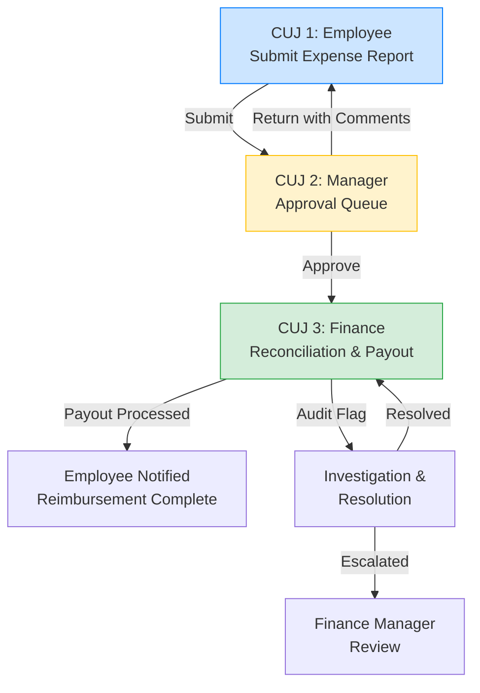

# Critical User Journeys (CUJs) — Guide, Template & Worked Example

## What Is a Critical User Journey?

A Critical User Journey (CUJ) is a step-by-step description of how a specific user accomplishes a specific goal using your system. It is not a list of features — it is the **story of what happens** when a real person sits down to do real work.

CUJs matter because they:

- **Force alignment** between business stakeholders, designers, and engineers on what the system actually does
- **Define "done"** — acceptance criteria tell you when a feature works, not just when it compiles
- **Expose gaps early** — walking through the steps reveals missing data, unclear handoffs, and edge cases before any code is written
- **Prioritize builds** — you can phase delivery around complete journeys rather than partial features

A good CUJ answers four questions:

1. **Who** is the user? (Persona)
2. **What** are they trying to accomplish? (Goal)
3. **How** do they accomplish it, step by step? (Flow)
4. **How do we know it works?** (Acceptance Criteria)

---

## How to Write CUJs for Your System

### Step 1: Identify Your Personas

List the 2-4 primary user types. For each persona, write one sentence describing their role and what they care about. Don't overthink it — "Warehouse Manager who needs to know what arrived today" is perfect.

### Step 2: List the Critical Workflows

For each persona, ask: **what are the 3-5 things they must be able to do?** These become your CUJs. If a workflow is too large (more than ~10 steps), split it into separate CUJs that link to each other.

### Step 3: Write Each CUJ Using the Template Below

Fill in every section. If you can't fill in a section, that's a signal — it means the workflow isn't well enough understood yet, and that's exactly the kind of gap CUJs are designed to surface.

### Step 4: Show How the CUJs Connect

Draw a simple navigation map showing how users move between CUJs. This catches orphaned pages and dead-end flows.

---

## Template

Copy the sections below for each CUJ in your system. Sections marked **(required)** must be filled in; sections marked **(recommended)** add significant clarity and should be included where possible.

---

### CUJ [N]: [Journey Name]

#### Goal (required)

*One or two sentences: what is the user trying to accomplish, and why does it matter?*

#### Persona (required)

*Which user type performs this journey?*

#### Trigger (required)

*What event or action causes the user to start this journey? Examples: a scheduled notification, clicking a link from another page, opening the app for the first time that day.*

#### Preconditions (required)

*What must be true before this journey can begin? Examples: data has been loaded, a prior workflow has completed, the user has a specific role or permission.*

#### Step-by-Step Flow (required)

*Walk through the journey as a numbered table. Each row is one interaction: what the user does, and what the system does in response.*

| Step | User Action | System Response |
|------|-------------|-----------------|
| 1    |             |                 |
| 2    |             |                 |
| 3    |             |                 |
| ...  |             |                 |

*If the journey has branching paths (e.g., different behavior depending on a condition), describe each path as a labeled sub-section (Path A, Path B, etc.).*

#### UI Representation (recommended)

*Show what the user sees at key moments in the journey. The goal is to communicate layout, information hierarchy, and available actions — not pixel-perfect design.*

**Use whatever format communicates the idea most effectively:**

- **ASCII wireframes** (text-based layouts embedded in the document — great for quick iteration and version control)
- **Hand-drawn sketches** (photo or scan — often the fastest way to explore layout ideas in a whiteboard session)
- **Spreadsheet mockups** (Excel or Google Sheets with cells used as a grid — effective for data-heavy screens like tables, dashboards, and reports)
- **Diagramming tools** (Figma, Miro, Lucidchart, draw.io, Balsamiq, etc. — useful when you want interactive or higher-fidelity representations)
- **Annotated screenshots** (if you have an existing system or competitor product, mark it up to show what you want to keep, change, or add)
- **Slide decks** (PowerPoint or Google Slides — sometimes the easiest way to lay out a sequence of screens as a storyboard)

The important thing is that the representation answers these questions:

1. **What information is on the screen?** (which fields, metrics, labels)
2. **How is it organized?** (cards, tables, panels, tabs)
3. **What actions can the user take?** (buttons, filters, links, selections)
4. **Where does each action lead?** (which page or CUJ comes next)

*Don't let the choice of tool slow you down. A clear hand-drawn sketch beats a polished wireframe that never gets created.*

#### Acceptance Criteria (required)

*A checklist of specific, testable statements that define when this CUJ is complete. Write them as "the system does X when Y" — each one should be verifiable by a person clicking through the UI.*

- [ ] Criterion 1
- [ ] Criterion 2
- [ ] ...

#### Sample Data (recommended)

*Provide example records that would appear in this journey. This helps designers and engineers build realistic screens and helps testers know what to expect.*

#### Error / Edge Cases (recommended)

*What happens when things go wrong? Examples: no data exists, the user has no permission, an external system is down, a search returns zero results.*

---

### Cross-CUJ Navigation Map (recommended)

*Show how the CUJs connect — which pages link to which, and what triggers the transitions. A Mermaid diagram, a hand-drawn flowchart, or even a bullet list with arrows all work.*

---

### Build Phases (recommended)

*Group the CUJs into delivery phases. Each phase should deliver at least one complete journey — avoid phases that deliver half a journey.*

| Phase | CUJs Included | What It Demonstrates |
|-------|---------------|----------------------|
| 1     |               |                      |
| 2     |               |                      |
| ...   |               |                      |

---

## Worked Example: Employee Expense Approval System

The following is a **complete, fictitious example** showing how the template above is applied to a real-world domain. Use it as a reference for the level of detail, tone, and structure expected — then adapt the content to your own system.

### System Overview

AnyCompany uses a manual, email-based expense reimbursement process. Employees submit receipts via email, managers approve via reply-all, and Finance reconciles in a spreadsheet. The new system automates submission, policy checking, approval routing, and reimbursement tracking.

### Personas

**Employee (Submitter)** — An AnyCompany staff member who incurs business expenses (travel, meals, supplies) and needs timely reimbursement. They want to submit expenses quickly and know when they'll be paid.

**Manager (Approver)** — A people manager who reviews and approves expense reports for their direct reports. They need to verify expenses comply with policy and flag anything unusual, without it consuming their day.

**Finance Analyst** — A Finance team member responsible for reconciling approved expenses against budgets, processing reimbursements, and auditing compliance. They need a clean pipeline with no missing receipts or policy violations slipping through.

### CUJ Summary

| CUJ | Name | Persona | Phase |
|-----|------|---------|-------|
| 1 | Submit an Expense Report | Employee | 1 |
| 2 | Review & Approve Expense Reports | Manager | 1 |
| 3 | Finance Reconciliation & Payout | Finance Analyst | 2 |

---

### CUJ 1: Submit an Expense Report

#### Goal

The employee creates an expense report, attaches receipts, and submits it for manager approval — all in under 5 minutes.

#### Persona

Employee (Submitter)

#### Trigger

- Employee returns from a business trip or incurs a reimbursable expense
- Employee navigates to the Expense portal from the company intranet

#### Preconditions

- Employee is authenticated via SSO
- Company expense policy (per-diem rates, category limits, receipt requirements) is loaded in the system
- Manager assignment is synced from HR system

#### Step-by-Step Flow

| Step | User Action | System Response |
|------|-------------|-----------------|
| 1 | Employee clicks "New Expense Report" | System creates a draft report with the employee's name, department, and cost center pre-populated |
| 2 | Employee enters a report title and travel dates | System validates dates are not in the future and sets the applicable per-diem rates |
| 3 | Employee clicks "Add Expense Line" | System shows a form with fields: Date, Category (dropdown), Description, Amount, Currency |
| 4 | Employee fills in the expense line and uploads a receipt photo | System OCRs the receipt, pre-fills Amount and Date if readable, and flags any discrepancy between OCR and manual entry |
| 5 | Employee reviews the pre-filled values and corrects if needed | System updates the line item and shows a green checkmark for "Receipt Attached" |
| 6 | Employee adds additional expense lines (repeats Steps 3-5) | System updates the running total and shows a per-category subtotal |
| 7 | Employee reviews the complete report | System displays a summary: total amount, number of line items, policy warnings (if any), and the assigned approver (their manager) |
| 8 | Employee clicks "Submit for Approval" | System locks the report, routes it to the manager's approval queue, and sends an email notification to the manager |

##### Path A: Policy Warning

| Step | User Action | System Response |
|------|-------------|-----------------|
| 7a | Employee reviews a policy warning (e.g., "Meal expense exceeds $75 daily limit") | System highlights the flagged line in yellow with the policy rule and limit. Report can still be submitted — the manager will see the warning. |
| 7b | Employee edits the flagged line or adds a justification note | System clears the warning (if within limits) or keeps it with the note attached for the manager |

#### UI Representation

*The wireframe below is an ASCII layout showing the report submission screen. In your own CUJs, use whatever format makes the layout clearest — a hand-drawn sketch on a whiteboard (photograph it and embed it), an Excel mockup where cells represent UI elements, a Balsamiq wireframe, or a Figma screen. The goal is to communicate what the user sees, not to produce a design deliverable.*

```
+------------------------------------------------------------------+
|  Expense Portal                          Welcome, Jane Doe  [Logout]|
+------------------------------------------------------------------+
|                                                                    |
|  New Expense Report                                                |
|  +----------------------------------------------------------------+|
|  | Title:       [Q4 Client Visit - Chicago         ]              ||
|  | Travel Dates:[10/15/2025] to [10/17/2025]                      ||
|  | Cost Center: ENG-4200 (pre-filled)                             ||
|  | Approver:    Bob Smith (auto-assigned)                         ||
|  +----------------------------------------------------------------+|
|                                                                    |
|  Expense Lines                                                     |
|  +----------------------------------------------------------------+|
|  | # | Date     | Category    | Description        | Amount | Rcpt||
|  |---|----------|-------------|--------------------|--------|-----||
|  | 1 | 10/15/25 | Airfare     | ORD→SFO round trip | $342   | ✓   ||
|  | 2 | 10/15/25 | Meals       | Client dinner      | $89    | ✓ ⚠ ||
|  | 3 | 10/16/25 | Ground Txp  | Uber to client HQ  | $34    | ✓   ||
|  | 4 | 10/16/25 | Hotel       | Marriott 1 night   | $189   | ✓   ||
|  +----------------------------------------------------------------+|
|  |                                          Subtotal: $654         ||
|  |                                                                ||
|  | [+ Add Expense Line]                                           ||
|  +----------------------------------------------------------------+|
|                                                                    |
|  Policy Warnings                                                   |
|  +----------------------------------------------------------------+|
|  | ⚠ Line 2: Meal expense ($89) exceeds daily limit ($75).        ||
|  |   Justification: [Client dinner, pre-approved by VP Sales    ] ||
|  +----------------------------------------------------------------+|
|                                                                    |
|  Report Summary                                                    |
|  +----------------------------------------------------------------+|
|  | Total: $654.00 | Lines: 4 | Warnings: 1 | Receipts: 4/4       ||
|  +----------------------------------------------------------------+|
|                                                                    |
|  [Save Draft]                            [Submit for Approval]     |
+------------------------------------------------------------------+
```

#### Acceptance Criteria

- [ ] Draft report pre-populates employee name, department, cost center, and approver from HR data
- [ ] Employee can add multiple expense lines with date, category, description, amount, and receipt
- [ ] Receipt upload triggers OCR that pre-fills amount and date (employee can override)
- [ ] System validates: dates not in the future, required fields present, receipt attached for lines > $25
- [ ] Policy warnings are shown inline with the specific rule and limit cited
- [ ] Employee can add a justification note to any policy warning
- [ ] Running total and per-category subtotals update as lines are added/edited
- [ ] "Submit" locks the report, routes to manager queue, and sends email notification
- [ ] "Save Draft" persists the report without submitting
- [ ] Submitted report shows status "Pending Approval" in the employee's report list

#### Sample Data

| Line | Date | Category | Description | Amount | Receipt | Policy Flag |
|------|------|----------|-------------|--------|---------|-------------|
| 1 | 10/15/2025 | Airfare | ORD→SFO round trip | $342.00 | flight-confirmation.pdf | — |
| 2 | 10/15/2025 | Meals | Client dinner at Gibson's | $89.00 | receipt-gibsons.jpg | Exceeds $75 daily meal limit |
| 3 | 10/16/2025 | Ground Transport | Uber to client HQ | $34.00 | uber-receipt.png | — |
| 4 | 10/16/2025 | Hotel | Marriott Magnificent Mile, 1 night | $189.00 | marriott-folio.pdf | — |

#### Error / Edge Cases

- **No receipt uploaded for a line > $25**: system blocks submission with a specific message ("Line 3 requires a receipt")
- **OCR fails on a receipt image**: system shows "Could not read receipt — please enter amount manually" and marks the receipt as "Manual Entry"
- **Duplicate submission**: if an employee submits a report with the same title and date range as an existing report, system warns "A report for these dates already exists" and requires confirmation
- **Manager not assigned**: if HR sync has no manager for the employee, system routes to Finance for manual assignment and notifies the employee

---

### CUJ 2: Review & Approve Expense Reports

#### Goal

The manager reviews pending expense reports from their team, checks for policy compliance and reasonableness, and approves or returns reports — ideally processing all pending reports in a single sitting each morning.

#### Persona

Manager (Approver)

#### Trigger

- Manager receives an email notification that a new expense report is pending their approval
- Manager navigates to the Approval Queue from the intranet or email link

#### Preconditions

- At least one expense report has been submitted and is in "Pending Approval" status for this manager
- Policy rules and limits are available for the system to highlight violations

#### Step-by-Step Flow

| Step | User Action | System Response |
|------|-------------|-----------------|
| 1 | Manager opens the Approval Queue | System displays all pending reports assigned to this manager, sorted by submission date (oldest first), with columns: Employee, Title, Total, Lines, Warnings, Submitted Date |
| 2 | Manager scans the queue for policy warnings | System shows a warning icon (⚠) next to reports that have one or more policy flags, with a count |
| 3 | Manager clicks on a report to review | System opens the Report Detail view showing all expense lines, receipts, policy warnings, and employee justifications |
| 4 | Manager reviews each line item | System shows the receipt image alongside the expense line. Policy-flagged lines are highlighted with the rule and the employee's justification (if provided). |
| 5 | Manager clicks on a receipt thumbnail | System opens a full-size receipt viewer (zoomable) |
| 6a | Manager approves the report | System moves the report to "Approved" status, notifies the employee, and routes to Finance for reimbursement |
| 6b | Manager returns the report with comments | System moves the report to "Returned" status, unlocks it for the employee to edit, and sends a notification with the manager's comments |
| 7 | Manager returns to the queue and reviews the next report | Queue updates to reflect the processed report (removed from pending) |

#### UI Representation

*This wireframe uses ASCII art, but a spreadsheet mockup would work equally well for this screen — the Approval Queue is essentially a table, and Excel's grid layout naturally represents it. If your system has a similar queue or table-heavy screen, consider mocking it up in a spreadsheet where you can adjust column widths and add color-coding to communicate priority and status.*

```
+------------------------------------------------------------------+
|  Approval Queue                               Bob Smith (Manager) |
+------------------------------------------------------------------+
|                                                                    |
|  Pending Reports (3)                                               |
|  +----------------------------------------------------------------+|
|  | Employee     | Title                | Total  | Lines | ⚠ | Date||
|  |--------------|----------------------|--------|-------|----|-----||
|  | Jane Doe     | Q4 Client Visit CHI  | $654   | 4     | 1  |10/17||
|  | Mike Chen    | AWS re:Invent Travel | $2,140 | 8     | 0  |10/18||
|  | Sara Patel   | Office Supplies Oct  | $127   | 3     | 0  |10/19||
|  +----------------------------------------------------------------+|
|                                                                    |
+------------------------------------------------------------------+

+------------------------------------------------------------------+
|  [< Back to Queue]                                                 |
|                                                                    |
|  Report Detail — Jane Doe: Q4 Client Visit CHI                    |
|  Status: Pending Your Approval                                     |
|                                                                    |
|  +-----------------------------++-------------------------------+  |
|  | Expense Lines               || Receipt Viewer                |  |
|  |-----------------------------||-------------------------------|  |
|  | 1. Airfare      $342  ✓    || [receipt image displayed here]|  |
|  | 2. Meals        $89   ✓ ⚠  ||                               |  |
|  |    ⚠ Exceeds $75 limit     ||                               |  |
|  |    Employee note: "Client   ||                               |  |
|  |    dinner, pre-approved     ||                               |  |
|  |    by VP Sales"             ||                               |  |
|  | 3. Ground Txp   $34   ✓    ||                               |  |
|  | 4. Hotel        $189  ✓    ||                               |  |
|  |-----------------------------|+-------------------------------+  |
|  | Total: $654.00              |                                   |
|  +-----------------------------+                                   |
|                                                                    |
|  Manager Comments:                                                 |
|  +----------------------------------------------------------------+|
|  | [                                                              ]||
|  +----------------------------------------------------------------+|
|                                                                    |
|  [Approve]  [Return to Employee]                                   |
+------------------------------------------------------------------+
```

#### Acceptance Criteria

- [ ] Approval Queue shows all pending reports for the logged-in manager
- [ ] Queue displays: employee name, report title, total amount, line count, warning count, submission date
- [ ] Reports with policy warnings show a visible warning indicator and count
- [ ] Queue is sortable by any column (default: oldest first)
- [ ] Clicking a report opens the detail view with all lines, receipts, and warnings
- [ ] Policy-flagged lines are highlighted with the rule cited and the employee's justification displayed
- [ ] Receipt images are viewable inline and can be expanded to full size
- [ ] "Approve" moves the report to Approved, notifies the employee, and routes to Finance
- [ ] "Return to Employee" requires a comment, moves to Returned status, unlocks for editing, and notifies the employee
- [ ] Processed reports are removed from the pending queue immediately
- [ ] Manager can see a history of previously approved/returned reports (separate tab or filter)

#### Error / Edge Cases

- **Report is withdrawn by employee while manager is reviewing**: system shows a banner "This report was withdrawn by the employee" and disables Approve/Return buttons
- **Manager tries to approve their own expense report**: system blocks and routes to skip-level manager
- **All reports processed**: queue shows "No pending reports — you're all caught up" empty state

---

### CUJ 3: Finance Reconciliation & Payout

#### Goal

The Finance Analyst reviews all manager-approved expense reports, reconciles them against department budgets, processes reimbursements in batch, and flags any anomalies for audit — ensuring employees are paid within the SLA (5 business days from approval).

#### Persona

Finance Analyst

#### Trigger

- Daily: Finance Analyst opens the Reconciliation Dashboard as part of their morning routine
- Alert: system notifies Finance when a report is approaching the 5-day SLA

#### Preconditions

- Manager has approved at least one expense report
- Department budget data is synced from the ERP system
- Payroll integration is configured for reimbursement processing

#### Step-by-Step Flow

| Step | User Action | System Response |
|------|-------------|-----------------|
| 1 | Finance Analyst opens the Reconciliation Dashboard | System shows: total approved (awaiting payout), total paid this week, total flagged for audit, SLA compliance %, and a budget utilization summary by department |
| 2 | Analyst views the Approved Queue | System displays all approved reports sorted by approval date, with columns: Employee, Department, Total, Approved By, Approval Date, Days Until SLA |
| 3 | Analyst selects reports for batch payout | Analyst checks multiple reports and clicks "Process Batch Payout" |
| 4 | System validates the batch | System checks: budget remaining for each department, no duplicate payouts, amounts match approved totals. Any issues are flagged inline. |
| 5 | Analyst confirms the batch | System processes reimbursements, updates report status to "Paid", and generates a payout summary |
| 6 | Analyst reviews the audit flag queue | System shows reports flagged by automated rules: same-day duplicates, amounts just below approval thresholds, unusually high frequency from one employee |
| 7 | Analyst investigates a flagged report | System shows the report detail with the audit flag reason and links to related reports (e.g., other reports from the same employee this quarter) |
| 8 | Analyst resolves the flag | Analyst marks as "Reviewed — No Issue" or escalates with a note |

#### UI Representation

*For this CUJ, the Finance dashboard is numbers-heavy. A spreadsheet mockup (Excel or Google Sheets) may actually be the most natural format — Finance teams think in spreadsheets, and seeing the data laid out in a familiar grid can accelerate feedback. Alternatively, a slide deck works well for walking stakeholders through the screen sequence: one slide per screen state (empty → populated → batch selected → payout confirmed).*

```
+------------------------------------------------------------------+
|  Finance Reconciliation Dashboard                                  |
+------------------------------------------------------------------+
|                                                                    |
|  Summary Cards                                                     |
|  +----------+  +----------+  +----------+  +----------+           |
|  | 14       |  | $8,420   |  | 2        |  | 96%      |           |
|  | Approved |  | Paid     |  | Audit    |  | SLA      |           |
|  | Awaiting |  | This     |  | Flags    |  | Compliance|           |
|  | Payout   |  | Week     |  |          |  |          |           |
|  +----------+  +----------+  +----------+  +----------+           |
|                                                                    |
|  Budget Utilization by Department                                  |
|  +----------------------------------------------------------------+|
|  | Department   | Budget    | Spent YTD  | Remaining | % Used     ||
|  |--------------|-----------|------------|-----------|------------|  |
|  | Engineering  | $50,000   | $38,420    | $11,580   | 77% ██░░░ ||
|  | Sales        | $80,000   | $62,100    | $17,900   | 78% ██░░░ ||
|  | Marketing    | $30,000   | $28,900    | $1,100    | 96% █████ ||
|  +----------------------------------------------------------------+|
|                                                                    |
|  Approved Reports — Awaiting Payout                                |
|  +----------------------------------------------------------------+|
|  |[✓]| Employee    | Dept | Total  | Approved By | Date   | SLA  ||
|  |---|-------------|------|--------|-------------|--------|------||
|  |[✓]| Jane Doe    | ENG  | $654   | Bob Smith   | 10/20  | 3d   ||
|  |[✓]| Mike Chen   | ENG  | $2,140 | Bob Smith   | 10/20  | 3d   ||
|  |[ ]| Sara Patel  | MKT  | $127   | Lisa Wong   | 10/21  | 4d   ||
|  +----------------------------------------------------------------+|
|                                                                    |
|  [Process Batch Payout (2 selected — $2,794)]                      |
+------------------------------------------------------------------+
```

#### Acceptance Criteria

- [ ] Dashboard shows summary cards: approved awaiting payout, paid this week, audit flags, SLA compliance %
- [ ] Budget utilization table shows spend vs. budget by department with visual indicator
- [ ] Approved queue shows all manager-approved reports with days-until-SLA countdown
- [ ] Reports approaching SLA (≤1 day remaining) are highlighted in red
- [ ] Analyst can select multiple reports for batch payout processing
- [ ] Batch validation checks: sufficient department budget, no duplicate payouts, amount matches
- [ ] "Process Batch Payout" generates a confirmation summary before executing
- [ ] Paid reports move to "Paid" status with payout date and reference number
- [ ] Employee receives email notification when reimbursement is processed
- [ ] Audit flag queue shows reports flagged by automated rules with the specific flag reason
- [ ] Analyst can mark flags as "Reviewed — No Issue" or escalate with a required note
- [ ] Audit actions are logged with analyst name and timestamp (immutable audit trail)

#### Error / Edge Cases

- **Department budget exceeded**: system blocks payout for that report and shows "Marketing budget is $1,100 under the $127 requested — requires Finance Manager override"
- **Duplicate payout detected**: system shows "This report was already paid on 10/19 (Ref #PAY-4821)" and prevents re-processing
- **Payroll system unavailable**: system queues the payout and shows "Payout queued — payroll system offline. Will retry automatically."

---

### Cross-CUJ Navigation Map



---

### Build Phases

| Phase | CUJs Included | What It Demonstrates |
|-------|---------------|----------------------|
| 1 | CUJ 1 (Submit) + CUJ 2 (Approve) | Core loop: employee submits, manager approves. Demonstrates OCR, policy checking, and approval workflow. |
| 2 | CUJ 3 (Finance Reconciliation) | End-to-end pipeline: submission → approval → payout. Demonstrates budget integration, batch processing, and audit. |

---

## How to Use This Document

1. **Read the worked example** to calibrate on the expected level of detail
2. **Copy the template sections** for each CUJ in your own system
3. **Fill in every section** — the required sections are non-negotiable; the recommended sections will save significant time during build
4. **Choose the right UI representation format** for each screen — use whichever method communicates the layout most clearly and efficiently for your team
5. **Review with your team** — walk through each CUJ step-by-step and ask "is this what actually happens?" The conversation this sparks is as valuable as the document itself
6. **Iterate** — CUJs are living documents. As you learn more (from user feedback, technical constraints, or scope changes), update them

---

*This document was prepared as a guide for creating Critical User Journeys. The "Employee Expense Approval System" example is entirely fictitious and is intended only to illustrate the structure and level of detail expected.*
