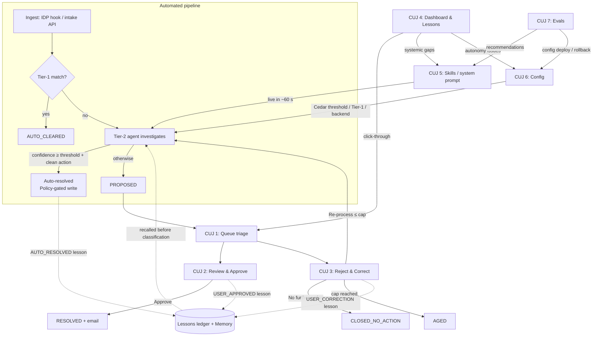

# Critical User Journeys — Reconciliation Workflow Agent

_This document applies the structure defined in [`CUJ-guide-and-template.md`](CUJ-guide-and-template.md) to this repository's application. It describes the journeys as built; see the root [`README.md`](../README.md) for architecture detail._

## System Overview

The Reconciliation Workflow Agent is an agentic reconciliation platform. Documents processed by an
IDP (Intelligent Document Processing) pipeline or structured datasets submitted via API — are
ingested as reconciliation items. A deterministic Tier-1 pass auto-clears exact matches; everything
else is investigated by an agent that characterizes the break and invokes one or more configurable
investigation skills to reconcile it, then either **resolves the item autonomously** (when its computed confidence clears an
admin-set threshold and a clean, provable ledger action exists) or **proposes a resolution for
human review**. Analysts approve or correct every human-reviewed proposal; corrections are captured
as lessons and fed back to the agent. The AI Engineer can tune the agent live — skills, system prompt,
autonomy threshold, backend — and monitor a continuous evaluation pipeline.

The humans interact with a Next.js web app (Okta OIDC login) with seven tabs: **Dashboard**,
**Queue**, **Case detail**, **Skills**, **Lessons**, **Evals**, **Config**.

### Terms

- **The agent** — the LLM investigation loop (AgentCore Runtime container or managed Harness):
  characterizes the break, then invokes **one or more** relevant skill procedures via gateway tools
  (skills are a composable library, not one-of-N classes) and proposes a resolution.
- **The worker** — the agent-worker Lambda (`backend/tier1/agent_worker.py`, and in harness mode
  `backend/harness_agent/worker.py`): the **dispatch + HITL driver**. It selects the backend,
  assembles prompts and the trace, services the harness `submit_proposal` pause/resume, computes
  the composite confidence, executes the Policy-gated ledger write through the gateway when the
  decision is "execute", and contains failures (a case is never stranded `IN_PROGRESS`).
- **The gateway trust layer** — enforcement lives in the AgentCore Gateway, uniformly for agent
  and human callers: Cedar **Policy** gates the ledger write on confidence (agents) or principal
  (human approve), and makes the workflow-status tool (`recon_update_status`) **platform-only**;
  the Lambda **REQUEST interceptor** enforces provenance (**the ledger reference is derived from
  actual `search_ledger` outputs, never model-supplied**) and re-checks case-state transitions.
  The model is propose-only: it cannot write to the ledger or move its own case.

## Personas

**Reconciliation Analyst**: Operations staff who work the exception queue daily. They review
agent-proposed resolutions against the source document and ledger evidence, then approve or
correct. They care about clearing breaks accurately and quickly, and about being able to verify
the agent's reasoning rather than take it on faith.

**Reconciliation Operations Lead**: Owns throughput, aging, and auditability across the book.
They monitor lifecycle counts, watch the autonomous-resolution rate, and drill into any state
that is accumulating. They care about SLA health and about proving every status transition is
logged.

**AI Engineer**: Configures and improves the agent itself: authors
investigation skills, edits the system prompt, sets the auto-resolve confidence threshold,
enables/disables deterministic Tier-1, makes updates to the agent backend (e.g. switching between runtime ⇄ harness),
and acts on evaluation metrics and recommendations. They care about raising straight-through-processing safely.

## CUJ Summary

| CUJ | Name                                                | Persona                        | Phase |
| --- | --------------------------------------------------- | ------------------------------ | ----- |
| 1   | Triage the Exception Queue                          | Reconciliation Analyst         | 1     |
| 2   | Review & Approve an Agent-Proposed Resolution       | Reconciliation Analyst         | 1     |
| 3   | Reject & Correct a Proposal                         | Reconciliation Analyst         | 1     |
| 4   | Monitor Reconciliation Health & Autonomous Activity | Reconciliation Operations Lead | 2     |
| 5   | Create or Edit an Investigation Skill               | AI Engineer                    | 2     |
| 6   | Tune Autonomy & Platform Configuration              | AI Engineer                    | 2     |
| 7   | Evaluate & Optimize the Agent                       | AI Engineer                    | 3     |

---

## CUJ 1: Triage the Exception Queue

### Goal

The analyst scans all open exceptions (items Tier-1 could not auto-clear), decides what to work
first, and disposes of routine items in bulk so that agent-proposed cases get human decisions
the same day they are proposed.

### Persona

Reconciliation Analyst

### Trigger

- Analyst opens the app at the start of a shift and navigates to the **Queue** tab (`/recon/queue`)
- Analyst returns to the queue after finishing a case review (CUJ 2/3)

### Preconditions

- Analyst is authenticated via Okta OIDC (the deployed `auth_provider`)
- At least one reconciliation item has been ingested (IDP hook or intake API) and was not
  auto-cleared by Tier-1 — i.e. cases exist in `PENDING`, `IN_PROGRESS`, or `PROPOSED`

### Step-by-Step Flow

| Step | User Action                                         | System Response                                                                                                                                                                                |
| ---- | --------------------------------------------------- | ---------------------------------------------------------------------------------------------------------------------------------------------------------------------------------------------- |
| 1    | Analyst opens the Queue tab                         | System lists open exceptions (`PENDING` / `IN_PROGRESS` / `PROPOSED`) with per-row: item id, source, the break characterization (its class), status, and a confidence meter for proposed cases |
| 2    | Analyst filters/sorts to `PROPOSED` cases           | System narrows the list to cases awaiting a human decision                                                                                                                                     |
| 3    | Analyst scans confidence meters                     | Low-confidence and IDP-penalized items are visually distinguishable, so the analyst can prioritize judgment calls                                                                              |
| 4    | Analyst multi-selects several routine cases         | System enables the bulk-action controls with the selection count                                                                                                                               |
| 5    | Analyst applies a bulk status update with a comment | System updates every selected case, writes one audit record per transition to the append-only audit table, and refreshes the queue                                                             |
| 6    | Analyst clicks a single case row                    | System navigates to Case detail (`/recon/case/[id]`) — continues as CUJ 2 or CUJ 3                                                                                                             |

### UI Representation

```
+---------------------------------------------------------------------------+
|  Recon  |  Dashboard  [Queue]  Skills  Evals  Lessons  Config    J.Doe ▾   |
+---------------------------------------------------------------------------+
|  Open Exceptions (7)                     Filter: [PROPOSED ▾]  [Search…]   |
|  +-----------------------------------------------------------------------+|
|  |[ ]| Item ID          | Class                 | Status      | Confidence||
|  |---|------------------|-----------------------|-------------|-----------||
|  |[✓]| idp-8f3c21       | record-match-review   | PROPOSED    | ▓▓▓▓░ 0.82||
|  |[✓]| idp-77aa04       | document-cross-ref…   | PROPOSED    | ▓▓▓░░ 0.71||
|  |[ ]| api-batch042-17  | record-match-review   | PROPOSED    | ▓▓▓▓░ 0.88||
|  |[ ]| idp-91d2c8       | unknown               | PROPOSED    | ▓▓░░░ 0.44||
|  |[ ]| idp-3e0b55       | —                     | IN_PROGRESS | —         ||
|  +-----------------------------------------------------------------------+|
|  2 selected   [Bulk update ▾]  Comment: [___________________]  [Apply]    |
+---------------------------------------------------------------------------+
```

### Acceptance Criteria

- [ ] Queue shows only open lifecycle states (`PENDING`, `IN_PROGRESS`, `PROPOSED`) — terminal cases do not appear
- [ ] Each `PROPOSED` row shows the classified skill name and the composite confidence as a meter
- [ ] Multi-select enables bulk status updates, and a comment can be attached to the bulk action
- [ ] Every status transition (single or bulk) produces an append-only audit record
- [ ] Clicking a row opens the case detail page for that item
- [ ] Queue reflects new ingests and agent completions without a redeploy (refresh shows current state)

### Sample Data

| Item ID         | Source                          | Class                    | Status      | Confidence |
| --------------- | ------------------------------- | ------------------------ | ----------- | ---------- |
| idp-8f3c21      | IDP (custodian payment advice)  | record-match-review      | PROPOSED    | 0.82       |
| idp-77aa04      | IDP (draw notice)               | document-cross-reference | PROPOSED    | 0.71       |
| api-batch042-17 | Intake API (structured dataset) | record-match-review      | PROPOSED    | 0.88       |
| idp-91d2c8      | IDP (unrecognized fax cover)    | unknown                  | PROPOSED    | 0.44       |
| idp-3e0b55      | IDP (payment advice)            | —                        | IN_PROGRESS | —          |

### Error / Edge Cases

- **Empty queue**: system shows an explicit "no open exceptions" state rather than an empty table
- **Item stuck `IN_PROGRESS`** (agent worker failed): the case remains visible in the queue rather than disappearing, so it can be noticed and re-driven
- **Tier-1 disabled** (Config tab): all new items escalate directly to the agent — queue volume rises but behavior is otherwise identical
- **Session expired**: any queue action redirects through the Okta login flow and returns to the queue

---

## CUJ 2: Review & Approve an Agent-Proposed Resolution

### Goal

The analyst verifies an agent's proposed resolution against the source document, the agent's
step-by-step evidence trail, and the ledger — then approves it, closing the break and notifying
the counterparty/stakeholders. This is the core human-in-the-loop decision of the platform.

### Persona

Reconciliation Analyst

### Trigger

- Analyst clicks a `PROPOSED` case in the Queue (CUJ 1, step 6)

### Preconditions

- The Tier-2 agent has completed its loop for the item: classification, skill-driven
  investigation, and a proposal with composite confidence **below** the auto-resolve threshold
  (otherwise it would have executed autonomously — see CUJ 4)
- For IDP-sourced items: the ingest hook embedded the IDP results (section classification,
  extracted fields, page-preview images) into the recon item at ingest

### Step-by-Step Flow

| Step | User Action                                   | System Response                                                                                                                                                                                                                        |
| ---- | --------------------------------------------- | -------------------------------------------------------------------------------------------------------------------------------------------------------------------------------------------------------------------------------------- |
| 1    | Analyst opens the case                        | System shows the case header (status `PROPOSED`, class, composite confidence vs. threshold) and the IDP document split view: section tabs on one side ⇄ page images + extracted field values on the other                              |
| 2    | Analyst inspects the source document          | Split view lets the analyst flip document sections and compare page images against the extracted fields the agent relied on                                                                                                            |
| 3    | Analyst reads characterization + reasoning    | System shows the break characterization, which skill(s) the agent invoked, the model's reasoning, and the confidence breakdown (self-consistency / evidence grounding / self-report, with the IDP low-confidence penalty when applied) |
| 4    | Analyst expands the agent trace               | System renders each investigation step as a typed reasoning step: tool called (`search_ledger`, `search_guidance`, `get_results`, `listSharedMailboxMessages`…), inputs/outputs, reasoning, and cited evidence                         |
| 5    | Analyst checks the proposed resolution        | System shows the structured `proposed_action` — e.g. set ledger draw `DRW-2026-00417` to `Confirmed` — with the ledger reference that was **derived by the worker from `search_ledger` results**, never free-typed by the model        |
| 6    | Analyst clicks **Approve** (optional comment) | System transitions `PROPOSED → APPROVED`, executes the resolution path, sends the notification email via Microsoft Graph (from the shared mailbox, through the gateway tool), and closes the case as `RESOLVED`                        |
| 7    | (parallel)                                    | System records the decision as a `USER_APPROVED` lesson in the lessons ledger **and** as an AgentCore Memory event, so future classifications weight this outcome                                                                      |

### UI Representation

```
+---------------------------------------------------------------------------+
|  ← Back to Queue      Case idp-8f3c21          Status: PROPOSED            |
|  Class: record-match-review        Overall Confidence: 0.82 (threshold .95)|
+---------------------------------------------------------------------------+
|  Document (IDP)                      |  Agent Analysis                     |
|  [Advice] [Remittance] [Terms]       |  Classification: record-match-review|
|  +-------------------------------+   |  Reasoning: amounts differ by fee…  |
|  |                               |   |  Confidence: cons .84 · grnd .78 ·  |
|  |   [page image preview]        |   |              self .85 · IDP ×0.9    |
|  |                               |   |-------------------------------------|
|  +-------------------------------+   |  Agent Trace                        |
|  Extracted fields                    |  1. search_ledger(ref=INV-2081…) ✓  |
|  Amount:    EUR 1,250,000.00         |     → 1 match: DRW-2026-00417       |
|  Value date: 2026-07-18              |  2. search_guidance("fee deduct…") ✓|
|  Reference: INV-2081-EU              |  3. Evidence: advice line 12 …      |
|                                      |-------------------------------------|
|                                      |  Proposed Resolution                |
|                                      |  set_draw_status(DRW-2026-00417,    |
|                                      |    Confirmed) — fee-adjusted match  |
+---------------------------------------------------------------------------+
|  Comment (optional): [_____________________]   [Approve]  [Disapprove]    |
+---------------------------------------------------------------------------+
```

### Acceptance Criteria

- [ ] Case detail shows the IDP split view (section tabs ⇄ page images + extracted fields) for IDP-sourced items
- [ ] Classification, reasoning, and the composite-confidence breakdown are visible
- [ ] The agent trace lists every tool call with inputs, outputs, reasoning, and cited evidence
- [ ] The proposed action displays the worker-derived ledger reference (0 or >1 candidate matches ⇒ no action is proposed)
- [ ] **Approve** transitions the case `PROPOSED → APPROVED → RESOLVED` and sends the notification email from the shared mailbox via the Microsoft Graph gateway tool
- [ ] An optional comment on approval is persisted with the decision
- [ ] The decision is captured as a `USER_APPROVED` lesson (DynamoDB ledger + AgentCore Memory event)
- [ ] The status transitions appear in the append-only audit table
- [ ] The resolved case leaves the Queue and is reachable from the Dashboard's filtered history

### Sample Data

Case `idp-8f3c21` — custodian payment advice for EUR 1,250,000.00; general ledger shows
EUR 1,249,850.00 on draw `DRW-2026-00417` (custodian fee deducted at source). Agent classifies
`record-match-review`, cites the fee line on the advice, proposes `set_draw_status(DRW-2026-00417,
Confirmed)` with composite confidence 0.82 — below the 0.85 threshold, so it halts for review.

### Error / Edge Cases

- **Notification email fails** (gateway or Graph error): the failure is surfaced to the analyst; the approval decision and audit trail are not silently lost
- **Case already decided** (another analyst, or auto-resolved between page load and click): the action fails safely and the page shows the current status instead of double-applying
- **No clean ledger action** (agent found 0 or multiple candidate references): the proposal shows investigation findings without an executable action; approval closes the case without a ledger write
- **IDP flagged low-confidence fields**: the ×0.9 penalty is visible in the confidence breakdown so the analyst knows to scrutinize the extracted values

---

## CUJ 3: Reject & Correct a Proposal

### Goal

The analyst disagrees with the agent's proposal, records _why_ (a required correction comment),
and chooses the outcome: close the case with no action, or send it back to the agent for
re-processing with the correction applied. Either way the correction becomes a lesson the agent
learns from — this journey is the platform's feedback loop.

### Persona

Reconciliation Analyst

### Trigger

- While reviewing a `PROPOSED` case (CUJ 2), the analyst finds the classification, evidence, or
  proposed action wrong or insufficient

### Preconditions

- Case is in `PROPOSED` status
- Same case-detail context as CUJ 2

### Step-by-Step Flow

| Step | User Action                                                                                                                        | System Response                                                                                               |
| ---- | ---------------------------------------------------------------------------------------------------------------------------------- | ------------------------------------------------------------------------------------------------------------- |
| 1    | Analyst clicks **Disapprove**                                                                                                      | System requires a correction comment before the action can proceed (unlike Approve, the comment is mandatory) |
| 2    | Analyst writes the correction (e.g. "This is a duplicate advice — the original already cleared on 07/15, do not confirm the draw") | System accepts the comment and asks for the outcome                                                           |
| 3    | Analyst selects an outcome                                                                                                         | Two paths — see below                                                                                         |

#### Path A: No further action

| Step | User Action                           | System Response                                                                                                                                                |
| ---- | ------------------------------------- | -------------------------------------------------------------------------------------------------------------------------------------------------------------- |
| 3a   | Analyst selects **No further action** | System transitions `PROPOSED → REJECTED → CLOSED_NO_ACTION` (terminal), records the audit transitions, and captures the decision as a `USER_CORRECTION` lesson |

#### Path B: Re-process with correction

| Step | User Action                                                             | System Response                                                                                                                                        |
| ---- | ----------------------------------------------------------------------- | ------------------------------------------------------------------------------------------------------------------------------------------------------ |
| 3b   | Analyst selects **Re-process**                                          | System stores the correction, transitions the case back to `IN_PROGRESS`, and re-invokes the agent worker with the correction available to the new run |
| 4b   | (later) Analyst sees the case reappear in the Queue as `PROPOSED`       | The new proposal reflects the correction; the analyst reviews again (CUJ 2)                                                                            |
| 5b   | If the case has already been re-processed up to the cap (default **3**) | System ages the case out to `AGED` (terminal) instead of looping forever                                                                               |

### UI Representation

The same case-detail screen as CUJ 2; **Disapprove** opens a modal:

```
+------------------------------------------------------+
|  Disapprove case idp-8f3c21                          |
|                                                      |
|  Correction (required):                              |
|  [ Duplicate advice — original cleared 07/15.     ]  |
|  [ Do not confirm DRW-2026-00417.                 ]  |
|                                                      |
|  Outcome:                                            |
|  (•) Re-process with this correction   (2 of 3 left) |
|  ( ) No further action — close case                  |
|                                                      |
|                       [Cancel]   [Confirm Disapprove]|
+------------------------------------------------------+
```

### Acceptance Criteria

- [ ] Disapprove is blocked until a correction comment is entered
- [ ] Outcome **No further action** transitions the case to `CLOSED_NO_ACTION` (terminal)
- [ ] Outcome **Re-process** stores the correction, returns the case to `IN_PROGRESS`, and re-invokes the agent
- [ ] The re-process count is enforced against the cap (default 3); at the cap the case transitions to `AGED`
- [ ] Every rejection is captured as a `USER_CORRECTION` lesson (DynamoDB ledger + AgentCore Memory event) and appears in the Lessons tab
- [ ] The agent's next run on the item can retrieve the correction (lessons recall happens before classification)
- [ ] All transitions are written to the append-only audit table

### Sample Data

Lesson record: `item idp-8f3c21 · trigger USER_CORRECTION · "Duplicate advice — original cleared
07/15, do not confirm the draw" · analyst jdoe · 2026-07-25T14:02Z · outcome re-process (attempt 2/3)`.

### Error / Edge Cases

- **Analyst tries to submit without a comment**: the confirm button stays disabled / returns a validation error naming the missing field
- **Re-process returns the same wrong answer**: each attempt consumes one of the capped retries; at the cap the case ages out (`AGED`) rather than ping-ponging indefinitely
- **Agent worker invocation fails on re-process**: the case remains `IN_PROGRESS` and visible in the queue rather than being lost
- **Concurrent decision**: if the case status changed since page load, the rejection fails safely with the current status shown

---

## CUJ 4: Monitor Reconciliation Health & Autonomous Activity

### Goal

The operations lead sees, at a glance, where every case in the book stands — how much Tier-1
auto-cleared, how much the agent resolved autonomously, what is waiting on humans, and what has
aged out — and drills into any state that looks wrong. They also spot-check autonomous
resolutions to keep trust in straight-through processing.

### Persona

Reconciliation Operations Lead

### Trigger

- Daily: lead opens the **Dashboard** tab (`/recon/dashboard`) as part of the morning routine
- Ad hoc: after a threshold or skill change (CUJ 5/6), to watch the effect on the mix

### Preconditions

- Cases exist across lifecycle states (the platform has been ingesting items)

### Step-by-Step Flow

| Step | User Action                                                    | System Response                                                                                                                                                                   |
| ---- | -------------------------------------------------------------- | --------------------------------------------------------------------------------------------------------------------------------------------------------------------------------- |
| 1    | Lead opens the Dashboard                                       | System shows lifecycle status counts across **all** cases: `PENDING`, `IN_PROGRESS`, `PROPOSED`, `APPROVED`, `RESOLVED`, `AUTO_CLEARED`, `REJECTED`, `CLOSED_NO_ACTION`, `AGED`   |
| 2    | Lead clicks a status count (e.g. `AUTO_CLEARED` or `RESOLVED`) | System opens the filtered case history for that status — click-through, not a dead-end metric                                                                                     |
| 3    | Lead opens an auto-resolved case                               | Case detail shows the same evidence package an analyst would see (trace, confidence ≥ threshold, Policy-permitted `set_draw_status` write) plus the `AUTO_RESOLVED` lesson record |
| 4    | Lead reviews the **Lessons** tab (`/recon/lessons`)            | System lists captured analyst decisions (`USER_APPROVED`, `USER_CORRECTION`, `AUTO_RESOLVED`) — the ground truth being fed back to the agent and used by the evaluation pipeline  |
| 5    | Lead notices `AGED` count rising                               | Filtered history shows which items hit the re-process cap; lead routes systemic patterns to the AI Engineer (new/edited skill — CUJ 5)                                            |

### UI Representation

```
+---------------------------------------------------------------------------+
|  Recon Ops Dashboard                                                       |
|  +---------+ +---------+ +---------+ +---------+ +---------+ +---------+  |
|  |   142   | |    12   | |    7    | |    38   | |    61   | |    3    |  |
|  | AUTO_   | | IN_     | | PROPOSED| | RESOLVED| | AUTO-   | |  AGED   |  |
|  | CLEARED | | PROGRESS| | (await  | | (human  | | RESOLVED| | (cap    |  |
|  | (Tier-1)| | (agent) | |  human) | | approved| | (agent) | |  hit)   |  |
|  +---------+ +---------+ +---------+ +---------+ +---------+ +---------+  |
|        each card clicks through to the filtered case history               |
+---------------------------------------------------------------------------+
```

### Acceptance Criteria

- [ ] Dashboard shows counts for every lifecycle status, including terminal states
- [ ] Each count clicks through to a filtered case history for that status
- [ ] Auto-resolved cases expose the full evidence package (trace, confidence, executed action) for after-the-fact review
- [ ] Lessons tab lists analyst decisions and corrections with item, trigger type, comment, and timestamp
- [ ] Counts reconcile with the Queue view (open states) — no case is invisible to both

### Sample Data

Morning snapshot: 263 items ingested this week → 142 `AUTO_CLEARED` (Tier-1), 61 `RESOLVED`
autonomously by the agent, 38 approved by analysts, 7 awaiting review, 12 in flight, 3 aged out.

### Error / Edge Cases

- **No data yet** (fresh environment): dashboard renders zero-counts rather than erroring
- **A status count looks impossible** (e.g. `IN_PROGRESS` growing without draining): filtered history + audit trail identify stuck items; this is the entry point for operational debugging
- **Spot-check finds a bad autonomous resolution**: lead's remediation path is the Config tab — raise the threshold or disable auto-resolve (CUJ 6); the Cedar Policy gate updates at runtime

---

## CUJ 5: Create or Edit an Investigation Skill

### Goal

The AI Engineer adds a new investigation/resolution skill — or improves an existing one — by
authoring a `SKILL.md` file in the UI. Skills are a **composable library of procedures** (not
mutually-exclusive classes); the agent invokes one or more relevant skills per item. Because the
library is served live from S3, the agent picks the change up within ~60 seconds, with no redeploy.

### Persona

AI Engineer

### Trigger

- A recurring break type is being classified `unknown` or aging out (signal from CUJ 4)
- Evaluation recommendations (CUJ 7) or analyst feedback suggest a skill's procedure is weak

### Preconditions

- AI Engineer is authenticated; **Skills** tab (`/recon/skills`) is reachable
- The gateway tools the skill will reference exist (e.g. `search_ledger`, `search_guidance`,
  `get_results`, `search_correspondence`, `set_draw_status`). Reference the **model-callable** name:
  the mailbox read is `search_correspondence` (the sanitized wrapper), never the raw
  `listSharedMailboxMessages`, whose `$`-prefixed OData arguments cannot be offered to a model. There
  is no send tool to reference on either backend — a skill that needs a counterparty email declares
  `tools: []` and tells the model to write the message into `submit_proposal`'s `email_draft`, which
  an analyst then approves on the case.

### Step-by-Step Flow

| Step | User Action                                                                    | System Response                                                                                                                                              |
| ---- | ------------------------------------------------------------------------------ | ------------------------------------------------------------------------------------------------------------------------------------------------------------ |
| 1    | AI Engineer opens the Skills tab                                               | System shows one tile per skill (name, description, tools from frontmatter); clicking a tile opens it **read-only**                                          |
| 2    | AI Engineer clicks **Edit** on a skill (or **Create** for a new one)           | System opens the SKILL.md editor: YAML frontmatter (`name`, `description`, `tools: [...]`, optional `model`) + free-text procedure body                      |
| 3    | AI Engineer writes the investigation procedure                                 | The markdown body _is_ the procedure the agent executes step-by-step during investigation                                                                    |
| 4    | AI Engineer saves                                                              | System writes `skills/<name>/SKILL.md` to S3 (directory-per-skill layout)                                                                                    |
| 5    | AI Engineer waits ~60 s                                                        | Runtime backend refreshes its skill cache (~60 s); harness backend loads per-session — the agent can invoke the new/updated skill on the next escalated item |
| 6    | (optional) AI Engineer opens **System prompt** (`/recon/skills/system-prompt`) | Same live-edit mechanic for the agent's system prompt                                                                                                        |
| 7    | AI Engineer verifies                                                           | The next case where the skill applies shows the agent invoking it; CUJ 4/7 confirm the effect over time                                                      |

### UI Representation

Skill tiles grid → editor. Example frontmatter as edited:

```markdown
---
name: duplicate-advice-check
description: Detect re-sent payment advices already cleared in the ledger
tools: [search_ledger, search_correspondence]
---

1. Extract the advice reference and value date from the item fields.
2. Call search_ledger with the reference; if a posting is already Confirmed
   within tolerance of the amount, treat this advice as a duplicate.
3. Search the shared mailbox for prior advices with the same reference…
```

### Acceptance Criteria

- [ ] Skills tab lists every deployed skill with name, description, and tools; tiles open read-only and Edit is an explicit action
- [ ] Create/edit/delete round-trips to the S3 directory-per-skill layout (`skills/<name>/SKILL.md`)
- [ ] Frontmatter `tools:` constrains which gateway tools the skill's investigation uses
- [ ] The agent picks up the updated skill library within ~60 s (runtime) / next session (harness) with **no redeploy**
- [ ] The `unknown` fallback skill cannot be deleted
- [ ] The system prompt is editable through the same live mechanism
- [ ] Classification below the global threshold (`DEFAULT_CLASS_THRESHOLD` 0.6) still falls back to `unknown`

### Sample Data

Pre-created catalog: `record-match-review`, `document-cross-reference`, `consult-guidance`,
`correspondence-search`, `counterparty-contact-draft`, `ledger-status-resolution`, `unknown`.

### Error / Edge Cases

- **Invalid frontmatter** (missing `name`/`description`, malformed YAML): save is rejected with the validation error; the live catalog is not corrupted
- **Skill references a tool the gateway doesn't expose**: the tool call fails at investigation time and is visible in the agent trace — the skill should be corrected
- **Deleting a skill that live cases referenced**: existing cases keep their recorded characterization; only future investigations are affected
- **Attempt to delete `unknown`**: blocked — it is the required escalate-with-context fallback

---

## CUJ 6: Tune Autonomy & Platform Configuration

### Goal

The AI Engineer adjusts how much the platform does without humans: the auto-resolve confidence
threshold (enforced server-side by the AgentCore Policy Cedar gate), the Tier-1 deterministic
pass, the agent backend (runtime ⇄ harness), and the model — all at runtime from the **Config**
tab, without a redeploy.

### Persona

AI Engineer

### Trigger

- Ops lead reports a bad autonomous resolution or wants more straight-through processing (CUJ 4)
- An A/B comparison of the two agent backends is planned (CUJ 7 follows up with metrics)

### Preconditions

- AI Engineer is authenticated; **Config** tab (`/recon/config`) is reachable
- AgentCore Policy is attached to the egress tools gateway (ENFORCE mode by default)

### Step-by-Step Flow

| Step | User Action                                                     | System Response                                                                                                                                                                                                       |
| ---- | --------------------------------------------------------------- | --------------------------------------------------------------------------------------------------------------------------------------------------------------------------------------------------------------------- |
| 1    | AI Engineer opens the Config tab                                | System shows current values: Tier-1 toggle (with inline read-only source), auto-resolve threshold (default 0.85, disableable), agent backend selector (with inline code viewer / harness skill list), model selection |
| 2    | AI Engineer edits the auto-resolve threshold (e.g. 0.85 → 0.90) | System **rewrites the Cedar policy at runtime** via the Policy `UpdatePolicy` API — the gateway gate tracks the new value immediately; the SSM copy the worker reads is only an execute-vs-escalate hint              |
| 3    | AI Engineer disables auto-resolve entirely                      | Every agent run now halts at `PROPOSED` for human review; the Policy gate blocks any below-threshold write regardless                                                                                                 |
| 4    | AI Engineer toggles Tier-1 off                                  | New items skip deterministic matching and escalate straight to the agent (SSM-backed, effective at runtime)                                                                                                           |
| 5    | AI Engineer switches the agent backend `runtime → harness`      | Subsequent escalations run on the managed AgentCore Harness (config-declared) instead of the Strands container — instant A/B; flipping back is instant rollback                                                       |
| 6    | AI Engineer verifies                                            | Dashboard mix (CUJ 4) and Evals metrics (CUJ 7) reflect the change                                                                                                                                                    |

### UI Representation

```
+---------------------------------------------------------------------------+
|  Config                                                                    |
|  Tier-1 deterministic matching       [ ON ▾]   (view source ⌄)             |
|  Auto-resolve threshold              [0.85 ]   [Disable auto-resolve]      |
|    ↳ enforced by AgentCore Policy (Cedar, ENFORCE) on the tools gateway    |
|  Agent backend                       (•) runtime   ( ) harness             |
|    ↳ inline code viewer / harness skill list                               |
|  Model                               [us.anthropic.claude-sonnet-5 ▾]      |
+---------------------------------------------------------------------------+
```

### Acceptance Criteria

- [ ] Threshold edit rewrites the Cedar policy statements at runtime (no redeploy) — a below-threshold `set_draw_status` is blocked **at the gateway**, not just in app code
- [ ] Disabling auto-resolve forces all agent outcomes to `PROPOSED`
- [ ] Tier-1 toggle takes effect for newly ingested items without redeploy, and its source is viewable read-only inline
- [ ] Backend switch changes which backend handles subsequent escalations; in-flight items complete on the backend that started them
- [ ] Model selection applies per backend
- [ ] Config values shown always reflect the current SSM/Policy state (no stale cache after save)

### Sample Data

`auto_resolve_threshold = 0.85` → agent auto-resolved case `idp-9a11e0` (composite 0.888, single
matched reference `DRW-2026-00417`); after raising to 0.95, an identical-confidence case halts at
`PROPOSED` — 0.95 is above what the composite can reach at the model's typical self-report, which
is exactly why the seeded default is 0.85 (see README, "What the composite can actually reach").

### Error / Edge Cases

- **Cedar rewrite fails** (Policy API error): the UI surfaces the failure; the admin must not be left believing the gate moved when it didn't
- **Policy in `LOG_ONLY` mode** (operational choice): decisions are logged but not blocked — the Config threshold is then advisory; ENFORCE is the default
- **Backend switched while items are in flight**: no items are lost; each item is driven by the worker path that picked it up
- **Threshold set very low**: the Policy gate still applies exactly the configured value — provenance (written reference must equal the persisted proposal) and the status allowlist remain enforced in the write Lambda regardless

---

## CUJ 7: Evaluate & Optimize the Agent

### Goal

The AI Engineer reviews continuous evaluation scores of agent sessions against analyst
ground-truth, runs authoritative batch re-scores, applies managed prompt/tool recommendations,
and deploys (or rolls back) versioned harness configurations — closing the improvement loop with
evidence instead of intuition.

### Persona

AI Engineer

### Trigger

- Weekly optimization review, or after a skill/threshold/backend change (CUJ 5/6)
- A drop in the analyst-agreement score

### Preconditions

- **Harness** backend active (evaluation scores harness OTel traces) and account-level CloudWatch
  Transaction Search enabled
- Enough analyst decisions exist in the lessons ledger to serve as ground truth

### Step-by-Step Flow

| Step | User Action                                                    | System Response                                                                                                                                                                                                               |
| ---- | -------------------------------------------------------------- | ----------------------------------------------------------------------------------------------------------------------------------------------------------------------------------------------------------------------------- |
| 1    | AI Engineer opens the Evals tab (`/recon/evals`)               | System shows last-7-days online-evaluation metrics across 4 evaluators: `GoalSuccessRate`, `Helpfulness`, `Correctness` (builtins) + custom **analyst-agreement** (scored against the lessons ledger), at 100% trace sampling |
| 2    | AI Engineer triggers an on-demand **batch** re-score           | System runs the authoritative agreement pass over the trace window and updates the metrics                                                                                                                                    |
| 3    | AI Engineer opens **Recommendations**                          | System lists managed `SYSTEM_PROMPT_RECOMMENDATION` / `TOOL_DESCRIPTION_RECOMMENDATION` items generated over the trace window                                                                                                 |
| 4    | AI Engineer applies a recommendation into a new harness config | System saves an immutable `harness-configs/v<NNNN>.json` document to S3                                                                                                                                                       |
| 5    | AI Engineer clicks **Deploy** on the new version               | System flips the SSM active-pointer to the new version — deployment is a pointer flip                                                                                                                                         |
| 6    | AI Engineer watches the next week's metrics                    | If agreement regresses, **Rollback** flips the pointer back to the previous immutable version                                                                                                                                 |

### UI Representation

```
+---------------------------------------------------------------------------+
|  Evals — last 7 days (harness traces, 100% sampling)                       |
|  GoalSuccessRate 0.91 | Helpfulness 0.88 | Correctness 0.90 | Agreement 0.84|
|  [Run batch re-score]                                                      |
|  Recommendations                                                           |
|   • SYSTEM_PROMPT_RECOMMENDATION: clarify fee-tolerance handling  [Apply]  |
|   • TOOL_DESCRIPTION_RECOMMENDATION: search_ledger date param     [Apply]  |
|  Harness config versions                                                   |
|   v0007 (active) · v0006 · v0005          [Save new] [Deploy] [Rollback]   |
+---------------------------------------------------------------------------+
```

### Acceptance Criteria

- [ ] Evals tab shows last-7-days scores for all four evaluators
- [ ] On-demand batch re-score runs and updates the authoritative analyst-agreement number
- [ ] Managed recommendations (system prompt + tool description) are listed for the trace window
- [ ] Saving a config creates an immutable versioned S3 document; deploy/rollback only move the SSM active-pointer
- [ ] Rollback restores the exact previous configuration (immutability guarantees reproducibility)
- [ ] Prerequisite failures (runtime backend active, Transaction Search disabled) are surfaced as actionable messages, not empty screens

### Sample Data

Week of 2026-07-20: agreement 0.84 over 41 scored sessions; recommendation applied → config
`v0007` deployed Tuesday; agreement 0.89 the following week.

### Error / Edge Cases

- **Runtime backend active** (harness required): the tab explains that online evaluation scores harness traces and what to switch (CUJ 6)
- **No traces in the window** (low volume): metrics show explicit "no data" rather than misleading zeros
- **Recommendation is wrong**: configs are immutable and versioned — deploy, observe, roll back; nothing is edited in place
- **Batch re-score fails mid-run**: prior scores remain; the failure is reported

---

## Cross-CUJ Navigation Map



---

## Build Phases

| Phase | CUJs Included                                              | What It Demonstrates                                                                                                                                                    |
| ----- | ---------------------------------------------------------- | ----------------------------------------------------------------------------------------------------------------------------------------------------------------------- |
| 1     | CUJ 1 (Queue) + CUJ 2 (Approve) + CUJ 3 (Reject & Correct) | The complete human-in-the-loop core loop: ingest → agent proposal → human decision → lesson capture. Every case reaches a terminal state with a full audit trail.       |
| 2     | CUJ 4 (Dashboard) + CUJ 5 (Skills) + CUJ 6 (Config)        | Operability and live tunability: visibility across the book, no-redeploy skill/prompt authoring, and safe autonomy (Cedar-gated threshold, Tier-1 toggle, backend A/B). |
| 3     | CUJ 7 (Evals)                                              | The evidence-driven improvement loop: continuous scoring against analyst ground truth, recommendations, and versioned config deploy/rollback.                           |
