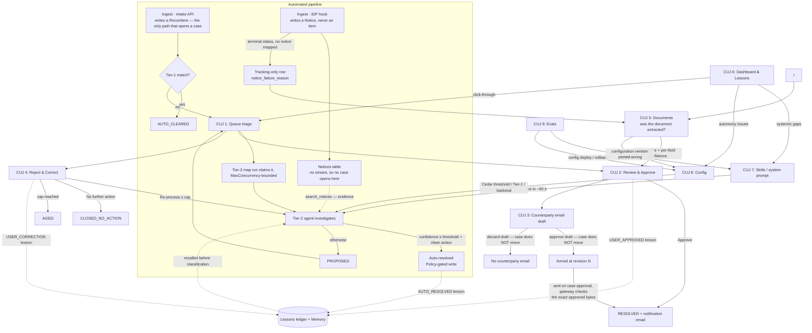

# Critical User Journeys — Reconciliation Workflow Agent

_This document applies the structure defined in [`CUJ-guide-and-template.md`](CUJ-guide-and-template.md) to this repository's application. It describes the journeys as built; see the root [`README.md`](../README.md) for architecture detail._

## System Overview

The Reconciliation Workflow Agent is an agentic reconciliation platform. Documents processed by an
IDP (Intelligent Document Processing) pipeline or structured datasets submitted via API — are
ingested as reconciliation items. A deterministic Tier-1 pass auto-clears exact matches; everything
else is investigated by an agent that characterizes the break and invokes one or more configurable
investigation skills to reconcile it, then either **resolves the item autonomously** (when its computed confidence clears an
admin-set threshold and a clean, provable ledger action exists) or **proposes a resolution for
human review**. Analysts approve or correct every human-reviewed proposal; corrections are captured
as lessons and fed back to the agent. The AI Engineer can tune the agent live — skills, system prompt,
autonomy threshold, backend — and monitor a continuous evaluation pipeline.

The humans interact with a Next.js web app (Okta OIDC login) with eight screens: **Dashboard**,
**Queue**, **Case detail**, **Documents**, **Skills**, **Lessons**, **Evals**, **Config** (all but
Case detail are nav tabs, and Config is admin-only). **Documents** is the document-level counterpart
to the case views: it reads recon's own notice store to show every document the extraction pipeline
finished — including the ones that produced no notice at all — so a document is never invisible to
the people who have to reconcile it.

### Terms

- **The agent** — the LLM investigation loop (AgentCore Runtime container or managed Harness):
  characterizes the break, then invokes **one or more** relevant skill procedures via gateway tools
  (skills are a composable library, not one-of-N classes) and proposes a resolution.
- **The worker** — the agent-worker Lambda (`backend/tier1/agent_worker.py`, and in harness mode
  `backend/harness_agent/worker.py`): the **dispatch + HITL driver**. It selects the backend,
  assembles prompts and the trace, services the harness `submit_proposal` pause/resume, computes
  the evidence-completeness score, executes the Policy-gated ledger write through the gateway when the
  decision is "execute", and contains failures (a case is never stranded `IN_PROGRESS`).
- **The gateway trust layer** — enforcement lives in the AgentCore Gateway, uniformly for agent
  and human callers: Cedar **Policy** gates the ledger write on confidence (agents) or principal
  (human approve), and makes the workflow-status tool (`recon_update_status`) **platform-only**;
  the Lambda **REQUEST interceptor** enforces provenance (**the ledger reference is derived from
  actual `search_ledger` outputs, never model-supplied**) and re-checks case-state transitions.
  The model is propose-only: it cannot write to the ledger or move its own case.

## Personas

**Reconciliation Analyst**: Operations staff who work the exception queue daily. They review
agent-proposed resolutions against the source document and ledger evidence, then approve or
correct. They care about clearing breaks accurately and quickly, and about being able to verify
the agent's reasoning rather than take it on faith.

**Reconciliation Operations Lead**: Owns throughput, aging, and auditability across the book.
They monitor lifecycle counts, watch the autonomous-resolution rate, and drill into any state
that is accumulating. They care about SLA health and about proving every status transition is
logged.

**AI Engineer**: Configures and improves the agent itself: authors
investigation skills, edits the system prompt, sets the auto-resolve confidence threshold,
enables/disables deterministic Tier-1, makes updates to the agent backend (e.g. switching between runtime ⇄ harness),
and acts on evaluation metrics and recommendations. They care about raising straight-through-processing safely.

## CUJ Summary

| CUJ | Name                                                | Persona                                   | Phase |
| --- | --------------------------------------------------- | ----------------------------------------- | ----- |
| 1   | Triage the Exception Queue                          | Reconciliation Analyst                    | 1     |
| 2   | Review & Approve an Agent-Proposed Resolution       | Reconciliation Analyst                    | 1     |
| 3   | Approve & Send a Counterparty Email                 | Reconciliation Analyst                    | 1     |
| 4   | Reject & Correct a Proposal                         | Reconciliation Analyst                    | 1     |
| 5   | Verify a Document Was Extracted                     | Reconciliation Analyst (AI Engineer, 2nd) | 1     |
| 6   | Monitor Reconciliation Health & Autonomous Activity | Reconciliation Operations Lead            | 2     |
| 7   | Create or Edit an Investigation Skill               | AI Engineer                               | 2     |
| 8   | Tune Autonomy & Platform Configuration              | AI Engineer                               | 2     |
| 9   | Evaluate & Optimize the Agent                       | AI Engineer                               | 3     |

---

## CUJ 1: Triage the Exception Queue

### Goal

The analyst scans all open exceptions (items Tier-1 could not auto-clear), decides what to work
first, and disposes of routine items in bulk so that agent-proposed cases get human decisions
the same day they are proposed.

### Persona

Reconciliation Analyst

### Trigger

- Analyst opens the app at the start of a shift and navigates to the **Queue** tab (`/recon/queue`)
- Analyst returns to the queue after finishing a case review (CUJ 2/4)

### Preconditions

- Analyst is authenticated via Okta OIDC (the deployed `auth_provider`)
- At least one reconciliation item has been written by the intake API — the only path that opens a
  case — and was not auto-cleared by Tier-1, i.e. cases exist in `PENDING`, `IN_PROGRESS`, or
  `PROPOSED`. (The IDP hook is the other half of ingest, but it writes a notice rather than an item,
  so extraction alone produces evidence and no case.)

### Step-by-Step Flow

| Step | User Action                                         | System Response                                                                                                                                                                                                                            |
| ---- | --------------------------------------------------- | ------------------------------------------------------------------------------------------------------------------------------------------------------------------------------------------------------------------------------------------ |
| 1    | Analyst opens the Queue tab                         | System lists open exceptions (`PENDING` / `IN_PROGRESS` / `PROPOSED`) with per-row: item id, source, the break characterization (its class), status, and a confidence meter for proposed cases — the number is the computed Evidence Score |
| 2    | Analyst filters/sorts to `PROPOSED` cases           | System narrows the list to cases awaiting a human decision                                                                                                                                                                                 |
| 3    | Analyst scans the Evidence Score meters             | Cases whose investigation obtained less of the evidence their skill prescribes are visually distinguishable, so the analyst can prioritize judgment calls                                                                                  |
| 4    | Analyst multi-selects several routine cases         | System enables the bulk-action controls with the selection count                                                                                                                                                                           |
| 5    | Analyst applies a bulk status update with a comment | System updates every selected case, writes one audit record per transition to the append-only audit table, and refreshes the queue                                                                                                         |
| 6    | Analyst clicks a single case row                    | System navigates to Case detail (`/recon/case/[id]`) — continues as CUJ 2 or CUJ 4                                                                                                                                                         |

### UI Representation

```
+---------------------------------------------------------------------------+
|  Recon | Dashboard [Queue] Skills Lessons Evals Documents Config  J.Doe ▾  |
+---------------------------------------------------------------------------+
|  Open Exceptions (7)                     Filter: [PROPOSED ▾]  [Search…]   |
|  +-----------------------------------------------------------------------+|
|  |[ ]| Item ID          | Class                 | Status      | Confidence||
|  |---|------------------|-----------------------|-------------|-----------||
|  |[✓]| idp-8f3c21       | record-match-review   | PROPOSED    | ▓▓▓▓░ 0.83||
|  |[✓]| idp-77aa04       | document-cross-ref…   | PROPOSED    | ▓▓▓░░ 0.60||
|  |[ ]| api-batch042-17  | record-match-review   | PROPOSED    | ▓▓▓░░ 0.67||
|  |[ ]| idp-91d2c8       | unknown               | PROPOSED    | ░░░░░ 0.00||
|  |[ ]| idp-3e0b55       | —                     | IN_PROGRESS | —         ||
|  +-----------------------------------------------------------------------+|
|  2 selected   [Bulk update ▾]  Comment: [___________________]  [Apply]    |
+---------------------------------------------------------------------------+
```

### Acceptance Criteria

- [ ] Queue shows only open lifecycle states (`PENDING`, `IN_PROGRESS`, `PROPOSED`) — terminal cases do not appear
- [ ] Each `PROPOSED` row shows the classified skill name and the evidence-completeness score as a meter
- [ ] Multi-select enables bulk status updates, and a comment can be attached to the bulk action
- [ ] Every status transition (single or bulk) produces an append-only audit record
- [ ] Clicking a row opens the case detail page for that item
- [ ] Queue reflects new ingests and agent completions without a redeploy (refresh shows current state)

### Sample Data

| Item ID         | Source                          | Class                    | Status      | Confidence |
| --------------- | ------------------------------- | ------------------------ | ----------- | ---------- |
| idp-8f3c21      | IDP (custodian payment advice)  | record-match-review      | PROPOSED    | 0.83 (5/6) |
| idp-77aa04      | IDP (draw notice)               | document-cross-reference | PROPOSED    | 0.60 (3/5) |
| api-batch042-17 | Intake API (structured dataset) | record-match-review      | PROPOSED    | 0.67 (4/6) |
| idp-91d2c8      | IDP (unrecognized fax cover)    | unknown                  | PROPOSED    | 0.00 (0/0) |
| idp-3e0b55      | IDP (payment advice)            | —                        | IN_PROGRESS | —          |

The score is a rational fraction of the matched skill's REQUIRED evidence steps, so the values a row
can show are fixed by that skill: `record-match-review` declares six required steps and can therefore
only score 0.00, 0.17, 0.33, 0.50, 0.67, 0.83 or 1.00. `unknown` declares none, so it is unscoreable
and reported as 0.00 — a case classified there always escalates.

### Error / Edge Cases

- **Empty queue**: system shows an explicit "no open exceptions" state rather than an empty table
- **Item stuck `IN_PROGRESS`** (agent worker failed): the case remains visible in the queue rather than disappearing, so it can be noticed and re-driven
- **Tier-1 disabled** (Config tab): all new items escalate — queue volume rises, and each waits in `PENDING` for the next Tier-2 map run rather than being dispatched on the spot; behaviour is otherwise identical
- **Session expired**: any queue action redirects through the Okta login flow and returns to the queue

---

## CUJ 2: Review & Approve an Agent-Proposed Resolution

### Goal

The analyst verifies an agent's proposed resolution against the source document, the agent's
step-by-step evidence trail, and the ledger — then approves it, closing the break and notifying
the counterparty/stakeholders. This is the core human-in-the-loop decision of the platform.

### Persona

Reconciliation Analyst

### Trigger

- Analyst clicks a `PROPOSED` case in the Queue (CUJ 1, step 6)

### Preconditions

- The Tier-2 agent has completed its loop for the item: classification, skill-driven
  investigation, and a proposal whose evidence-completeness score is **below** the auto-resolve threshold
  (otherwise it would have executed autonomously — see CUJ 6)
- For IDP-sourced items: the ingest hook embedded the IDP results (section classification,
  extracted fields, page-preview images) into the recon item at ingest

### Step-by-Step Flow

| Step | User Action                                   | System Response                                                                                                                                                                                                                                                                                         |
| ---- | --------------------------------------------- | ------------------------------------------------------------------------------------------------------------------------------------------------------------------------------------------------------------------------------------------------------------------------------------------------------- |
| 1    | Analyst opens the case                        | System shows the case header (status `PROPOSED`, class, Evidence Score vs. threshold) and the IDP document split view: section tabs on one side ⇄ page images + extracted field values on the other                                                                                                     |
| 2    | Analyst inspects the source document          | Split view lets the analyst flip document sections and compare page images against the extracted fields the agent relied on                                                                                                                                                                             |
| 3    | Analyst reads characterization + reasoning    | System shows the break characterization, which skill(s) the agent invoked, the model's reasoning, and the **Evidence Behind the Score** table — one row per evidence step the matched skill prescribes, and what the agent's tool calls returned for it                                                 |
| 4    | Analyst expands the agent trace               | System renders each investigation step as a typed reasoning step: tool called (`search_ledger`, `search_notices`, `search_guidance`, `listSharedMailboxMessages`…), inputs/outputs, reasoning, and cited evidence                                                                                       |
| 5    | Analyst checks the proposed resolution        | System shows the structured `proposed_action` — e.g. set ledger draw `DRW-2026-00417` to `Confirmed` — with the ledger reference that was **derived by the worker from `search_ledger` results**, never free-typed by the model                                                                         |
| 6    | Analyst clicks **Approve** (optional comment) | System transitions `PROPOSED → APPROVED`, executes the resolution path, sends the **approved counterparty email** if one is armed on the case (CUJ 3), sends the internal notification email via Microsoft Graph (from the shared mailbox, through the gateway tool), and closes the case as `RESOLVED` |
| 7    | (parallel)                                    | System records the decision as a `USER_APPROVED` lesson in the lessons ledger **and** as an AgentCore Memory event, so future classifications weight this outcome                                                                                                                                       |

### UI Representation

```
+---------------------------------------------------------------------------+
|  ← Back to Queue      Case idp-8f3c21          Status: PROPOSED            |
|  Class: record-match-review          Evidence Score: 83% (threshold .85)   |
+---------------------------------------------------------------------------+
|  Document (IDP)                      |  Agent Analysis                     |
|  [Advice] [Remittance] [Terms]       |  Classification: record-match-review|
|  +-------------------------------+   |  Reasoning: amounts differ by fee…  |
|  |                               |   |  5 of 6 required evidence steps     |
|  |   [page image preview]        |   |  unsatisfied: fund_alias_match      |
|  |                               |   |  Skill: record-match-review         |
|  +-------------------------------+   |-------------------------------------|
|  Extracted fields                    |  Agent Trace                        |
|  Amount:    EUR 1,250,000.00         |  1. search_ledger(ref=INV-2081…) ✓  |
|  Value date: 2026-07-18              |     → 1 match: DRW-2026-00417       |
|  Reference: INV-2081-EU              |  2. search_guidance("fee deduct…") ✓|
|                                      |  3. Evidence: advice line 12 …      |
|                                      |-------------------------------------|
|                                      |  Proposed Resolution                |
|                                      |  set_draw_status(DRW-2026-00417,    |
|                                      |    Confirmed) — fee-adjusted match  |
+---------------------------------------------------------------------------+
|  Comment (optional): [_____________________]   [Approve]  [Disapprove]    |
+---------------------------------------------------------------------------+
```

### Acceptance Criteria

- [ ] Case detail shows the IDP split view (section tabs ⇄ page images + extracted fields) for IDP-sourced items
- [ ] Classification, reasoning, and the evidence-completeness breakdown are visible
- [ ] The agent trace lists every tool call with inputs, outputs, reasoning, and cited evidence
- [ ] The proposed action displays the worker-derived ledger reference (0 or >1 candidate matches ⇒ no action is proposed)
- [ ] **Approve** transitions the case `PROPOSED → APPROVED → RESOLVED` and sends the internal notification email from the shared mailbox via the Microsoft Graph gateway tool
- [ ] If a counterparty email draft is approved on the case, **Approve** also sends that exact text (CUJ 3) — after the ledger write and **before** any status change, so a send failure leaves the case `PROPOSED`
- [ ] An optional comment on approval is persisted with the decision
- [ ] The decision is captured as a `USER_APPROVED` lesson (DynamoDB ledger + AgentCore Memory event)
- [ ] The status transitions appear in the append-only audit table
- [ ] The resolved case leaves the Queue and is reachable from the Dashboard's filtered history

### Sample Data

Case `idp-8f3c21` — custodian payment advice for EUR 1,250,000.00; general ledger shows
EUR 1,249,850.00 on draw `DRW-2026-00417` (custodian fee deducted at source). Agent classifies
`record-match-review`, cites the fee line on the advice, proposes `set_draw_status(DRW-2026-00417,
Confirmed)` and scores 0.83 — five of the skill's six required evidence steps returned data, with
`fund_alias_match` unsatisfied. That is the highest partial a six-step skill can reach, and it is
still below the 0.85 threshold, so the case halts for review. This is the live shape of the score
rather than a rounded illustration: 0.83 is 5/6 and nothing sits between it and 1.00.

### Error / Edge Cases

- **Notification email fails** (gateway or Graph error): the failure is surfaced to the analyst; the approval decision and audit trail are not silently lost
- **Case already decided** (another analyst, or auto-resolved between page load and click): the action fails safely and the page shows the current status instead of double-applying
- **No clean ledger action** (agent found 0 or multiple candidate references): the proposal shows investigation findings without an executable action; approval closes the case without a ledger write
- **IDP flagged low-confidence fields**: the extraction pipeline's own alert count is shown beside the Evidence Score — it is a **different quantity** and does not change the score, but it tells the analyst to scrutinize the extracted values, and a non-zero count is what lets the gateway interceptor refuse an unattended write outright

---

## CUJ 3: Approve & Send a Counterparty Email

### Goal

The analyst decides the one message this platform sends to an outside party. The agent **drafts and
stops** — it has no send tool on either backend — so the analyst picks the recipient from the
operator's contact list, edits the wording if it needs it, and approves a specific revision. That
approval is what authorizes the send: the gateway refuses any outgoing message that is not the exact
text approved on that case at that revision.

### Persona

Reconciliation Analyst

### Trigger

- While reviewing a `PROPOSED` case (CUJ 2), the analyst finds a **Counterparty Email Draft** panel
  on the case screen — the agent's investigation resolved to `counterparty-contact-draft`, a skill
  that declares `tools: []` and whose whole deliverable is a draft rather than a ledger write

### Preconditions

- Case is `PROPOSED`. Only a case still awaiting a decision has an editable draft; once it moves, the
  panel says so and every control goes read-only
- The agent's `submit_proposal` carried an `email_draft`, and the platform turned it into
  `case.proposed_email` at ingest — rendering the operator's template **before** the analyst ever
  sees it, because approval is compared byte-for-byte at send time and rendering afterwards would
  fail that comparison on every send
- The model supplied a `recipient_contact_id` and a `template_id`, never an address and never message
  text. A literal `recipient` in its payload is **refused**, not dropped
- At least one **active** `counterparty` contact exists in the operator's list — with none, the panel
  says the email has no one to go to rather than offering an empty dropdown
- The recipient's domain is in `counterparty_email_domains` (a single-entry allowlist in this
  deployment, e.g. `["contoso.onmicrosoft.com"]`), enforced at the gateway interceptor by
  `is_recipient_allowed`: an **exact** domain match, no suffix matching, and an empty allowlist
  allows nothing

### Step-by-Step Flow

| Step | User Action                                                         | System Response                                                                                                                                                                                                                                                                                                        |
| ---- | ------------------------------------------------------------------- | ---------------------------------------------------------------------------------------------------------------------------------------------------------------------------------------------------------------------------------------------------------------------------------------------------------------------- |
| 1    | Analyst reads the draft on the case screen                          | Panel shows the draft status (`pending`), the revision, the rendered subject and body, and which template they came from with its variables. The agent's own guess at the counterparty (`recipient_hint`) is displayed but never pre-selected                                                                          |
| 2    | Analyst picks a recipient                                           | A dropdown over the operator's active `counterparty` contacts showing **display names, not addresses**. The browser never handles an address at all: the draft stores `recipient_contact_id` and `recipient` stays `null` for the life of the draft                                                                    |
| 3    | (the pick disagrees with the agent's hint)                          | Panel says so in amber. The hint came from a counterparty's own paperwork, so neither is necessarily wrong — but a silent mismatch is how mail reaches the wrong desk                                                                                                                                                  |
| 4    | Analyst edits the subject/body and presses **Save changes**         | `PUT /api/recon/cases/{id}/draft` at the **displayed** revision bumps the revision, records `edited_by`/`edited_at`, and returns the draft to `pending` — which **revokes any earlier approval**. The route resolves the contact server-side only to prove it still resolves to an address, then discards it           |
| 5    | Analyst presses **Approve draft**                                   | `approve_draft` records `approved_by`/`approved_at` and pins `approved_revision` to that revision. **The case does not move** — none of the three draft decisions transitions it. The panel reads "Armed at revision _N_ — this text is sent when you approve the case"                                                |
| 6    | (optional) Analyst presses **Revoke approval** or **Discard draft** | `revoke_draft` withdraws the approval and reopens the text for editing; `discard_draft` records that this case sends no counterparty email and keeps the draft read-only as part of the record. Again, neither moves the case                                                                                          |
| 7    | Analyst approves the **case** (CUJ 2, step 6) — the send trigger    | System stamps `send_attempted_at` from the approved revision, resolves the address from `recipient_contact_id` out of the operator's table on this call, and sends from the shared mailbox via the egress gateway's `microsoft-graph___sendSharedMailboxMail` tool with `sendPurpose: "counterparty"` plus the case id |
| 8    | (in parallel, at the gateway)                                       | The REQUEST interceptor independently re-reads the case's draft, re-resolves the same contact id itself, checks the recipient domain, and **denies** the send unless recipient, subject and body all match the approved text at the approved revision                                                                  |
| 9    | (on success)                                                        | `sent_at` is stamped and the draft becomes `sent` (terminal). The send runs after the ledger write and **before** any status change, so a failure leaves the case `PROPOSED` and the retry is safe                                                                                                                     |

### UI Representation

A panel on the same case-detail screen as CUJ 2:

```
+---------------------------------------------------------------------------+
|  COUNTERPARTY EMAIL DRAFT                      [pending]        rev 2     |
+---------------------------------------------------------------------------+
|  To                                                                        |
|  [ Acme Capital — Loan Admin              ▾]                               |
|  The address is not shown, and not stored on the draft. It is read from     |
|  the contact list when the mail is sent.                                    |
|  ⚠ The source document named Acme Capital AP, but this is addressed to      |
|    Acme Capital — Loan Admin. Confirm that is intended.                     |
|                                                                            |
|  Subject                                                                   |
|  [ Missing allocation detail — INV-2081-EU                              ]  |
|                                                                            |
|  Body                                                                      |
|  [ We received your advice for EUR 1,250,000.00 dated 2026-07-18 …      ]  |
|  [                                                                      ]  |
|                                                                            |
|  Drafted from template counterparty-detail-request with                    |
|  reference=INV-2081-EU, amount=EUR 1,250,000.00.                          |
|  edited by jdoe · 2026-07-25 13:58Z                                        |
|                                                                            |
|  [Save changes]   [Approve draft]   [Discard draft]                        |
+---------------------------------------------------------------------------+

once approved, the same panel:
+---------------------------------------------------------------------------+
|  COUNTERPARTY EMAIL DRAFT                     [approved]        rev 2      |
|  approved by jdoe · 2026-07-25 14:01Z                                      |
|  ◆ Armed at revision 2 — this text is sent when you approve the case.      |
|                                                [Revoke approval]           |
+---------------------------------------------------------------------------+
```

### Acceptance Criteria

- [ ] The agent can draft but never send: no send tool is offered on either backend, and the `counterparty-contact-draft` skill declares `tools: []`
- [ ] The persisted draft carries a `recipient_contact_id` and never an address; a model payload containing a literal `recipient` is refused with an error rather than silently stripped
- [ ] The recipient control lists operator-maintained contact **display names**; the address is resolved server-side at send time, twice and independently (the BFF to send, the interceptor to allow)
- [ ] Saving an edit bumps the revision and returns the draft to `pending`, so a prior approval no longer authorizes anything
- [ ] Unsaved edits cannot be approved — approval names a stored revision, and the text in the inputs is not yet one
- [ ] Every control acts on the displayed `revision`; a stale one is refused with **409** rather than overwriting what is current
- [ ] `approve_draft`, `revoke_draft` and `discard_draft` each update only the draft — none of them transitions the case
- [ ] The gateway refuses any outgoing message whose recipient, subject or body is not the approved text at the approved revision (`draft_matches_message`), comparison NFC-normalized but **not** whitespace-collapsed
- [ ] The recipient domain is checked against `counterparty_email_domains` at the interceptor, by exact domain match, with an empty allowlist allowing nothing
- [ ] A `render_failed` draft is editable and discardable but has **no** approve button
- [ ] Draft actions are recorded on the draft itself (`edited_by`, `approved_by`, `discarded_by`, with timestamps), not in the case's audit rows — whose status column speaks only in case statuses
- [ ] `send_attempted_at` is stamped **before** the Graph call, so a process that dies mid-send leaves evidence rather than an ambiguity the UI cannot see

### Sample Data

Draft on case `idp-77aa04`: `draft_status pending · revision 2 · recipient_contact_id
ctc-acme-loanadmin · recipient_hint "Acme Capital AP" · template_id counterparty-detail-request ·
variables {reference: INV-2081-EU, amount: EUR 1,250,000.00} · recipient null` — subject _"Missing
allocation detail — INV-2081-EU"_, body rendered from the operator's template. After **Approve
draft**: `draft_status approved · approved_revision 2 · approved_by jdoe`. After the case is
approved: `send_attempted_at` then `sent_at` stamped and `draft_status sent`.

The five draft states are `pending`, `approved`, `discarded`, `render_failed` and `sent`; only
`discarded` and `sent` are terminal.

### Error / Edge Cases

- **`render_failed` at ingest**: the operator's template was deleted, deactivated, or its declared variables disagreed with the model's payload. The draft is **persisted anyway**, visibly broken, carrying `render_error` — because raising would have discarded it, and a case with no email is indistinguishable from a case that legitimately needed none. It is editable and discardable; saving clears the failure and the approve button appears
- **Stale revision**: any save or decision against a revision that is no longer current is refused with **409**, never applied to whatever happens to be current. The revision is required in the request body — defaulting it to 0 is exactly the race this pins
- **Contact deactivated between approval and send**: the address is resolved from the contact id at send time, so deactivation makes an already-approved draft unsendable without anyone touching the case; the approve path reports it as a conflict and holds the case at `PROPOSED`
- **Unknown send state**: `send_attempted_at` set with `sent_at` unset means recon cannot tell whether the counterparty received the mail. The panel refuses to quietly offer a retry — it names the attempt time, points the analyst at the shared mailbox's Sent Items, and requires an explicit "I checked and nothing was sent" acknowledgement (`override_unknown_send`) before a re-arm is permitted. This is the double-send guard
- **Recipient outside the allowed domains**: denied at the gateway interceptor, which re-derives the verdict from its own copy of the allowlist on every send. The BFF deliberately does **not** re-check it — a second opinion there could only agree or be wrong, since the two read different copies
- **An edit revokes a prior approval**: the analyst must approve again. `draft_matches_message` also catches it independently, reporting that the revision moved since approval, so a stale approval cannot ride an edit out to a counterparty
- **No counterparty contacts configured**: the panel says the email has no one to go to and points at the Config tab, rather than showing an empty dropdown
- **Case moves while the draft is open**: the panel goes read-only and states the case's current status, so a decision cannot be recorded against a case that is no longer awaiting one

---

## CUJ 4: Reject & Correct a Proposal

### Goal

The analyst disagrees with the agent's proposal, records _why_ (a required correction comment),
and chooses the outcome: close the case with no action, or send it back to the agent for
re-processing with the correction applied. Either way the correction becomes a lesson the agent
learns from — this journey is the platform's feedback loop.

### Persona

Reconciliation Analyst

### Trigger

- While reviewing a `PROPOSED` case (CUJ 2), the analyst finds the classification, evidence, or
  proposed action wrong or insufficient

### Preconditions

- Case is in `PROPOSED` status
- Same case-detail context as CUJ 2

### Step-by-Step Flow

| Step | User Action                                                                                                                        | System Response                                                                                               |
| ---- | ---------------------------------------------------------------------------------------------------------------------------------- | ------------------------------------------------------------------------------------------------------------- |
| 1    | Analyst clicks **Disapprove**                                                                                                      | System requires a correction comment before the action can proceed (unlike Approve, the comment is mandatory) |
| 2    | Analyst writes the correction (e.g. "This is a duplicate advice — the original already cleared on 07/15, do not confirm the draw") | System accepts the comment and asks for the outcome                                                           |
| 3    | Analyst selects an outcome                                                                                                         | Two paths — see below                                                                                         |

#### Path A: No further action

| Step | User Action                           | System Response                                                                                                                                                |
| ---- | ------------------------------------- | -------------------------------------------------------------------------------------------------------------------------------------------------------------- |
| 3a   | Analyst selects **No further action** | System transitions `PROPOSED → REJECTED → CLOSED_NO_ACTION` (terminal), records the audit transitions, and captures the decision as a `USER_CORRECTION` lesson |

#### Path B: Re-process with correction

| Step | User Action                                                             | System Response                                                                                                                                        |
| ---- | ----------------------------------------------------------------------- | ------------------------------------------------------------------------------------------------------------------------------------------------------ |
| 3b   | Analyst selects **Re-process**                                          | System stores the correction, transitions the case back to `IN_PROGRESS`, and re-invokes the agent worker with the correction available to the new run |
| 4b   | (later) Analyst sees the case reappear in the Queue as `PROPOSED`       | The new proposal reflects the correction; the analyst reviews again (CUJ 2)                                                                            |
| 5b   | If the case has already been re-processed up to the cap (default **3**) | System ages the case out to `AGED` (terminal) instead of looping forever                                                                               |

### UI Representation

The same case-detail screen as CUJ 2; **Disapprove** opens a modal:

```
+------------------------------------------------------+
|  Disapprove case idp-8f3c21                          |
|                                                      |
|  Correction (required):                              |
|  [ Duplicate advice — original cleared 07/15.     ]  |
|  [ Do not confirm DRW-2026-00417.                 ]  |
|                                                      |
|  Outcome:                                            |
|  (•) Re-process with this correction   (2 of 3 left) |
|  ( ) No further action — close case                  |
|                                                      |
|                       [Cancel]   [Confirm Disapprove]|
+------------------------------------------------------+
```

### Acceptance Criteria

- [ ] Disapprove is blocked until a correction comment is entered
- [ ] Outcome **No further action** transitions the case to `CLOSED_NO_ACTION` (terminal)
- [ ] Outcome **Re-process** stores the correction, returns the case to `IN_PROGRESS`, and re-invokes the agent
- [ ] The re-process count is enforced against the cap (default 3); at the cap the case transitions to `AGED`
- [ ] Every rejection is captured as a `USER_CORRECTION` lesson (DynamoDB ledger + AgentCore Memory event) and appears in the Lessons tab
- [ ] The agent's next run on the item can retrieve the correction (lessons recall happens before classification)
- [ ] All transitions are written to the append-only audit table

### Sample Data

Lesson record: `item idp-8f3c21 · trigger USER_CORRECTION · "Duplicate advice — original cleared
07/15, do not confirm the draw" · analyst jdoe · 2026-07-25T14:02Z · outcome re-process (attempt 2/3)`.

### Error / Edge Cases

- **Analyst tries to submit without a comment**: the confirm button stays disabled / returns a validation error naming the missing field
- **Re-process returns the same wrong answer**: each attempt consumes one of the capped retries; at the cap the case ages out (`AGED`) rather than ping-ponging indefinitely
- **Agent worker invocation fails on re-process**: the case remains `IN_PROGRESS` and visible in the queue rather than being lost
- **Concurrent decision**: if the case status changed since page load, the rejection fails safely with the current status shown

---

## CUJ 5: Verify a Document Was Extracted

### Goal

The analyst finds out whether a document the counterparty sent came out of the extraction pipeline
as a notice recon can reconcile against — and, when it did not, reads the reason recon recorded
instead of asking whoever runs that pipeline. Before the **Documents** tab existed, a document that
failed extraction, or that carried no date recon could key a notice on, left no trace anywhere an
analyst could look.

### Persona

Reconciliation Analyst (primary). AI Engineer (secondary): only an admin is offered the **Upload**
control, and only they care about the configuration-version column as a pin-typo detector.

### Trigger

- Analyst has emailed or uploaded a notice and wants to know whether it was read — opens the
  **Documents** tab (`/recon/idp-documents`)
- A case's extracted fields look wrong or thin (CUJ 2, step 2) and the analyst wants the source file
  beside the extractor's own per-field confidence
- AI Engineer has just changed the configuration version a workflow type pins on the Config tab and
  wants to see which version the pipeline actually ran

### Preconditions

- Analyst is authenticated via Okta OIDC (`/api/recon/*` is gated deny-by-default; only the upload
  route additionally requires the recon admin group)
- The extraction pipeline has reached a **terminal** Step Functions status for the document —
  `SUCCEEDED`, `FAILED`, `TIMED_OUT` or `ABORTED`. The IDP post-processing hook fires only on those,
  and the row this tab reads is what the hook wrote at ingest
- At least one workflow type on the Config tab pins a configuration version (`route: extraction`) —
  with no pin, no _versioned_ row can be attributed to this deployment
- The console task has `NOTICES_TABLE` and `IDP_INPUT_BUCKET` set: the notice row and the raw
  document bytes come from two different places on purpose

### Step-by-Step Flow

| Step | User Action                                          | System Response                                                                                                                                                                                                                                                                                                                                                                                       |
| ---- | ---------------------------------------------------- | ----------------------------------------------------------------------------------------------------------------------------------------------------------------------------------------------------------------------------------------------------------------------------------------------------------------------------------------------------------------------------------------------------- |
| 1    | Analyst opens the Documents tab                      | System queries **recon's own notices table** (`${name_prefix}-notices`, deployed as `recon-dev-notices`) on the `idp-document-index` GSI — hash `idp_record` = the constant `"document"`, range `idp_started_at` — newest-first over a 30-day window. One row per document: file name, status, start time, configuration version. No call to the extraction pipeline's API                            |
| 2    | Analyst adjusts the dates, or presses **Load more**  | System reads the next page off the index with an opaque `nextToken` (the marshalled `LastEvaluatedKey`, base64url so a `+` in a query string cannot corrupt it) and appends the rows                                                                                                                                                                                                                  |
| 3    | Analyst types into **Filter loaded rows**            | System filters the rows **already loaded** on file name, configuration version and status. There is deliberately no server-side text search — the index has nothing to search a file name by — and the caption says so, naming the count it searched                                                                                                                                                  |
| 4    | Analyst clicks a row                                 | System expands that document's detail directly under the row (clicking again collapses it): source file on the left, what was extracted on the right. Three independent reads — tracking record, extraction, bytes — so a side that fails names its own gap while the others still render                                                                                                             |
| 5    | Analyst checks a doubtful figure against the page    | Raw bytes stream from the extraction pipeline's input bucket (`IDP_INPUT_BUCKET`) through recon's own route, which resolves the S3 key from the notice row's `source_document` rather than from the URL — so only a document recon has a record of can be served. Raw customer documents are deliberately not copied into recon's storage; the preview is sticky so it stays beside a long field list |
| 6    | Analyst opens a document that produced no notice     | The row is **tracking-only** (`record_kind: "document"`): the pipeline reached a terminal status and recon mapped no notice out of it, so it recorded `notice_failure_reason`. The fields half shows that row's own sentence in place of values — and the source file still previews                                                                                                                  |
| 7    | (optional) Analyst presses **Load extracted fields** | One `BatchGetItem` over the shown rows' notice rows populates per-(class, field) columns, derived from the extractions actually loaded, all hidden by default and offered under **Columns**. Each value carries the extractor's confidence, ambered when below that field's own threshold                                                                                                             |
| 8    | AI Engineer scans the **Config version** column      | The version the pipeline reported sits in the same row as the pin it was meant to match, so a mistyped pin is something an operator can see. A `?` marks a row recon recorded no version for at all; rows on an unpinned version are hidden and counted in the caption                                                                                                                                |
| 9    | (admin) AI Engineer presses **Upload**               | System accepts the document and records the submission in recon's own upload-audit table; **Recent uploads** lists it with per-file status and any refusal reason. An extraction upload appears in _both_ that panel and the table above once the pipeline finishes                                                                                                                                   |

### UI Representation

```
+---------------------------------------------------------------------------+
|  Recon | Dashboard Queue Skills Lessons Evals [Documents] Config  J.Doe ▾  |
+---------------------------------------------------------------------------+
|  Documents         Read from recon's notice store     [Upload] admin only  |
|  From [2026-08-10]  To [2026-09-09]  [Apply]   Filter: [_______________]   |
|  The filter searches the 21 rows loaded so far, not the whole window.      |
|  Showing only these configuration versions, pinned by the workflow types   |
|  on the Config tab: Recon-IDP. 3 loaded rows belong to another             |
|  configuration and are hidden. Plus 16 rows that predate recon's tracking  |
|  snapshot, so no version was ever captured — shown, marked with a ?.       |
|  +-----------------------------------------------------------------------+|
|  | Document                      | Status    | Started       | Config ver.||
|  |-------------------------------|-----------|---------------|------------||
|  | Paydown and Interest Notice…  | SUCCEEDED | 09-08 14:02   | Recon-IDP  ||
|  | Agent Notice - Partial Fax C… | SUCCEEDED | 09-08 13:57   | Recon-IDP  ||
|  | Borrowing Notice.pdf          | —         | 2026-03-11 ≈  | —  ?       ||
|  | Optional Paydown Notice.pdf   | FAILED    | 09-07 09:40   | Recon-IDP  ||
|  +-----------------------------------------------------------------------+|
|  [Load more] [Load extracted fields (4)]  24 loaded · 21 on a pinned conf. |
+---------------------------------------------------------------------------+
        clicking a row expands its detail underneath that row ↓
+---------------------------------------------------------------------------+
|  Document detail  06-incomplete-notices/Agent Notice - Partial…   [Close]  |
|  Source document                     |  Object status   SUCCEEDED          |
|  +-------------------------------+   |  Config version  Recon-IDP          |
|  |                               |   |  Evaluation (as at extraction)      |
|  |    [source PDF in a frame]    |   |                  EVALUATING         |
|  |                               |   |  Queued / Started / Completed  …    |
|  +-------------------------------+   |  Pages           1                  |
|   (sticky — the field list beside    |-------------------------------------|
|    it scrolls past it)               |  Pipeline reports                   |
|                                      |  Evaluation report — s3://…/eval    |
|                                      |-------------------------------------|
|                                      |  Extracted fields                   |
|                                      |  Recon mapped no notice from this   |
|                                      |  document. Reason recorded:         |
|                                      |  ◇ extracted no notice_date/…       |
+---------------------------------------------------------------------------+
|  Recent uploads — recon's own upload audit; overlaps the table above       |
+---------------------------------------------------------------------------+
```

### Acceptance Criteria

- [ ] The list comes from recon's own notices table off the `idp-document-index` GSI, newest-first over an operator-set date window — no call to the extraction pipeline's API
- [ ] Paging uses an opaque `nextToken`, and **Load more** stays pressable even when the current page shows no rows (a page can be entirely another deployment's while the next holds recon's)
- [ ] The text filter searches only the loaded rows, and the caption states that plus the count it searched
- [ ] Only rows whose configuration version matches a version pinned by an `extraction` workflow type are shown — matched case-insensitively across **all** pins — plus rows recon recorded no version for at all
- [ ] Rows on a non-null unpinned version are hidden and **counted** in the caption; if the pins cannot be read at all, every row is shown and the reason is stated
- [ ] A row recon recorded no configuration version for is included and marked with a visible `?`, not filtered out
- [ ] A start time derived from the notice's business date rather than observed shows a visible `≈`, explained in the page header
- [ ] `ObjectStatus` and `EvaluationStatus` are labelled as a snapshot at extraction; no human-review (HITL) field or column exists anywhere on the screen, and the way out is the **Pipeline reports** pointers
- [ ] Clicking a row expands its detail under that row and clicking it again collapses it; the source file renders beside the extracted record
- [ ] The source bytes are served from the extraction pipeline's input bucket via a route that takes the S3 key from recon's own notice row, so an invented key 404s
- [ ] A tracking-only row (`record_kind: "document"`) shows `notice_failure_reason` in place of the fields **and** still previews its source file
- [ ] A tracking row and a later successful notice for the same document share one `notice_id` (`idp-<ObjectKey>`), so a reprocessed document never appears twice
- [ ] Tracking rows are excluded from `search_notices`, so a failed extraction is never returned to the agent as reconciliation evidence
- [ ] Per-(class, field) columns appear only after **Load extracted fields**, are hidden by default, and show each value's confidence ambered below that field's own threshold
- [ ] The console computes no confidence of its own — the hook's numbers and the pipeline's own threshold alerts are stored and rendered as-is
- [ ] The **Upload** control is offered only to an admin and the route re-checks the group server-side, returning 403 regardless of what the browser rendered
- [ ] **Recent uploads** reads recon's own upload-audit table and states that it overlaps the table above rather than complementing it

### Sample Data

The `paydown` workflow type on the Config tab pins configuration version `Recon-IDP` — typed by
hand, because nothing exposes the list of valid names, which is exactly why the column exists.

A **mapped** document: `03-paydown-principal-notices/Paydown and Interest Notice.pdf` →
`record_kind: "notice"`, extracted fields visible with per-field confidence once **Load extracted
fields** is pressed.

A **tracking-only** document: `06-incomplete-notices/Agent Notice - Partial Fax Cover.pdf` →
`record_kind: "document"`, `notice_failure_reason` = the mapper's own sentence, _"IDP document …
extracted no notice_date/value_date"_. The extractor did read this page — `counterparty`
`NORTHWIND MANUFACTURING LLC`, `agent_bank` `Tarnsmoor Trust Bank, N.A.`, `agent_contact_name`
`AGENCY SERVICES` — it simply carries no notice date recon could key a notice on. Both rows would
share the one id `idp-<ObjectKey>`, so reprocessing this document successfully overwrites its
tracking row rather than adding a second one.

Alongside them in the same table, and hidden: documents another deployment queued against
configurations `default` and `slim15-assess-no-granular`. Plus 16 of recon's own rows from before
the hook captured a tracking snapshot, which a backfill put into this index precisely so that
history would be visible — they carry no version at all, and one of their derived start times sorts
into the future.

### Error / Edge Cases

- **Document processed against an unpinned configuration**: hidden and counted in the caption. The extraction pipeline is shared and the hook fires for every terminal outcome on that state machine, so recon's table holds other deployments' documents — and "no documents" and "documents, none of them ours" are different answers
- **Pipeline has not finished the document**: no row at all, because the hook fires only on a terminal status. An in-flight document is absent rather than shown as pending
- **Tracking row whose source PDF still previews**: deliberate. The source route gates on `parse_method == "IDP"` and never on `record_kind`, because a document that failed is exactly when an operator needs to open the file
- **Per-field detail dropped to stay under DynamoDB's item-size limit**: the hook records that it dropped the detail, and the panel shows the stored sentence naming the sizes — a named gap, dim rather than red, not an empty field list. A notice extracted before recon stored per-field detail at all gets the same treatment, and says that re-uploading produces a row that has it
- **Undecodable `nextToken`**: a 400 naming the parameter, never a silent restart from page one — a paging client would read page one as more results and follow it forever
- **A key recon has no row for**: 404 from both the detail and the source route, not an empty success that would read as a document processed to nothing
- **Object gone from the input bucket** (expired or deleted after processing): 404 saying recon has a row and the bucket does not, with the verbatim S3 error on a response header; `AccessDenied` is mapped to the same outcome so a dropped `s3:ListBucket` grant does not surface as a raw IAM denial
- **No production/test filter**: recon records no such flag on a notice, so a `view` parameter is refused with a 400 rather than ignored — a caller written against the older contract finds out instead of trusting a filter that was never applied

---

## CUJ 6: Monitor Reconciliation Health & Autonomous Activity

### Goal

The operations lead sees, at a glance, where every case in the book stands — how much Tier-1
auto-cleared, how much the agent resolved autonomously, what is waiting on humans, and what has
aged out — and drills into any state that looks wrong. They also spot-check autonomous
resolutions to keep trust in straight-through processing.

### Persona

Reconciliation Operations Lead

### Trigger

- Daily: lead opens the **Dashboard** tab (`/recon/dashboard`) as part of the morning routine
- Ad hoc: after a threshold or skill change (CUJ 7/8), to watch the effect on the mix

### Preconditions

- Cases exist across lifecycle states (the platform has been ingesting items)

### Step-by-Step Flow

| Step | User Action                                                    | System Response                                                                                                                                                                   |
| ---- | -------------------------------------------------------------- | --------------------------------------------------------------------------------------------------------------------------------------------------------------------------------- |
| 1    | Lead opens the Dashboard                                       | System shows lifecycle status counts across **all** cases: `PENDING`, `IN_PROGRESS`, `PROPOSED`, `APPROVED`, `RESOLVED`, `AUTO_CLEARED`, `REJECTED`, `CLOSED_NO_ACTION`, `AGED`   |
| 2    | Lead clicks a status count (e.g. `AUTO_CLEARED` or `RESOLVED`) | System opens the filtered case history for that status — click-through, not a dead-end metric                                                                                     |
| 3    | Lead opens an auto-resolved case                               | Case detail shows the same evidence package an analyst would see (trace, confidence ≥ threshold, Policy-permitted `set_draw_status` write) plus the `AUTO_RESOLVED` lesson record |
| 4    | Lead reviews the **Lessons** tab (`/recon/lessons`)            | System lists captured analyst decisions (`USER_APPROVED`, `USER_CORRECTION`, `AUTO_RESOLVED`) — the ground truth being fed back to the agent and used by the evaluation pipeline  |
| 5    | Lead notices `AGED` count rising                               | Filtered history shows which items hit the re-process cap; lead routes systemic patterns to the AI Engineer (new/edited skill — CUJ 7)                                            |

### UI Representation

```
+---------------------------------------------------------------------------+
|  Recon Ops Dashboard                                                       |
|  +---------+ +---------+ +---------+ +---------+ +---------+ +---------+  |
|  |   142   | |    12   | |    7    | |    38   | |    61   | |    3    |  |
|  | AUTO_   | | IN_     | | PROPOSED| | RESOLVED| | AUTO-   | |  AGED   |  |
|  | CLEARED | | PROGRESS| | (await  | | (human  | | RESOLVED| | (cap    |  |
|  | (Tier-1)| | (agent) | |  human) | | approved| | (agent) | |  hit)   |  |
|  +---------+ +---------+ +---------+ +---------+ +---------+ +---------+  |
|        each card clicks through to the filtered case history               |
+---------------------------------------------------------------------------+
```

### Acceptance Criteria

- [ ] Dashboard shows counts for every lifecycle status, including terminal states
- [ ] Each count clicks through to a filtered case history for that status
- [ ] Auto-resolved cases expose the full evidence package (trace, confidence, executed action) for after-the-fact review
- [ ] Lessons tab lists analyst decisions and corrections with item, trigger type, comment, and timestamp
- [ ] Counts reconcile with the Queue view (open states) — no case is invisible to both

### Sample Data

Morning snapshot: 263 items ingested this week → 142 `AUTO_CLEARED` (Tier-1), 61 `RESOLVED`
autonomously by the agent, 38 approved by analysts, 7 awaiting review, 12 in flight, 3 aged out.

### Error / Edge Cases

- **No data yet** (fresh environment): dashboard renders zero-counts rather than erroring
- **A status count looks impossible** (e.g. `IN_PROGRESS` growing without draining): filtered history + audit trail identify stuck items; this is the entry point for operational debugging
- **Spot-check finds a bad autonomous resolution**: lead's remediation path is the Config tab — raise the threshold or disable auto-resolve (CUJ 8); the Cedar Policy gate updates at runtime

---

## CUJ 7: Create or Edit an Investigation Skill

### Goal

The AI Engineer adds a new investigation/resolution skill — or improves an existing one — by
authoring a `SKILL.md` file in the UI. Skills are a **composable library of procedures** (not
mutually-exclusive classes); the agent invokes one or more relevant skills per item. Because the
library is served live from S3, the agent picks the change up within ~60 seconds, with no redeploy.

### Persona

AI Engineer

### Trigger

- A recurring break type is being classified `unknown` or aging out (signal from CUJ 6)
- Evaluation recommendations (CUJ 9) or analyst feedback suggest a skill's procedure is weak

### Preconditions

- AI Engineer is authenticated; **Skills** tab (`/recon/skills`) is reachable
- The gateway tools the skill will reference exist (e.g. `search_ledger`, `search_notices`,
  `search_guidance`, `search_correspondence`, `set_draw_status`). Reference the **model-callable** name:
  the mailbox read is `search_correspondence` (the sanitized wrapper), never the raw
  `listSharedMailboxMessages`, whose `$`-prefixed OData arguments cannot be offered to a model. The
  knowledge-base read is the one tool whose gateway name is not its short name — it is
  `managed-kb___Retrieve` (Bedrock's own operation, reached through a managed connector), and the
  container runtime offers it as `search_guidance` as well. A skill that narrows the retrieval should
  say which metadata facets to filter on (`doc_type`, `break_class`, `skill`, `message_id`, a date
  bound) rather than spelling out filter JSON, because the two backends take different argument
  shapes. There
  is no send tool to reference on either backend — a skill that needs a counterparty email declares
  `tools: []` and tells the model to write the message into `submit_proposal`'s `email_draft`, which
  an analyst then approves on the case.

### Step-by-Step Flow

| Step | User Action                                                                    | System Response                                                                                                                                              |
| ---- | ------------------------------------------------------------------------------ | ------------------------------------------------------------------------------------------------------------------------------------------------------------ |
| 1    | AI Engineer opens the Skills tab                                               | System shows one tile per skill (name, description, tools from frontmatter); clicking a tile opens it **read-only**                                          |
| 2    | AI Engineer clicks **Edit** on a skill (or **Create** for a new one)           | System opens the SKILL.md editor: YAML frontmatter (`name`, `description`, `tools: [...]`, optional `model`) + free-text procedure body                      |
| 3    | AI Engineer writes the investigation procedure                                 | The markdown body _is_ the procedure the agent executes step-by-step during investigation                                                                    |
| 4    | AI Engineer saves                                                              | System writes `skills/<name>/SKILL.md` to S3 (directory-per-skill layout)                                                                                    |
| 5    | AI Engineer waits ~60 s                                                        | Runtime backend refreshes its skill cache (~60 s); harness backend loads per-session — the agent can invoke the new/updated skill on the next escalated item |
| 6    | (optional) AI Engineer opens **System prompt** (`/recon/skills/system-prompt`) | Same live-edit mechanic for the agent's system prompt                                                                                                        |
| 7    | AI Engineer verifies                                                           | The next case where the skill applies shows the agent invoking it; CUJ 6/9 confirm the effect over time                                                      |

### UI Representation

Skill tiles grid → editor. Example frontmatter as edited:

```markdown
---
name: duplicate-advice-check
description: Detect re-sent payment advices already cleared in the ledger
tools: [search_ledger, search_correspondence]
---

1. Extract the advice reference and value date from the item fields.
2. Call search_ledger with the reference; if a posting is already Confirmed
   within tolerance of the amount, treat this advice as a duplicate.
3. Search the shared mailbox for prior advices with the same reference…
```

### Acceptance Criteria

- [ ] Skills tab lists every deployed skill with name, description, and tools; tiles open read-only and Edit is an explicit action
- [ ] Create/edit/delete round-trips to the S3 directory-per-skill layout (`skills/<name>/SKILL.md`)
- [ ] Frontmatter `tools:` constrains which gateway tools the skill's investigation uses
- [ ] The agent picks up the updated skill library within ~60 s (runtime) / next session (harness) with **no redeploy**
- [ ] The `unknown` fallback skill cannot be deleted
- [ ] The system prompt is editable through the same live mechanism
- [ ] Classification naming no catalog entry still falls back to `unknown` (which declares no evidence steps and so always escalates)

### Sample Data

Pre-created catalog: `record-match-review`, `document-cross-reference`, `consult-guidance`,
`correspondence-search`, `counterparty-contact-draft`, `ledger-status-resolution`, `unknown`.

### Error / Edge Cases

- **Invalid frontmatter** (missing `name`/`description`, malformed YAML): save is rejected with the validation error; the live catalog is not corrupted
- **Skill references a tool the gateway doesn't expose**: the tool call fails at investigation time and is visible in the agent trace — the skill should be corrected
- **Deleting a skill that live cases referenced**: existing cases keep their recorded characterization; only future investigations are affected
- **Attempt to delete `unknown`**: blocked — it is the required escalate-with-context fallback

---

## CUJ 8: Tune Autonomy & Platform Configuration

### Goal

The AI Engineer adjusts how much the platform does without humans: the auto-resolve confidence
threshold (enforced server-side by the AgentCore Policy Cedar gate), the Tier-1 deterministic
pass, the agent backend (runtime ⇄ harness), and the model — all at runtime from the **Config**
tab, without a redeploy.

### Persona

AI Engineer

### Trigger

- Ops lead reports a bad autonomous resolution or wants more straight-through processing (CUJ 6)
- An A/B comparison of the two agent backends is planned (CUJ 9 follows up with metrics)

### Preconditions

- AI Engineer is authenticated; **Config** tab (`/recon/config`) is reachable
- AgentCore Policy is attached to the egress tools gateway (ENFORCE mode by default)

### Step-by-Step Flow

| Step | User Action                                                     | System Response                                                                                                                                                                                                       |
| ---- | --------------------------------------------------------------- | --------------------------------------------------------------------------------------------------------------------------------------------------------------------------------------------------------------------- |
| 1    | AI Engineer opens the Config tab                                | System shows current values: Tier-1 toggle (with inline read-only source), auto-resolve threshold (default 0.85, disableable), agent backend selector (with inline code viewer / harness skill list), model selection |
| 2    | AI Engineer edits the auto-resolve threshold (e.g. 0.85 → 0.90) | System **rewrites the Cedar policy at runtime** via the Policy `UpdatePolicy` API — the gateway gate tracks the new value immediately; the SSM copy the worker reads is only an execute-vs-escalate hint              |
| 3    | AI Engineer disables auto-resolve entirely                      | Every agent run now halts at `PROPOSED` for human review; the Policy gate blocks any below-threshold write regardless                                                                                                 |
| 4    | AI Engineer toggles Tier-1 off                                  | New items skip deterministic matching and escalate straight to the agent (SSM-backed, effective at runtime)                                                                                                           |
| 5    | AI Engineer switches the agent backend `runtime → harness`      | Subsequent escalations run on the managed AgentCore Harness (config-declared) instead of the Strands container — instant A/B; flipping back is instant rollback                                                       |
| 6    | AI Engineer verifies                                            | Dashboard mix (CUJ 6) and Evals metrics (CUJ 9) reflect the change                                                                                                                                                    |

### UI Representation

```
+---------------------------------------------------------------------------+
|  Config                                                                    |
|  Tier-1 deterministic matching       [ ON ▾]   (view source ⌄)             |
|  Auto-resolve threshold              [0.85 ]   [Disable auto-resolve]      |
|    ↳ enforced by AgentCore Policy (Cedar, ENFORCE) on the tools gateway    |
|  Agent backend                       (•) runtime   ( ) harness             |
|    ↳ inline code viewer / harness skill list                               |
|  Model                               [us.anthropic.claude-sonnet-5 ▾]      |
+---------------------------------------------------------------------------+
```

### Acceptance Criteria

- [ ] Threshold edit rewrites the Cedar policy statements at runtime (no redeploy) — a below-threshold `set_draw_status` is blocked **at the gateway**, not just in app code
- [ ] Disabling auto-resolve forces all agent outcomes to `PROPOSED`
- [ ] Tier-1 toggle takes effect for newly ingested items without redeploy, and its source is viewable read-only inline
- [ ] Backend switch changes which backend handles subsequent escalations; the guarantee is per-RUN: `collect` resolves the backend once and stamps every item, so a run cannot straddle a switch
- [ ] Model selection applies per backend
- [ ] Config values shown always reflect the current SSM/Policy state (no stale cache after save)

### Sample Data

`auto_resolve_threshold = 0.85` → agent auto-resolved case `idp-9a11e0` (Evidence Score 1.00 — all
four of `ledger-status-resolution`'s required steps returned data — single matched reference
`DRW-2026-00417`); a sibling case that missed one step scored 0.75 and halted at `PROPOSED`.

Moving the threshold has a **coarse** effect, because the score is a rational fraction of one skill's
required steps. For a four-step skill the only reachable values are 0.00, 0.25, 0.50, 0.75 and 1.00,
so any threshold in (0.75, 1.00] — including both 0.85 and 0.95 — demands complete evidence and
behaves identically. Raising 0.85 → 0.95 is therefore not a small tightening; it is a no-op for every
skill declaring six or fewer required steps. The meaningful moves are downward (0.75 would let a
four-step skill auto-resolve on partial evidence) or disabling auto-resolve outright. 0.85 is seeded
because it demands complete evidence for every skill shipped today while leaving headroom for a
future skill with seven or more required steps, where 6/7 ≈ 0.857 would clear.

### Error / Edge Cases

- **Cedar rewrite fails** (Policy API error): the UI surfaces the failure; the admin must not be left believing the gate moved when it didn't
- **Policy in `LOG_ONLY` mode** (operational choice): decisions are logged but not blocked — the Config threshold is then advisory; ENFORCE is the default
- **Backend switched while items are in flight**: no items are lost; each run is homogeneous — the backend is resolved once per map run and stamped on every item in it
- **Threshold set very low**: the Policy gate still applies exactly the configured value — provenance (written reference must equal the persisted proposal) and the status allowlist remain enforced in the write Lambda regardless

---

## CUJ 9: Evaluate & Optimize the Agent

### Goal

The AI Engineer reviews continuous evaluation scores of agent sessions against analyst
ground-truth, runs authoritative batch re-scores, applies managed prompt/tool recommendations,
and deploys (or rolls back) versioned harness configurations — closing the improvement loop with
evidence instead of intuition.

### Persona

AI Engineer

### Trigger

- Weekly optimization review, or after a skill/threshold/backend change (CUJ 7/8)
- A drop in the analyst-agreement score

### Preconditions

- **Harness** backend active (evaluation scores harness OTel traces) and account-level CloudWatch
  Transaction Search enabled
- Enough analyst decisions exist in the lessons ledger to serve as ground truth

### Step-by-Step Flow

| Step | User Action                                                    | System Response                                                                                                                                                                                                               |
| ---- | -------------------------------------------------------------- | ----------------------------------------------------------------------------------------------------------------------------------------------------------------------------------------------------------------------------- |
| 1    | AI Engineer opens the Evals tab (`/recon/evals`)               | System shows last-7-days online-evaluation metrics across 4 evaluators: `GoalSuccessRate`, `Helpfulness`, `Correctness` (builtins) + custom **analyst-agreement** (scored against the lessons ledger), at 100% trace sampling |
| 2    | AI Engineer triggers an on-demand **batch** re-score           | System runs the authoritative agreement pass over the trace window and updates the metrics                                                                                                                                    |
| 3    | AI Engineer opens **Recommendations**                          | System lists managed `SYSTEM_PROMPT_RECOMMENDATION` / `TOOL_DESCRIPTION_RECOMMENDATION` items generated over the trace window                                                                                                 |
| 4    | AI Engineer applies a recommendation into a new harness config | System saves an immutable `harness-configs/v<NNNN>.json` document to S3                                                                                                                                                       |
| 5    | AI Engineer clicks **Deploy** on the new version               | System flips the SSM active-pointer to the new version — deployment is a pointer flip                                                                                                                                         |
| 6    | AI Engineer watches the next week's metrics                    | If agreement regresses, **Rollback** flips the pointer back to the previous immutable version                                                                                                                                 |

### UI Representation

```
+---------------------------------------------------------------------------+
|  Evals — last 7 days (harness traces, 100% sampling)                       |
|  GoalSuccessRate 0.91 | Helpfulness 0.88 | Correctness 0.90 | Agreement 0.84|
|  [Run batch re-score]                                                      |
|  Recommendations                                                           |
|   • SYSTEM_PROMPT_RECOMMENDATION: clarify fee-tolerance handling  [Apply]  |
|   • TOOL_DESCRIPTION_RECOMMENDATION: search_ledger date param     [Apply]  |
|  Harness config versions                                                   |
|   v0007 (active) · v0006 · v0005          [Save new] [Deploy] [Rollback]   |
+---------------------------------------------------------------------------+
```

### Acceptance Criteria

- [ ] Evals tab shows last-7-days scores for all four evaluators
- [ ] On-demand batch re-score runs and updates the authoritative analyst-agreement number
- [ ] Managed recommendations (system prompt + tool description) are listed for the trace window
- [ ] Saving a config creates an immutable versioned S3 document; deploy/rollback only move the SSM active-pointer
- [ ] Rollback restores the exact previous configuration (immutability guarantees reproducibility)
- [ ] Prerequisite failures (runtime backend active, Transaction Search disabled) are surfaced as actionable messages, not empty screens

### Sample Data

Week of 2026-07-20: agreement 0.84 over 41 scored sessions; recommendation applied → config
`v0007` deployed Tuesday; agreement 0.89 the following week.

### Error / Edge Cases

- **Runtime backend active** (harness required): the tab explains that online evaluation scores harness traces and what to switch (CUJ 8)
- **No traces in the window** (low volume): metrics show explicit "no data" rather than misleading zeros
- **Recommendation is wrong**: configs are immutable and versioned — deploy, observe, roll back; nothing is edited in place
- **Batch re-score fails mid-run**: prior scores remain; the failure is reported

---

## Cross-CUJ Navigation Map



---

## Build Phases

| Phase | CUJs Included                                                                                               | What It Demonstrates                                                                                                                                                                                                                                                                                                                                                                                                                                                                                                      |
| ----- | ----------------------------------------------------------------------------------------------------------- | ------------------------------------------------------------------------------------------------------------------------------------------------------------------------------------------------------------------------------------------------------------------------------------------------------------------------------------------------------------------------------------------------------------------------------------------------------------------------------------------------------------------------- |
| 1     | CUJ 1 (Queue) + CUJ 2 (Approve) + CUJ 3 (Counterparty email) + CUJ 4 (Reject & Correct) + CUJ 5 (Documents) | The complete human-in-the-loop core loop: ingest → agent proposal → human decision → lesson capture. Plus the two things that make it trustworthy end to end: **document-level verification** that a notice was extracted at all — or the recorded reason it was not — and the **propose-only email path**, where the agent drafts, a human authorizes a revision, and the gateway enforces the exact approved bytes. Every case reaches a terminal state with a full audit trail, and no document is silently invisible. |
| 2     | CUJ 6 (Dashboard) + CUJ 7 (Skills) + CUJ 8 (Config)                                                         | Operability and live tunability: visibility across the book, no-redeploy skill/prompt authoring, and safe autonomy (Cedar-gated threshold, Tier-1 toggle, backend A/B).                                                                                                                                                                                                                                                                                                                                                   |
| 3     | CUJ 9 (Evals)                                                                                               | The evidence-driven improvement loop: continuous scoring against analyst ground truth, recommendations, and versioned config deploy/rollback.                                                                                                                                                                                                                                                                                                                                                                             |
