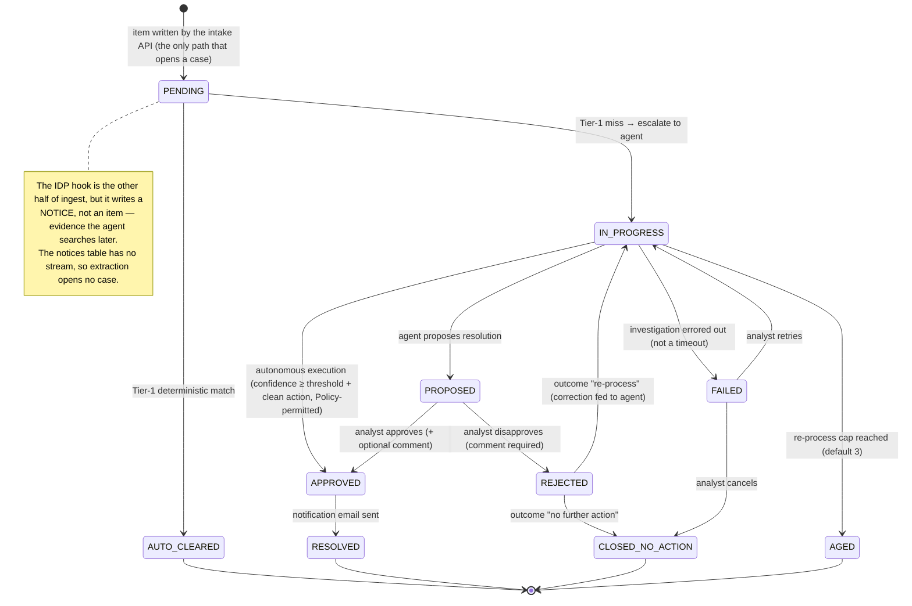

# Case lifecycle

> Detail page for the [Reconciliation Workflow Agent](../README.md). Every status a case can hold,
> every transition between them, and which component performs each one.

The same state machine as a diagram source:

## Step-by-step

| #   | Step                                | Status                                  | What happens                                                                                                                                                                                                                                                                                                                                                                                                                                                                                                                                                                                                                                                                                                                                                                                                                                                                                                                                                                                                                                                                                                                                                                                                                                                                                                                                                                                                                                                                                                                                                                                                                                                                                                                                                                                                                                                     |
| --- | ----------------------------------- | --------------------------------------- | ---------------------------------------------------------------------------------------------------------------------------------------------------------------------------------------------------------------------------------------------------------------------------------------------------------------------------------------------------------------------------------------------------------------------------------------------------------------------------------------------------------------------------------------------------------------------------------------------------------------------------------------------------------------------------------------------------------------------------------------------------------------------------------------------------------------------------------------------------------------------------------------------------------------------------------------------------------------------------------------------------------------------------------------------------------------------------------------------------------------------------------------------------------------------------------------------------------------------------------------------------------------------------------------------------------------------------------------------------------------------------------------------------------------------------------------------------------------------------------------------------------------------------------------------------------------------------------------------------------------------------------------------------------------------------------------------------------------------------------------------------------------------------------------------------------------------------------------------------------------- |
| 1   | Ingest                              | → `PENDING`                             | A structured dataset hits the intake API, which validates the whole batch and writes canonical `ReconItem`s. Writing an item opens a `PENDING` case, because the items table is the only one carrying a DynamoDB stream. A completed IDP document takes the other path and does **not** open a case: the hook Lambda writes a **Notice** to `recon-dev-notices` (idempotent on `idp-<documentId>`) with the per-section classification, extracted field values, and page-preview images copied into recon's own assets bucket. Notices are evidence the agent searches, never work items, and the mechanism is that `recon-dev-notices` has no stream — an absence rather than a flag (`backend/idp_hook/handler.py`). The item write is conditional: `put_if_absent` puts under `ConditionExpression="attribute_not_exists(item_id)"` and returns `False` instead of raising (`backend/recon_core/ddb.py`). **A duplicate here means the same `item_id` and nothing else.** The caller supplies `item_id` in the batch, so a resubmission carrying one that already exists is skipped rather than overwritten — no write, therefore no stream event, therefore Tier-1 and the agent are never re-triggered for an item already in flight, and the batch reports `written: 0`. Economic similarity is not duplication: two different items that happen to match the same ledger row are not duplicates and both proceed independently.                                                                                                                                                                                                                                                                                                                                                                                                                           |
| 2   | Tier-1 deterministic                | → `AUTO_CLEARED` or → `IN_PROGRESS`     | A DynamoDB-stream Lambda runs rule-based matching. Sided items match within tolerance. Sides-less (IDP) items are matched against the mocked general ledger on the cash item's economic identity (`backend/tier1/gl_match.py`): account name (IDP `BorrowerName` → GL `borrower`), the entry-type direction (CREDIT/DEBIT, derived by keyword from the opaque IDP document class), and an amount within ±0.05 of an IDP-extracted amount. It never keys on the document filename or reference. Auto-clear requires exactly one surviving GL row; zero means no match, more than one means ambiguous, and both escalate to `IN_PROGRESS` with the candidate rows attached as `gl_candidates` context before invoking the agent worker. Tier-1 can be disabled at runtime from the Config tab (SSM-backed).                                                                                                                                                                                                                                                                                                                                                                                                                                                                                                                                                                                                                                                                                                                                                                                                                                                                                                                                                                                                                                                        |
| 2b  | Agent dispatch                      | `IN_PROGRESS` (no change)               | Tier-1 hands off with `lambda:Invoke` / `InvocationType=Event`, so no stream shard is held for the minutes an investigation takes. Two **independent** switches then decide how the agent is reached — they are not peer options. `_resolve_backend()` picks the implementation, returning either `runtime` (our own AgentCore Runtime container) or `harness` (the managed AgentCore Harness), read from the SSM parameter the Config tab writes so an operator moves traffic with no redeploy; the `AGENT_BACKEND` env var is only the seed used when that parameter is unset, unreadable, or holds anything else. The second switch applies **only** to the runtime backend: with `USE_INGRESS_GATEWAY` on and `INGRESS_GATEWAY_URL` set — `use_ingress_gateway = true` in this deployment (`infra/environments/recon/main.tf`), against a module default of `false` — the worker SigV4-signs a POST through the AgentCore ingress gateway using `urllib`, so every invocation passes one entry point a gateway resource policy can control and audit; otherwise it calls `InvokeAgentRuntime` through botocore. Both transports reach the **same** container, and the OTel span attribute `recon.transport` (`ingress` or `direct`, mirrored by the `path` the worker returns) is what tells them apart. Direct is also the automatic fallback, not just a configured alternative: any ingress failure that proves the request never ran — a signing or URL error, or an HTTP status from the gateway — falls back to a direct invoke, so a misconfigured gateway or policy cannot strand escalated items. A **timeout is the exception**, because it means the request _was_ delivered and the investigation is still executing; the worker re-raises rather than falling back, since a fallback there would start a second investigation of the same item. |
| 3   | Tier-2 agent                        | `IN_PROGRESS` → `PROPOSED`              | The agent characterizes the break (which selects the driving skill), investigates by invoking one or more relevant skills from the live SKILL.md library (gateway tools, with reasoning and cited evidence per step), then proposes a resolution and reports, step by step, which of its skill's prescribed evidence steps actually obtained data. The confidence is that fraction.                                                                                                                                                                                                                                                                                                                                                                                                                                                                                                                                                                                                                                                                                                                                                                                                                                                                                                                                                                                                                                                                                                                                                                                                                                                                                                                                                                                                                                                                              |
| 3b  | Autonomous execution + auto-resolve | `IN_PROGRESS` → `APPROVED` → `RESOLVED` | When confidence clears the admin threshold and a single matched ledger reference exists, the agent executes `set_draw_status` through the Policy-gated egress gateway. The AgentCore Policy (Cedar, ENFORCE) gates it at the gateway, and the write Lambda additionally verifies provenance by checking the reference against the persisted proposal. On success the case auto-resolves: notification, `AUTO_RESOLVED` lesson, `RESOLVED`. Below threshold, or with no clean action, it halts at `PROPOSED` for human review.                                                                                                                                                                                                                                                                                                                                                                                                                                                                                                                                                                                                                                                                                                                                                                                                                                                                                                                                                                                                                                                                                                                                                                                                                                                                                                                                    |
| 4   | Human review                        | `PROPOSED`                              | The analyst reviews the case: IDP document panel (section tabs ⇄ page images + extracted fields), classification and reasoning, the proposed resolution, and the step-by-step agent trace. Bulk status updates are supported, with comments.                                                                                                                                                                                                                                                                                                                                                                                                                                                                                                                                                                                                                                                                                                                                                                                                                                                                                                                                                                                                                                                                                                                                                                                                                                                                                                                                                                                                                                                                                                                                                                                                                     |
| 5a  | Approve                             | → `APPROVED` → `RESOLVED`               | Optional comment. A notification email goes out and the case closes as `RESOLVED`. The decision is captured as a `USER_APPROVED` lesson.                                                                                                                                                                                                                                                                                                                                                                                                                                                                                                                                                                                                                                                                                                                                                                                                                                                                                                                                                                                                                                                                                                                                                                                                                                                                                                                                                                                                                                                                                                                                                                                                                                                                                                                         |
| 5b  | Disapprove                          | → `REJECTED` → …                        | A correction comment is required, plus an outcome: _No further action_ → `CLOSED_NO_ACTION`, or _Re-process_ → stores the correction and re-invokes the agent (`IN_PROGRESS`). Re-processing is capped (default 3) and ages out at the cap. Captured as a `USER_CORRECTION` lesson.                                                                                                                                                                                                                                                                                                                                                                                                                                                                                                                                                                                                                                                                                                                                                                                                                                                                                                                                                                                                                                                                                                                                                                                                                                                                                                                                                                                                                                                                                                                                                                              |
| 3c  | Investigation failure               | `IN_PROGRESS` → `FAILED`                | Only the agent writes the `PROPOSED` row, so a run that dies leaves nothing behind. The agent worker therefore marks the case `FAILED` with the error text and a timestamp, and the case surfaces in the default triage queue with a **Retry** action (re-opens it to `IN_PROGRESS` and re-drives the worker) or **Cancel** (`CLOSED_NO_ACTION`). Timeouts are exempt: the investigation is still running server-side and will persist its own outcome, so a retry would duplicate it.                                                                                                                                                                                                                                                                                                                                                                                                                                                                                                                                                                                                                                                                                                                                                                                                                                                                                                                                                                                                                                                                                                                                                                                                                                                                                                                                                                           |
| 6   | Lessons learned                     | (parallel)                              | Every analyst decision is captured twice: in the `recon-lessons` DynamoDB ledger, and as an AgentCore Memory event (`lessons_learned` SEMANTIC strategy). Before classifying, the agent retrieves consolidated lessons and weights them in both classification and investigation.                                                                                                                                                                                                                                                                                                                                                                                                                                                                                                                                                                                                                                                                                                                                                                                                                                                                                                                                                                                                                                                                                                                                                                                                                                                                                                                                                                                                                                                                                                                                                                                |

## Terminal states

`AUTO_CLEARED` · `RESOLVED` · `CLOSED_NO_ACTION` · `AGED`

`FAILED` is deliberately **not** terminal — most causes are transient (throttling, an output-token
cap, a tool outage), so it is a retry queue rather than an archive.
