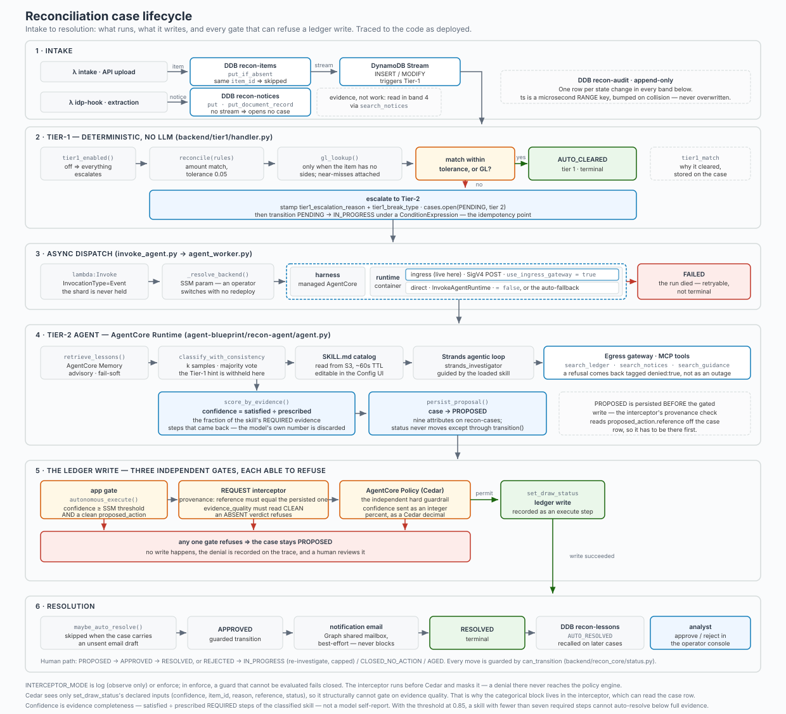

# Case lifecycle

> Detail page for the [Reconciliation Workflow Agent](../README.md). Every status a case can hold,
> every transition between them, and which component performs each one.

The same state machine as a diagram source:

## Step-by-step

| #   | Step                                | Status                                  | What happens                                                                                                                                                                                                                                                                                                                                                                                                                                                                                                                                                                                                                                                                                                                                                                                                                                                                                                                                                                                                                                                                                                                                                                                                                                                                                                                                                                                                                                                                                                                                                                                                                                                                                                                                                                                                                                                                                                                                                                                                                                                                                                                                                                                       |
| --- | ----------------------------------- | --------------------------------------- | -------------------------------------------------------------------------------------------------------------------------------------------------------------------------------------------------------------------------------------------------------------------------------------------------------------------------------------------------------------------------------------------------------------------------------------------------------------------------------------------------------------------------------------------------------------------------------------------------------------------------------------------------------------------------------------------------------------------------------------------------------------------------------------------------------------------------------------------------------------------------------------------------------------------------------------------------------------------------------------------------------------------------------------------------------------------------------------------------------------------------------------------------------------------------------------------------------------------------------------------------------------------------------------------------------------------------------------------------------------------------------------------------------------------------------------------------------------------------------------------------------------------------------------------------------------------------------------------------------------------------------------------------------------------------------------------------------------------------------------------------------------------------------------------------------------------------------------------------------------------------------------------------------------------------------------------------------------------------------------------------------------------------------------------------------------------------------------------------------------------------------------------------------------------------------------------------- |
| 1   | Ingest                              | → `PENDING`                             | A structured dataset hits the intake API, which validates the whole batch and writes canonical `ReconItem`s. Writing an item opens a `PENDING` case, because the items table is the only one carrying a DynamoDB stream. A completed IDP document takes the other path and does **not** open a case: the hook Lambda writes a **Notice** to `recon-dev-notices` (idempotent on `idp-<documentId>`) with the per-section classification, extracted field values, and page-preview images copied into recon's own assets bucket. Notices are evidence the agent searches, never work items, and the mechanism is that `recon-dev-notices` has no stream — an absence rather than a flag (`backend/idp_hook/handler.py`). The item write is conditional: `put_if_absent` puts under `ConditionExpression="attribute_not_exists(item_id)"` and returns `False` instead of raising (`backend/recon_core/ddb.py`). **A duplicate here means the same `item_id` and nothing else.** The caller supplies `item_id` in the batch, so a resubmission carrying one that already exists is skipped rather than overwritten — no write, therefore no stream event, therefore Tier-1 and the agent are never re-triggered for an item already in flight, and the batch reports `written: 0`. Economic similarity is not duplication: two different items that happen to match the same ledger row are not duplicates and both proceed independently.                                                                                                                                                                                                                                                                                                                                                                                                                                                                                                                                                                                                                                                                                                                                                             |
| 2   | Tier-1 deterministic                | → `AUTO_CLEARED` or stays `PENDING`     | A DynamoDB-stream Lambda runs rule-based matching. Sided items match within tolerance. Sides-less (IDP) items are matched against the mocked general ledger on the cash item's economic identity (`backend/tier1/gl_match.py`): account name (IDP `BorrowerName` → GL `borrower`), the entry-type direction (CREDIT/DEBIT, derived by keyword from the opaque IDP document class), and an amount within ±0.05 of an IDP-extracted amount. It never keys on the document filename or reference. Auto-clear requires exactly one surviving GL row; zero means no match, more than one means ambiguous, and both escalate with the candidate rows attached as `gl_candidates` context. Escalation leaves the case `PENDING`: this consumer opens the case and dispatches nothing, because it runs one invocation per stream shard and shard count on a `PAY_PER_REQUEST` table is exactly what a large intake batch inflates — a fan-out from here would scale with the burst it has to absorb. Tier-1 can be disabled at runtime from the Config tab (SSM-backed).                                                                                                                                                                                                                                                                                                                                                                                                                                                                                                                                                                                                                                                                                                                                                                                                                                                                                                                                                                                                                                                                                                                                   |
| 2b  | Agent dispatch                      | `PENDING` → `IN_PROGRESS`               | A **Step Functions map run** (`infra/modules/tier2-dispatch`) decides when and how many investigations happen — started on a schedule (the module default is disabled; recon-dev runs `rate(5 minutes)`) or by hand. It collects `PENDING` cases oldest-first off the `status-index` GSI, writes the list to S3 because a Distributed Map's `ItemReader` can only read from S3, then runs a Distributed `Map` whose **`MaxConcurrency` is the Bedrock TPM budget**. Each child claims its case (`PENDING` → `IN_PROGRESS`); a lost race returns `claimed:false` and the child succeeds, which is what makes re-running a map over the same list cost nothing. For the **runtime** backend the child uses `lambda:invoke.waitForTaskToken`: a thin dispatcher hands the agent a task token and returns in ~1s, the execution then pauses billing no compute, and the agent signals `SendTaskSuccess` when it finishes. That is why `MaxConcurrency` is the right instrument — a paused child is still a _running_ child execution, so the limit counts investigations in flight rather than calls being made. `TimeoutSeconds` (1800s, ~3× the worst observed run) is the single authority on giving up; there is no heartbeat. The **harness** backend keeps the old blocking shape, because it runs in-process inside the agent-worker Lambda and has no container to background into; it is bounded by that function's `reserved_concurrent_executions` instead. The backend is resolved **once per run** by the collect step and stamped on every item, so a run cannot straddle an operator's mid-run switch. The ingress-gateway switch is unchanged and applies only to the runtime backend: with `USE_INGRESS_GATEWAY` on, the dispatcher SigV4-signs a POST through the AgentCore ingress gateway so every invocation passes one auditable entry point; otherwise it calls `InvokeAgentRuntime` directly. Direct is also the automatic fallback for any ingress failure that proves the request never ran. A **timeout is the exception** and never falls back: the dispatch may have landed, and a fallback would start a second investigation of the same item against the same session. |
| 3   | Tier-2 agent                        | `IN_PROGRESS` → `PROPOSED`              | The agent characterizes the break (which selects the driving skill), investigates by invoking one or more relevant skills from the live SKILL.md library (gateway tools, with reasoning and cited evidence per step), then proposes a resolution and reports, step by step, which of its skill's prescribed evidence steps actually obtained data. The confidence is that fraction.                                                                                                                                                                                                                                                                                                                                                                                                                                                                                                                                                                                                                                                                                                                                                                                                                                                                                                                                                                                                                                                                                                                                                                                                                                                                                                                                                                                                                                                                                                                                                                                                                                                                                                                                                                                                                |
| 3b  | Autonomous execution + auto-resolve | `IN_PROGRESS` → `APPROVED` → `RESOLVED` | When confidence clears the admin threshold and a single matched ledger reference exists, the agent executes `set_draw_status` through the Policy-gated egress gateway. The AgentCore Policy (Cedar, ENFORCE) gates it at the gateway, and the write Lambda additionally verifies provenance by checking the reference against the persisted proposal. On success the case auto-resolves: notification, `AUTO_RESOLVED` lesson, `RESOLVED`. Below threshold, or with no clean action, it halts at `PROPOSED` for human review.                                                                                                                                                                                                                                                                                                                                                                                                                                                                                                                                                                                                                                                                                                                                                                                                                                                                                                                                                                                                                                                                                                                                                                                                                                                                                                                                                                                                                                                                                                                                                                                                                                                                      |
| 4   | Human review                        | `PROPOSED`                              | The analyst reviews the case: IDP document panel (section tabs ⇄ page images + extracted fields), classification and reasoning, the proposed resolution, and the step-by-step agent trace. Bulk status updates are supported, with comments.                                                                                                                                                                                                                                                                                                                                                                                                                                                                                                                                                                                                                                                                                                                                                                                                                                                                                                                                                                                                                                                                                                                                                                                                                                                                                                                                                                                                                                                                                                                                                                                                                                                                                                                                                                                                                                                                                                                                                       |
| 5a  | Approve                             | → `APPROVED` → `RESOLVED`               | Optional comment. A notification email goes out and the case closes as `RESOLVED`. The decision is captured as a `USER_APPROVED` lesson.                                                                                                                                                                                                                                                                                                                                                                                                                                                                                                                                                                                                                                                                                                                                                                                                                                                                                                                                                                                                                                                                                                                                                                                                                                                                                                                                                                                                                                                                                                                                                                                                                                                                                                                                                                                                                                                                                                                                                                                                                                                           |
| 5b  | Disapprove                          | → `REJECTED` → …                        | A correction comment is required, plus an outcome: _No further action_ → `CLOSED_NO_ACTION`, or _Re-process_ → stores the correction and re-invokes the agent (`IN_PROGRESS`). Re-processing is capped (default 3) and ages out at the cap. Captured as a `USER_CORRECTION` lesson.                                                                                                                                                                                                                                                                                                                                                                                                                                                                                                                                                                                                                                                                                                                                                                                                                                                                                                                                                                                                                                                                                                                                                                                                                                                                                                                                                                                                                                                                                                                                                                                                                                                                                                                                                                                                                                                                                                                |
| 3c  | Investigation failure               | `IN_PROGRESS` → `FAILED`                | Only the agent writes the `PROPOSED` row, so a run that dies leaves nothing behind. The **container itself** marks the case `FAILED` with the error text and a timestamp — it is the only party that knows the difference between "I died" and "I am still working" — and the map run's `Catch` is the backstop for the case it cannot report, where the container died outright and nothing in it ran. The case surfaces in the default triage queue with a **Retry** action (re-opens it to `IN_PROGRESS` and re-drives the worker) or **Cancel** (`CLOSED_NO_ACTION`). Three causes are distinguished, and conflating them is how cases get lost. A **timeout** in the blocking worker is exempt: the investigation is still running server-side and will persist its own outcome, so a retry would duplicate it. A **throttle** is neither a timeout nor a handled error — nothing ran, so there is nothing in flight and nothing to degrade; it is recorded `FAILED`, and on the harness backend specifically it must not become a `confidence=0.0` `PROPOSED` row, which would ask an analyst to review a proposal that was never made. A **dead run** is what the `Catch` covers.                                                                                                                                                                                                                                                                                                                                                                                                                                                                                                                                                                                                                                                                                                                                                                                                                                                                                                                                                                                                           |
| 6   | Lessons learned                     | (parallel)                              | Every analyst decision is captured twice: in the `recon-lessons` DynamoDB ledger, and as an AgentCore Memory event (`lessons_learned` SEMANTIC strategy). Before classifying, the agent retrieves consolidated lessons and weights them in both classification and investigation.                                                                                                                                                                                                                                                                                                                                                                                                                                                                                                                                                                                                                                                                                                                                                                                                                                                                                                                                                                                                                                                                                                                                                                                                                                                                                                                                                                                                                                                                                                                                                                                                                                                                                                                                                                                                                                                                                                                  |

## Terminal states

`AUTO_CLEARED` · `RESOLVED` · `CLOSED_NO_ACTION` · `AGED`

`FAILED` is deliberately **not** terminal — most causes are transient (throttling, an output-token
cap, a tool outage), so it is a retry queue rather than an archive.
