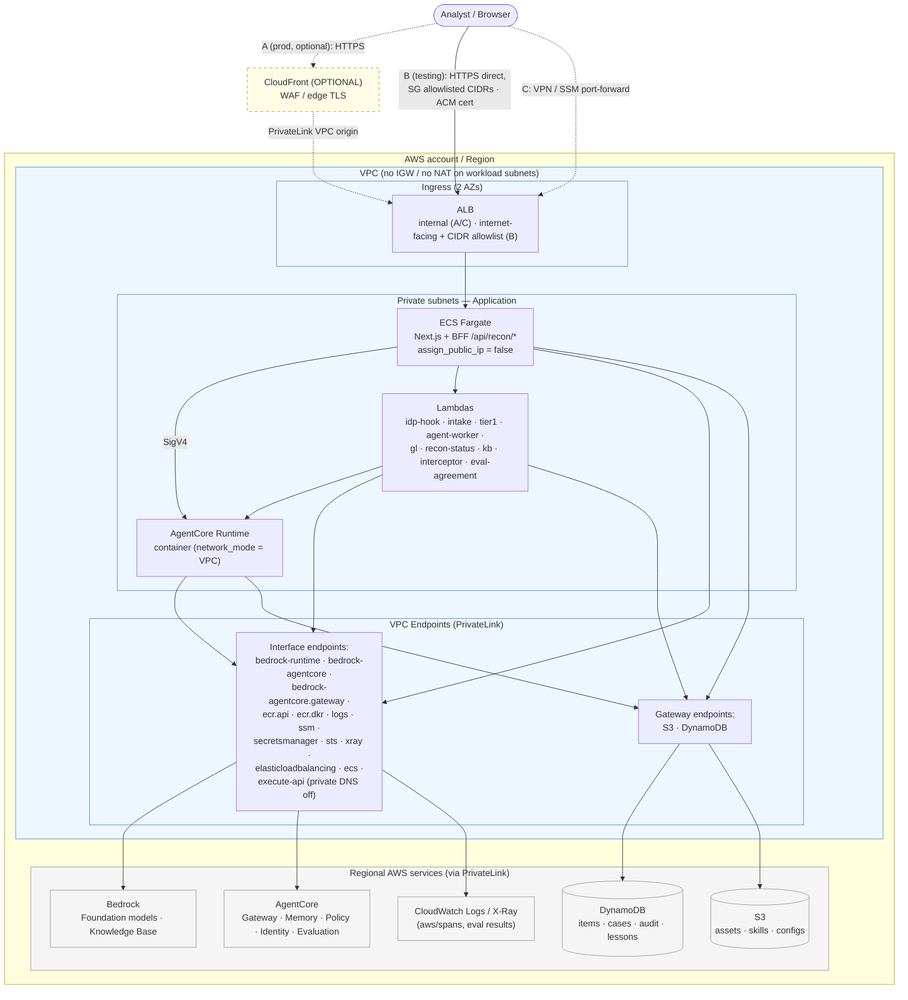

# Private VPC deployment

> Detail page for the [Reconciliation Workflow Agent](../README.md). The dev default is public
> CloudFront + internet-facing ALB; everything here is the `private_vpc = true` profile of the same
> modules.

The dev default trades isolation for cost: public Fargate subnets and a single NAT. For a regulated or
internet-restricted deployment, the frontend and backend both run entirely on private subnets with no
route to an Internet Gateway, and every AWS dependency is reached over PrivateLink interface endpoints
instead of the public internet. CloudFront is an optional edge layer here rather than part of the
isolation: the workload isolation is identical without it, and only the ingress hop differs.

## Ingress options (CloudFront optional)

| Option                       | Ingress path                                                                                        | When to use                                                                                                                                                                                                                                               |
| ---------------------------- | --------------------------------------------------------------------------------------------------- | --------------------------------------------------------------------------------------------------------------------------------------------------------------------------------------------------------------------------------------------------------- |
| **A — CloudFront (prod)**    | CloudFront → **PrivateLink VPC origin** → **internal ALB**                                          | Production: global edge, WAF attachment point, managed TLS, no internet-facing ALB                                                                                                                                                                        |
| **B — Direct ALB (testing)** | Internet-facing ALB in the two public subnets, **SG locked to tester CIDRs** → private Fargate task | Easier testing without CloudFront: the workloads stay exactly as private; only the ALB is reachable, and only from allowlisted IPs. Needs an ACM cert on the ALB (or HTTP for quick tests) and the ALB DNS name added to the Okta/Entra **redirect URIs** |
| **C — Fully private**        | **Internal ALB**, reached via Client VPN / Direct Connect, or an SSM port-forward for ad-hoc tests  | Internet-restricted environments; nothing is reachable from the internet at all                                                                                                                                                                           |

## What changes vs. the dev default

| Concern             | Dev default (cost-optimized)                        | Private VPC mode                                                                                                                                                                                                                  |
| ------------------- | --------------------------------------------------- | --------------------------------------------------------------------------------------------------------------------------------------------------------------------------------------------------------------------------------- |
| Fargate placement   | Public subnets, `assign_public_ip = true`, no NAT   | Private subnets, `assign_public_ip = false`, no public IP                                                                                                                                                                         |
| ALB                 | Internet-facing, open to the CloudFront prefix list | Option A/C: **internal** ALB · Option B: internet-facing but **CIDR-allowlisted** (testing)                                                                                                                                       |
| Egress to AWS APIs  | Direct (Fargate) + single NAT (Lambdas/Runtime)     | All AWS access via **VPC interface endpoints** (PrivateLink) + S3/DynamoDB gateway endpoints. No IGW route for the frontend; the NAT is what the endpoints make **removable** — the flag does not delete it (see "Enabling it")   |
| Bedrock / AgentCore | Over NAT to public endpoints                        | `bedrock-runtime`, `bedrock-agentcore` and `bedrock-agentcore.gateway` (Gateway has its own PrivateLink service) **interface endpoints**. No `bedrock-agent-runtime` — the KB `Retrieve` is made by the Gateway, not from the VPC |
| Intake API          | Public HTTP API only (`POST /items`, OIDC JWT)      | The public HTTP API stays (it cannot be made private), **plus** a VPC-only PRIVATE REST API onto the same Lambda, reachable only through the `execute-api` endpoint                                                               |
| Blast radius        | Task can reach the internet                         | Task can reach **only** the enumerated endpoint services                                                                                                                                                                          |

## Interface (PrivateLink) endpoints required

Beyond the S3 + DynamoDB **gateway** endpoints and the `ecr.api` / `ecr.dkr` / `logs`
interface endpoints already provisioned, the root `private_vpc = true` flag (which sets the
network module's `enable_private_endpoints`) adds the following
(`infra/modules/network/main.tf`, `_private_interface_endpoints`) so nothing needs the NAT:
`bedrock-runtime`, `bedrock-agentcore`, `bedrock-agentcore.gateway`, `ssm`, `secretsmanager`,
`sts`, `elasticloadbalancing`, `ecs` / `ecs-agent` / `ecs-telemetry`,
`xray` (OTel span export — without it the VPC-attached worker drops every span while otherwise
working normally), and `execute-api` (the private intake API — see below). Each carries a security
group allowing 443 from the workload SGs.

`execute-api` is the one endpoint with **`private_dns_enabled = false`**, and that is deliberate.
Private DNS on it would create a private hosted zone for the whole
`*.execute-api.<region>.amazonaws.com` wildcard, so every in-VPC call to any _public_ API Gateway API —
including the platform's own `recon-dev-api` HTTP API — would resolve to the endpoint and fail there,
because the endpoint service serves private REST APIs only. The private intake API is reached by its
`<api-id>-<vpce-id>.execute-api.<region>.vpce.amazonaws.com` hostname instead, which needs no private
DNS. `modules/network/main.tf` computes `private_dns_enabled = each.value != "execute-api"` for exactly
this reason.

`lambda` is **not** in the list, and it is the next gap of the same kind as `bedrock-agent-runtime`
below: four in-VPC callers invoke Lambdas (the BFF's intake submission and case retry, Tier-1's GL
lookup, and the console's agent-worker retry), and they work today only because the NAT survives.
The Tier-2 map run adds a different dependency: `states`, now in the endpoint list, because collect and
the runtime container both call Step Functions from inside the VPC. Add it
in the same change that removes the NAT — see
[intake-http-api.md](intake-http-api.md#the-lambda-endpoint-is-a-latent-no-nat-gap-regardless).

`bedrock-agent-runtime` is deliberately absent, and it is worth knowing why, because the name looks
like one of the two above. It is the service a Bedrock KB `Retrieve` call goes to via
`boto3.client("bedrock-agent-runtime")` — a different service from `bedrock-runtime` (model
inference) — and an in-VPC caller of it hangs without the endpoint in a no-NAT deployment. The KB
read the agent makes does **not** go through the VPC at all: `managed-kb` is a connector target, so
the `Retrieve` call is made by the AgentCore Gateway's own service role from outside the VPC, and the
only thing the workload has to reach is `bedrock-agentcore.gateway`. Add it if you ever put an in-VPC
caller of `Retrieve` / `RetrieveAndGenerate` / `InvokeAgent` in. `states` IS now present, and must be: `backend/tier2_dispatch/collect.py` paginates `ListExecutions` for the single-flight guard, and the runtime container calls `SendTaskSuccess`/`SendTaskFailure` to release its task token. Both fail silently without it — the guard fails CLOSED so the queue stops draining while everything reports healthy, and an unreleased token waits out the state's 1800s timeout so a successful investigation is recorded as FAILED.

> **AgentCore Gateway PrivateLink Support:** AgentCore publishes three PrivateLink services, and Gateway is supported on both
> data and control plane:
>
> | Service name                                       | Private DNS                                          | Purpose                         |
> | -------------------------------------------------- | ---------------------------------------------------- | ------------------------------- |
> | `com.amazonaws.<region>.bedrock-agentcore`         | `bedrock-agentcore.<region>.amazonaws.com`           | data plane (Runtime, Memory, …) |
> | `com.amazonaws.<region>.bedrock-agentcore.gateway` | `*.gateway.bedrock-agentcore.<region>.amazonaws.com` | **Gateway invocation**          |
> | `com.amazonaws.<region>.bedrock-agentcore-control` | `bedrock-agentcore-control.<region>.amazonaws.com`   | control plane (Runtime/Memory)  |
>
> The gateway endpoint is not redundant with the data-plane one. A gateway URL is
> `<gateway-id>.gateway.bedrock-agentcore.<region>.amazonaws.com`, a subdomain the data-plane
> endpoint's exact-name private zone does not resolve. Assuming egress-tool traffic "still leaves via
> the `bedrock-agentcore` interface endpoint's service" is the trap: in a no-NAT deployment those
> calls then have no private path at all. `bedrock-agentcore.gateway` is in
> `_private_interface_endpoints` for exactly this reason.
>
> Both recon gateways use AWS_IAM/SigV4 inbound auth, so the default full-access endpoint policy works
> and a custom policy can scope `Principal` to specific IAM identities. There is an asymmetry to watch
> if the ingress is ever switched to OAuth/JWT: endpoint policies can only match IAM principals, so an
> OAuth-ingress gateway requires `Principal: "*"` or every call over the endpoint is denied.
>
> Separately, gateway targets can now reach private VPC resources through a `privateEndpoint` /
> `managedVpcResource` block (VPC Lattice) on MCP and OpenAPI targets, so a target no longer has to be
> publicly reachable. Nothing here uses it: Lambda targets need no configuration and already run in
> the VPC, and the Graph OpenAPI target is a public third-party API. It is the supported route if the
> IDP MCP endpoint is ever moved inside a VPC. It does not apply to Smithy targets, and API Gateway
> targets need the export-as-OpenAPI workaround with `routingDomain` set to the API's VPCE DNS name.

## Architecture (private-VPC mode)




**Request path.** The user arrives by exactly one of three routes: (A) CloudFront → PrivateLink VPC
origin → internal ALB, (B) allowlisted HTTPS straight to the ALB for testing without CloudFront, or
(C) a VPN/SSM tunnel to the internal ALB. All three land on the same ECS Fargate task (Next.js plus
the same-origin `/api/recon/*` BFF, running under the task role). The OIDC login runs in the SPA and
behaves identically on every option; each origin URL, whether the CloudFront domain or the ALB DNS
name, just has to be registered as a redirect URI in the IdP app.

From the task inward nothing differs between the options. BFF and agent calls reach the AgentCore
Runtime over SigV4, through the ingress gateway or a direct `InvokeAgentRuntime`, and every AWS API
call (Bedrock models, the AgentCore control and data planes, DynamoDB, S3, SSM, Secrets Manager,
CloudWatch) flows through the S3/DynamoDB gateway endpoints and the interface endpoints. No workload
holds a public IP, and in option B the only internet-reachable component is the CIDR-allowlisted ALB.

The diagram shows the end-state topology. `private_vpc` gets you the endpoints and the private
frontend; removing the NAT gateway is the last manual step, described under "Enabling it".

## Enabling it

One flag does it. `terraform apply -var="private_vpc=true"` switches the whole topology to option C in
a single change, with no per-module wiring to do:

```bash
cd infra/environments/recon
terraform apply -var="private_vpc=true" -var='private_ingress_cidrs=["10.0.0.0/8"]'
```

| What the flag does                                                                                                                                                                                                                                                                                                                                                                                                                                                                 | Where                        |
| ---------------------------------------------------------------------------------------------------------------------------------------------------------------------------------------------------------------------------------------------------------------------------------------------------------------------------------------------------------------------------------------------------------------------------------------------------------------------------------- | ---------------------------- |
| Adds the twelve interface endpoints listed above (`enable_private_endpoints`), for fifteen in total with the three already provisioned                                                                                                                                                                                                                                                                                                                                             | `infra/modules/network`      |
| Adds a **private intake door**: a PRIVATE REST API (`recon-dev-intake-private`) on the `execute-api` endpoint, authorized with **AWS_IAM** (SigV4 — a Lambda authorizer verifying Okta tokens would need JWKS egress and would fail closed with no NAT), integrating the same `recon-dev-intake` Lambda. An HTTP API cannot be made private, so without this the platform's only synchronous write endpoint would stay internet-facing. URL in the `intake_private_api_url` output | `infra/modules/intake`       |
| ALB becomes **internal**; ingress from `private_ingress_cidrs` (empty ⇒ the VPC CIDR only)                                                                                                                                                                                                                                                                                                                                                                                         | `infra/modules/frontend-ecs` |
| Fargate moves to the private subnets, `assign_public_ip = false`, private-endpoint SG                                                                                                                                                                                                                                                                                                                                                                                              | `infra/modules/frontend-ecs` |
| **CloudFront is not created at all** — distribution, WAF web ACL, log bucket, and origin-request policy all `count = 0`, and no public subnets / IGW route for the frontend                                                                                                                                                                                                                                                                                                        | `infra/modules/frontend-ecs` |

`private_ingress_cidrs` is your VPN or corporate range; leave it empty to allow the VPC CIDR only.
Register the internal ALB's DNS name as an OIDC redirect URI in Okta/Entra, then reach the UI over
Client VPN / Direct Connect or
`aws ssm start-session --document-name AWS-StartPortForwardingSessionToRemoteHost`.

Three things stay manual, and the flag does none of them:

1. **The NAT gateway survives.** `aws_nat_gateway.this`, its EIP and public subnet, and the private
   route table's `0.0.0.0/0 → NAT` route are unconditional in `infra/modules/network/main.tf`. A
   `private_vpc = true` apply therefore gives you the interface endpoints and a fully private
   frontend while the backend subnets still hold a default route out. Removing the NAT, and the
   ~$35/mo it costs, is a follow-up edit to that module. Do it only after confirming the endpoint set
   covers every dependency. The one easiest to miss is `bedrock-agentcore.gateway` — every egress
   tool call goes through it, including the KB read, since `managed-kb` is a connector target the
   gateway calls Bedrock for.
2. **Option A is out of reach of the flag**, which removes CloudFront outright. A CloudFront →
   PrivateLink-VPC-origin front end has to be added back on top of the internal ALB.
3. **Option B is a hand edit too.** Keep `private_vpc = false`, replace the CloudFront prefix-list
   ingress rule on the ALB SG with your tester CIDRs, and attach an ACM certificate. Workloads stay
   as private as the module makes them, but no variable expresses this.

The dev environment root defaults to `private_vpc = false`, the cost-optimized public-subnet variant.
Private mode is the hardened profile of the same modules, not a different deployment.
